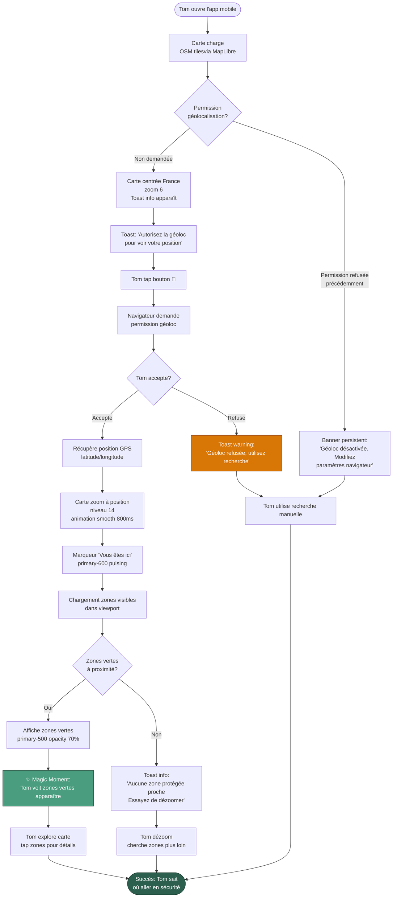
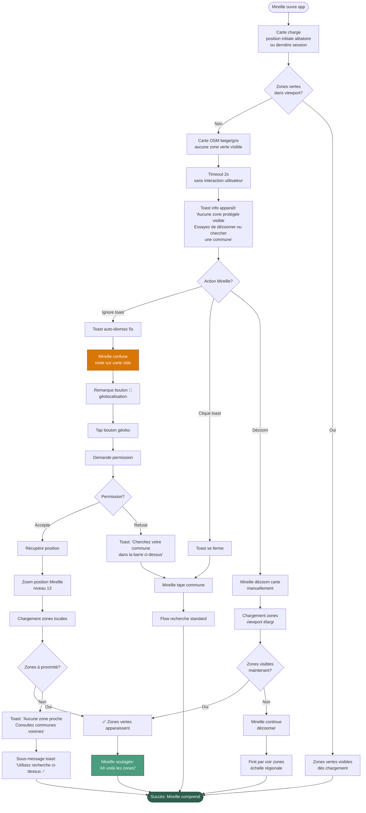

# UX Design Specification NatureTranquille

**Author:** Teddy
**Date:** 13 mars 2026

---

## Executive Summary

### Project Vision

NatureTranquille est une application web cartographique qui démocratise l'accès aux zones sans chasse en France. Le produit transforme des données publiques géospatiales éclatées et techniques (RNCFS, réserves naturelles, open data départementaux) en une carte interactive unique, simple et accessible au grand public.

La vision UX repose sur trois piliers :

1. **Simplicité Radicale** : Une carte, une recherche, des détails. Pas de complexité SIG, pas de jargon technique.
2. **Transparence comme Force** : Afficher clairement ce qui est connu vs inconnu, transformer les limites en opportunité de contribution communautaire.
3. **Performance Multi-Échelle** : Navigation fluide du niveau national au niveau local avec affichage instantané des détails (< 500ms).

Le moment décisif : un utilisateur découvre une zone protégée près de chez lui qu'il ne connaissait pas et planifie sereinement sa sortie nature.

### Target Users

**Persona Primaire : Tom - Le Parent Sécuritaire**

- 38 ans, papa de 2 enfants en bas âge (Léa 4 ans, Hugo 6 ans)
- Veut emmener ses enfants en forêt le dimanche sans risque pendant la saison de chasse
- Niveau tech : utilisateur moyen, privilégie simplicité et rapidité
- Devices : mobile pour géolocalisation terrain, desktop pour planification weekend
- Moment d'usage : samedi soir après avoir couché les enfants
- Besoin UX : **trouver une zone sûre en moins de 2 minutes** avec confiance dans l'information

**Persona Secondaire : Marie - La Photographe Méthodique**

- 52 ans, photographe animalière semi-professionnelle
- Cherche spots d'affût sans perturbation humaine pour photographier cerfs/chevreuils
- Niveau tech : savvy, utilise Google Maps satellite pour cross-check
- Devices : desktop pour recherche approfondie, mobile sur terrain
- Moment d'usage : planification 2-3 semaines à l'avance pour sessions photo
- Besoin UX : **exploration stratégique** avec critères multiples (forêt dense, proximité cours d'eau) + fiabilité données

**Persona Tertiaire : Mireille - La Cueilleuse Traditionnelle**

- 64 ans, retraitée passionnée de mycologie
- Adore cueillette champignons mais redoute stress de la chasse
- Niveau tech : moyennement à l'aise, a besoin d'aide de son fils
- Devices : desktop avec assistance familiale
- Moment d'usage : saison champignons (septembre-octobre)
- Besoin UX : **interface très simple** avec gros boutons clairs, pas de terminologie complexe

**Caractéristiques Communes :**

- Frustration avec solutions actuelles : données éclatées, barrière technique
- Résultat actuel : **renoncement** aux sorties nature pendant chasse
- Attente : solution simple, rapide, fiable avec transparence sur limites

### Key Design Challenges

**Challenge 1 : Gestion UX de l'Incertitude et des Données Incomplètes**

Le défi fondamental de NatureTranquille est que la couverture territoriale sera progressive (5 départements au MVP → 20 à 6 mois → nationale à plus long terme). Comment communiquer clairement que la carte affiche **uniquement les zones connues** sans décourager l'utilisation ?

**Edge Case Critique :**

- Tom recherche "Givors 69700" → carte zoom sur sa zone... mais elle est vide (Rhône pas encore couvert)
- Risque : frustration, incompréhension ("pas de zones sans chasse près de chez moi ?"), abandon

**Solutions UX :**

- **Disclaimer visible mais non intrusif** : bandeau info discret ou bouton ℹ️ "À propos" bien placé
- **Message clair** : "Carte affiche SEULEMENT zones sans chasse identifiées à ce jour. Absence de zone ≠ chasse autorisée partout (peut être manque de données)."
- **Page "Sources de données"** accessible avec liste départements couverts + roadmap expansion visible
- **Feedback valorisé** : bouton "Signaler mon intérêt pour cette zone" → email confirmation "Département prévu Q2 2026"
- **Framing positif** : "Données en expansion continue - aidez-nous à compléter !" vs "Données incomplètes"

**Challenge 2 : Performance Cartographique Multi-Échelle**

Afficher des milliers de zones polygonales complexes (certaines avec des milliers de points) du niveau national (France entière) au niveau local (parcelle) avec navigation fluide.

**Contraintes Techniques :**

- Chargement initial < 2s (75th percentile, 3G mobile)
- Détails zone < 500ms au clic
- Navigation (zoom, pan) sans lag perceptible
- Support mobile (tactile) + desktop (souris)

**Solutions UX/Technique :**

- **Tuiles vectorielles MVT** : format binaire compact (~10x plus léger que GeoJSON), simplification géométrique adaptative par zoom (Douglas-Peucker)
- **Clustering visuel** si densité zones élevée à faible zoom
- **Données embarquées dans tuiles** : métadonnées (nom, type, gestionnaire) incluses → popup instantanée sans API call
- **Code splitting** : MapLibre GL JS (~500KB gzipped) chargé séparément
- **Cache multi-niveaux** : navigateur 1 an (tiles immutables), serveur Nginx, CDN UE si nécessaire

**Challenge 3 : Accessibilité Multi-Générations et Conformité RGAA 4.1**

3 générations d'utilisateurs (Tom 38 ans, Marie 52 ans, Mireille 64 ans) avec niveaux techniques différents, dont certains nécessitant assistance (Mireille + fils).

**Exigences RGAA Niveau AA :**

- **Contrastes** : ratios ≥ 4.5:1 texte normal, ≥ 3:1 texte large/éléments interactifs
- **Navigation clavier complète** : carte navigable touches fléchées, focus visible, ordre tabulation logique
- **Mobile tactile** : boutons ≥ 44px minimum, bottom sheet pour détails zones (ne masque pas carte)
- **Zones identifiables sans couleur seule** : motif/forme en plus de vert
- **Labels explicites** : tooltips pour termes techniques (RNCFS → "Réserve Nationale de Chasse et de Faune Sauvage")
- **Lecteurs d'écran** : ARIA landmarks, description textuelle alternative carte (liste zones sous carte)

**Solutions UX :**

- **Design responsive mobile-first** : carte plein écran 100vh, header minimal fixe
- **Contrôles tactiles natifs MapLibre** : pinch-zoom, pan, boutons zoom +/- tactiles 44px
- **Simplicité interface** : pas de menus complexes, fonctions principales accessibles en 1-2 taps
- **Aide contextuelle** : bouton aide visible, tooltips sur termes techniques

**Challenge 4 : Clarification Terminologique et Pédagogie sur Types de Zones**

Un piège sémantique majeur menace l'adoption du produit : **"réserve de chasse"** peut être interprété à l'opposé de sa signification réelle.

**Confusion Potentielle :**

- Utilisateur lit "Réserve de Chasse" → pense "zone réservée À la chasse" → évite la zone
- Réalité : RNCFS = Réserve Nationale de Chasse et de Faune Sauvage = **chasse interdite**
- Risque : utilisateurs ne vont pas dans des zones sûres par incompréhension du terme

**Problèmes de Wording :**

- "Zone sans chasse" : correct mais inélégant, peu engageant
- "Réserve de chasse" : ambigu, peut être mal compris
- Besoin : terminologie claire, compréhensible instantanément, alignée avec recherches Google

**Considérations SEO :**
Les utilisateurs recherchent :

- "carte des réserves de chasse" (ambigu mais recherché)
- "carte zone chasse interdite" (clair mais verbeux)
- "où se promener sans chasse"
- "forêt sans chasseurs"

Il faut que le wording UX soit à la fois :

1. **Clair** : aucune ambiguïté possible sur "chasse autorisée vs interdite"
2. **SEO-friendly** : matche les termes recherchés par les utilisateurs
3. **Élégant** : pas trop technique, engageant

**Solutions UX :**

1. **Système de Labeling Hiérarchique**
    - **Titre principal carte** : "Zones Protégées de la Chasse" (clair + SEO)
    - **Sous-titre explicatif** : "Réserves naturelles et zones où la chasse est interdite"
    - **Dans les détails** : utiliser le nom officiel ("RNCFS") avec explication immédiate

2. **Espace Pédagogique Intégré**
   Prévoir dans l'UX un espace accessible (sans être intrusif) pour expliquer les types de zones :
    - **Bouton ℹ️ "Types de zones"** dans le header (à côté recherche)
    - **Modal/panneau latéral** avec explications :

        ```
        🌲 Réserve Naturelle
        Zone protégée pour la biodiversité. Chasse interdite toute l'année.

        🦌 RNCFS (Réserve Nationale de Chasse et de Faune Sauvage)
        Espace de protection de la faune. Chasse interdite.
        Note : "réserve de chasse" signifie zone SANS chasse, pas zone pour chasser.

        🏞️ Réserve Régionale/Départementale
        Zone protégée par autorité locale. Chasse interdite.

        🔒 Terrain Privé - Chasse Interdite
        Propriété privée où le propriétaire interdit la chasse.
        ```

3. **Clarifications Visuelles**
    - **Icônes distinctives** par type (🌲 réserve naturelle, 🦌 RNCFS, etc.)
    - **Code couleur** : toutes en vert (sûres) mais nuances différentes par type
    - **Tooltip hover desktop** : "RNCFS - Chasse interdite"
    - **Popup détails** : première ligne toujours "✅ Chasse interdite" en gras

4. **Wording Page d'Accueil et SEO**
    - **H1** : "Carte des Zones où la Chasse est Interdite en France"
    - **Meta description** : "Trouvez les réserves naturelles, RNCFS et zones protégées de la chasse pour vos balades en forêt en toute sécurité."
    - **URLs départements** : `/departements/bas-rhin/zones-chasse-interdite` ou `/departements/bas-rhin/zones-protegees`
    - **Contenu texte minimal SEO** (footer) : "Réserves de chasse (RNCFS), réserves naturelles, zones chasse interdite"

5. **Glossaire/FAQ Intégré**
   Page `/glossaire` accessible depuis footer :
    - "Qu'est-ce qu'une RNCFS ?"
    - "Pourquoi 'réserve de chasse' signifie 'sans chasse' ?"
    - "Quels types de zones sont affichés ?"
    - SEO-friendly pour requêtes informationnelles

**Affinage Progressif :**
Au MVP, tester plusieurs formulations avec utilisateurs réels (A/B testing si trafic suffisant) :

- Variante A : "Zones Protégées de la Chasse"
- Variante B : "Zones Sans Chasse"
- Variante C : "Espaces Nature Sécurisés"

Mesurer :

- Taux de compréhension (questionnaire post-usage)
- Taux de clics sur explication "Types de zones"
- Signalements d'erreurs liés à confusion terminologique

### Design Opportunities

**Opportunité 1 : Transparence Radicale comme Avantage Compétitif**

Plutôt que de promettre l'exhaustivité (approche marketing classique impossible à garantir), faire de la **transparence sur les limites** une stratégie de différenciation.

**Positionnement Unique :**

- "Voici ce que nous savons" vs "Voici tout ce qu'il y a"
- Page "Sources de données" détaillée avec méthodologie de validation, roadmap départements, appel à contribution
- Signalements utilisateurs = amélioration visible du produit
- Confiance renforcée à long terme vs sur-promesse → déception

**UX Innovation :**

- Transformer limitation en force : communauté contributrice (signalements zones manquantes, suggestions sources départementales)
- Feedback loop visible : "Grâce à vos signalements, nous avons ajouté 3 nouveaux départements ce mois"
- Positionnement factuel et apaisé vs militant anti-chasse

**Opportunité 2 : Deep Linking SEO-Optimisé pour Découvrabilité Maximale**

NextJS 14+ avec SSG permet génération de routes statiques pour chaque département avec métadonnées dynamiques.

**Pattern UX :**

- URLs typées `/departements/bas-rhin`, `/regions/grand-est` → carte auto-zoomée sur zone
- `<title>` dynamique : "Zones Sans Chasse - Bas-Rhin | NatureTranquille"
- OpenGraph pour partage réseaux sociaux : image carte + description zone
- Simplicité maximale : pas de contenu texte généré (FAQ, listes), juste carte + métadonnées SEO

**Avantages Discovery :**

- Utilisateur cherche "zones sans chasse Bas-Rhin" → trouve lien direct département
- Clic → carte affichée **directement zoomée** sur Bas-Rhin, pas de navigation manuelle
- Partage facilité : Tom envoie lien WhatsApp aux parents d'élèves → accès direct zone
- Référencement Google optimisé par départements

**Opportunité 3 : Simplicité Extrême vs Complexité SIG Institutionnelle**

Les portails gouvernementaux géospatiaux sont souvent complexes, techniques, destinés à des professionnels. NatureTranquille peut se différencier par une **simplicité radicale**.

**Design Principles :**

- **Une seule page** : carte interactive, pas de navigation multi-pages
- **Clarté terminologique** : privilégier "chasse interdite" aux termes ambigus, prévoir espace pédagogique accessible mais non intrusif (modal/panneau "Types de zones")
- **Pas de jargon non expliqué** : RNCFS toujours accompagné de "Chasse interdite" ou d'une icône ✅
- **Zéro configuration** : pas de réglages, pas de compte utilisateur au MVP
- **Focus unique** : afficher zones, expliquer clairement ce qu'elles signifient
- **Mobile-first** : optimisé pour usage terrain avec tooltips tactiles pour explications

**Contraste Différenciateur :**

- Portails SIG institutionnels : WMS/WFS, CQL filters, projections multiples, exports techniques
- NatureTranquille : carte + recherche + détails + clarifications, c'est tout
- Courbe d'apprentissage : < 30 secondes vs plusieurs minutes pour portails SIG

---

## Core User Experience

### Defining Experience

L'expérience centrale de NatureTranquille repose sur une action primaire unique et critique :

**"Trouver rapidement une zone sans chasse autour de moi"**

Cette action définit tout le produit. Que ce soit Tom samedi soir planifiant sa sortie du dimanche, Marie cherchant un spot d'affût 3 semaines à l'avance, ou Mireille explorant de nouveaux coins champignons, tous convergent vers cette action fondamentale.

**L'expérience se décompose en trois étapes critiques :**

1. **Arrivée et Contexte** (0-5 secondes)
    - Carte charge instantanément (< 2s)
    - Hiérarchie de contextes intelligente (sans configuration utilisateur) :
        1. **Géolocalisation accordée** → zoom automatique position utilisateur
        2. **Pas de géoloc + utilisateur récurrent** → zoom dernière zone consultée (mémorisée au clic zone)
        3. **Pas de géoloc + nouveau visiteur** → affichage France entière avec **zone de recherche bien visible**

2. **Découverte Visuelle** (5-60 secondes)
    - Navigation fluide : zoom, pan, rotation sans lag perceptible
    - Zones vertes immédiatement identifiables et compréhensibles
    - Clustering visuel si forte densité à faible zoom
    - Simplification géométrique adaptative automatique selon niveau de zoom
    - **Contrôle "Vue France"** (🏠) : réinitialiser vue vers France entière en 1 clic (bottom-right, discret)

3. **Validation et Détails** (1-2 minutes)
    - Clic sur zone → popup instantanée (< 500ms) avec métadonnées embarquées
    - Première ligne toujours "✅ Chasse interdite" (clarté immédiate)
    - Type de zone + explication pédagogique accessible (modal "Types de zones")
    - Informations complémentaires : gestionnaire, date mise à jour, source données
    - **Stockage automatique** : `lastViewedRegion` sauvegardé au clic zone (intention explicite), pas navigation passive

**Moment "Aha!" :**
L'utilisateur voit une zone verte près de chez lui qu'il ne connaissait pas et réalise : _"Je peux aller me promener là en toute sécurité."_

**Objectif temporel :**
De l'URL tapée à la découverte d'une zone pertinente : **moins de 2 minutes** pour un utilisateur moyen, **moins de 30 secondes** pour un utilisateur récurrent.

### Platform Strategy

**Plateforme Primaire : Web Application Responsive (Mobile-First)**

NatureTranquille est une **Single Page Application (SPA)** accessible via navigateur web, optimisée mobile-first avec support desktop complet.

**Justification Stratégique :**

1. **Pas d'app native au MVP** :
    - Barrière d'installation éliminée (pas de téléchargement App Store/Play Store)
    - Découvrabilité SEO maximale (Google indexation directe)
    - Maintenance simplifiée (une seule codebase)
    - Partage facilité (URL directe, pas "télécharge l'app d'abord")

2. **Web-first mais mobile-optimized** :
    - 70%+ usage attendu mobile (géolocalisation terrain, recherche en mobilité)
    - 30% usage desktop (planification approfondie, exploration stratégique)
    - Design responsive adaptatif, pas simplement réduit

3. **Progressive Web App (PWA) - Post-MVP** :
    - Installable sur home screen mobile sans app native
    - Mode hors-ligne potentiel (cache tuiles zones favorites)
    - Notifications push géolocalisées ("Vous approchez d'une zone sans chasse")
    - Intégration GPS temps réel pour randonneurs

**Modalités d'Interaction :**

- **Mobile (< 768px)** : Tactile primaire
    - Pinch-to-zoom, pan gestuel, tap pour détails
    - Bottom sheet slide-up pour détails zones (ne masque pas carte)
    - Boutons tactiles ≥ 44px (WCAG)
    - Recherche fixe top, toujours accessible
    - Contrôle "Vue France" 🏠 32px (action secondaire)

- **Desktop (≥ 1024px)** : Souris + Clavier
    - Scroll-wheel zoom, drag pan, clic pour détails
    - Sidebar permanent 400px pour détails zones
    - Hover states sur polygones (highlight au survol)
    - Navigation clavier complète (accessibilité RGAA)
    - Contrôle "Vue France" avec tooltip "Voir la France entière"

**Capacités Plateforme Exploitées :**

- **Geolocation API** (mobile primaire) : zoom automatique position utilisateur
- **LocalStorage** : mémorisation `lastViewedRegion` (clic zone), préférences disclaimer
- **Service Workers** (PWA post-MVP) : cache tuiles pour performance et offline
- **Clipboard API** : partage URL position/zoom spécifique
- **Share API** (mobile) : partage natif zone découverte

**Contraintes Plateforme :**

- **Support navigateurs** : 3 dernières versions Chrome, Firefox, Safari, Edge
- **Pas de support IE11** : EOL 2022, incompatible MapLibre GL JS
- **Performance 3G mobile** : chargement < 2s même sur connexion lente (contrainte design)
- **Accessibilité** : RGAA 4.1 niveau AA obligatoire (service public)

**Partage Social et OpenGraph :**

- **MVP** : Image OpenGraph statique (carte France + logo NatureTranquille)
- **V1 (Post-MVP)** : Images dynamiques par département (pré-générées au build Next.js)
- Partage URL avec preview optimisé pour WhatsApp, Facebook, Twitter

### Effortless Interactions

Les interactions suivantes doivent être **complètement naturelles, sans friction, intuitives** :

**1. Découverte Visuelle des Zones**

- **Comportement** : Zones vertes immédiatement visibles dès chargement carte
- **Zero Effort** : Pas de clic "afficher les zones", pas de layer toggle, pas de config
- **Technique** : Tuiles vectorielles MVT pré-chargées, rendu côté client instantané
- **Feedback** : Zones apparaissent progressivement pendant zoom (pas de flash/reload)

**2. Navigation Cartographique Multi-Échelle**

- **Comportement** : Zoom fluide du niveau France au niveau parcelle sans lag
- **Zero Effort** : Pas de bouton "simplifier géométries", adaptation automatique
- **Technique** : Simplification géométrique (Douglas-Peucker) par niveau de zoom côté serveur, clustering visuel si densité élevée
- **Feedback** : Navigation instantanée, pas de spinner/loader pendant pan/zoom

**3. Accès aux Détails d'une Zone**

- **Comportement** : Clic/tap sur polygone → popup détails instantanée (< 500ms)
- **Zero Effort** : Pas de "charger les détails", pas d'attente, métadonnées déjà là
- **Technique** : Métadonnées embarquées dans tuiles MVT (nom, type, gestionnaire, date)
- **Feedback** : Popup/bottom sheet apparaît immédiatement, pas d'API call visible

**4. Localisation et Mémorisation Contextuelle**

- **Comportement** : Arrivée sur site → contexte intelligent hiérarchique (géoloc > dernière zone > France)
- **Zero Effort** : Pas de "revenir à ma zone", pas de configuration, adaptation automatique
- **Technique** : Geolocation API + LocalStorage `lastViewedRegion` (stocké au clic zone, pas navigation passive)
- **Feedback** : Zoom immédiat sur contexte pertinent, contrôle 🏠 disponible pour réinitialiser

**5. Recherche Géographique**

- **Comportement** : Barre recherche bien visible top, autocomplete instantané
- **Zero Effort** : Tape "Lyon" → suggestions département/ville apparaissent, Enter → zoom
- **Technique** : Geocoding via Nominatim (OSS) ou base locale codes postaux, debounce 300ms
- **Feedback** : Suggestions dès 3 caractères, zoom smooth vers résultat

**6. Compréhension des Types de Zones**

- **Comportement** : Termes techniques (RNCFS) toujours accompagnés d'explication contextuelle
- **Zero Effort** : Pas de "lire le glossaire d'abord", clarifications intégrées inline
- **Technique** : Tooltips hover desktop, tap mobile, modal "Types de zones" accessible header
- **Feedback** : Icônes distinctives par type (🌲 réserve naturelle, 🦌 RNCFS), code couleur nuancé

**Interactions Éliminées (vs Concurrents SIG) :**

- ❌ Pas de sélection de layers multiples (zones toujours affichées)
- ❌ Pas de choix projection/système coordonnées (WGS84 uniquement, transparent)
- ❌ Pas de configuration affichage (style unique optimisé)
- ❌ Pas de compte utilisateur obligatoire (accès direct anonyme)
- ❌ Pas de formulaires complexes avant d'accéder à la carte
- ❌ Pas de popup confirmation "revenir à dernière zone" (comportement par défaut intelligent)

### Critical Success Moments

**Moment 1 : First Impression (0-5 secondes) - "Je Comprends Immédiatement"**

**Critère de Succès :**
Un utilisateur qui arrive pour la première fois comprend **instantanément** de quoi il s'agit sans lire de texte explicatif.

**Éléments UX Critiques :**

- **H1 ultra-clair** : "Carte des Zones où la Chasse est Interdite en France"
- **Carte visible immédiatement** (pas de splash screen, pas de modal bloquant)
- **Zones vertes identifiables** en < 2 secondes de chargement
- **Disclaimer non intrusif** mais accessible (bandeau discret ou bouton ℹ️)

**Échec si :**

- Utilisateur se demande "c'est quoi ce site ?"
- Chargement > 3 secondes → frustration, rebond
- Carte vide (pas de zones visibles dans viewport initial) → confusion

**Mesure :** Taux de rebond < 40%, temps avant première interaction < 10 secondes

---

**Moment 2 : Discovery (5-60 secondes) - "Je Trouve une Zone Près de Moi"**

**Critère de Succès :**
L'utilisateur découvre **au moins une zone pertinente** dans sa zone géographique d'intérêt en moins de 1 minute.

**Éléments UX Critiques :**

- **Contexte intelligent** : géoloc → position, sinon dernière zone consultée (récurrent), sinon France + recherche visible
- **Recherche efficace** : recherche "Lyon" → zoom département → zones visibles
- **Zones visibles** : clustering intelligent pour éviter carte vide à faible zoom
- **Feedback couverture** : si zone vide, message clair "Pas encore de données pour cette région"
- **Contrôle utilisateur** : bouton 🏠 "Vue France" pour réinitialiser vue manuellement si besoin

**Échec si :**

- Utilisateur cherche sa ville, carte vide, pas d'explication → pense "pas de zones sûres ici"
- Navigation confuse, ne trouve pas comment zoomer sur sa région
- Trop de zones → surcharge visuelle, impossible de distinguer
- Dernière zone mémorisée frustrante (veut explorer ailleurs), pas de moyen facile de réinitialiser

**Mesure :** % sessions avec au moins 1 clic sur zone > 30%, recherche utilisée > 40% sessions sans géoloc, utilisation bouton 🏠 < 10% (signe que contexte intelligent fonctionne)

---

**Moment 3 : Validation (1-2 minutes) - "Cette Zone Est Sûre, Je Peux y Aller"**

**Critère de Succès :**
L'utilisateur clique sur une zone, lit les détails, et **valide mentalement** que c'est une zone sûre où il peut aller.

**Éléments UX Critiques :**

- **Popup instantanée** (< 500ms) avec info structurée et scannable
- **Première ligne en gras** : "✅ Chasse interdite" (validation immédiate)
- **Type de zone clair** : "Réserve Naturelle Régionale" + icône 🌲
- **Crédibilité** : Gestionnaire (Parc Naturel Régional du Pilat), date mise à jour (15/01/2026)
- **Explication accessible** : lien "Qu'est-ce qu'une réserve naturelle ?" vers modal pédagogique

**Échec si :**

- Popup trop lente (> 1s) → utilisateur clique ailleurs, frustration
- Infos floues/ambiguës → doute "est-ce vraiment sans chasse ?"
- Jargon non expliqué (RNCFS sans clarification) → incompréhension
- Données obsolètes visibles (mise à jour 2018) → perte de confiance

**Mesure :** Temps moyen sur détails zone > 5 secondes (lecture), taux de signalement confusion < 5%

---

**Moment 4 : Action (Post-Découverte) - "Je Planifie Ma Sortie / Je Partage"**

**Critère de Succès :**
L'utilisateur a suffisamment confiance pour **agir** : planifier une sortie, sauvegarder la zone, partager le lien.

**Éléments UX Critiques :**

- **Partage facile** : bouton "Partager cette zone" → copie URL avec position/zoom spécifique
- **Preview OpenGraph** : MVP = image statique (carte France + logo), V1 = images dynamiques par département
- **Recallabilité** : URL `/departements/bas-rhin` bookmarkable, retour direct à la zone
- **Confiance renforcée** : page "Sources de données" accessible, méthodologie transparente
- **Call-to-action subtil** : "Trouvé une erreur ? Signalez-la ici" (contribution communautaire)

**Échec si :**

- Utilisateur découvre zone mais ne peut pas retrouver facilement (pas d'URL partageable)
- Partage WhatsApp sans preview attrayant → faible taux de clic
- Doute persiste après lecture détails → ne va pas sur le terrain
- Pas de mécanisme pour signaler erreur → frustration silencieuse si info incorrecte

**Mesure :** Taux de partage (Share API + copie URL) > 10%, signalements utilisateurs > 5/semaine au MVP

---

**Moment 5 : Récurrence (Utilisateur Revenant) - "Je Reviens Régulièrement"**

**Critère de Succès :**
Un utilisateur satisfait revient explorer d'autres zones ou vérifier de nouvelles données.

**Éléments UX Critiques :**

- **Performance constante** : expérience aussi fluide à la 10e visite qu'à la 1ère
- **Contexte mémorisé** : zoom automatique dernière zone consultée (si pas de géoloc) → gain de temps immédiat
- **Évolution visible** : bandeau "3 nouveaux départements ajoutés ce mois" → sentiment de progrès
- **Valeur ajoutée** : utilisateur découvre des zones qu'il n'aurait jamais trouvées autrement
- **Facilité extrême** : bookmark homepage ou URL département favorite, accès direct

**Échec si :**

- Expérience régresse (performance dégradée, bugs introduits)
- Données stagnent (pas de mise à jour visible) → perd intérêt
- Utilisateur a fait le tour de sa région, pas d'incitation à explorer ailleurs
- Contexte mémorisé toujours même zone → frustrant s'il veut explorer ailleurs (mitigé par bouton 🏠)

**Mesure :** Taux de retour 30 jours > 20%, sessions moyennes par utilisateur récurrent > 3

### Experience Principles

**Principe 1 : "Visual-First, Zero Configuration"**

La carte EST l'interface. Aucune configuration, aucun réglage, aucune étape préliminaire. L'utilisateur arrive → la carte charge avec les zones → c'est tout.

**Application Concrète :**

- Pas de wizard "configurez votre recherche"
- Pas de choix de style carte (un seul, optimisé)
- Pas de toggle layers (zones toujours affichées)
- Pas de compte requis pour consulter

**Trade-off Assumé :** Moins de flexibilité vs simplicité radicale. Nous sacrifions la personnalisation pour l'instantanéité.

---

**Principe 2 : "Performance as a Feature"**

La vitesse n'est pas un détail technique, c'est une feature UX centrale. Chaque milliseconde compte pour l'expérience de découverte fluide.

**Application Concrète :**

- Chargement initial < 2s (contrainte design, pas "best effort")
- Détails zone < 500ms (métadonnées embarquées tuiles)
- Navigation (zoom, pan) 60 FPS minimum
- Pas de spinner/loader visible sauf chargement initial

**Performance Measurement (Monitoring Production) :**

- **Target** : 75th percentile, 3G mobile, France métropolitaine
- **Monitoring** : Real User Monitoring (RUM) avec alertes si dérive > 10%
- **Budget Performance** : < 200KB JS initial (hors MapLibre GL JS ~500KB)
- **Core Web Vitals** : LCP < 2.5s, FID < 100ms, CLS < 0.1

**Trade-off Assumé :** Complexité technique accrue (tuiles vectorielles, cache multi-niveaux, pré-génération) vs UX instantanée. Nous investissons en infra pour éviter latence utilisateur.

---

**Principe 3 : "Transparency Builds Trust"**

L'honnêteté radicale sur les limites est un actif UX, pas un défaut à cacher. L'utilisateur doit toujours savoir ce qu'il consulte et ce qui manque.

**Application Concrète :**

- Disclaimer visible mais non intrusif (pas de modal bloquant, bandeau discret)
- Page "Sources de données" accessible en 1 clic
- Roadmap expansion départements publique
- Date de mise à jour visible sur chaque zone
- Message clair si zone sans données : "Pas encore de données pour cette région, département prévu Q2 2026"

**Trade-off Assumé :** Risque de décourager certains utilisateurs vs confiance long terme. Nous préférons la transparence qui fidélise à la sur-promesse qui déçoit.

---

**Principe 4 : "Context-Aware, Not User-Configured"**

Le système s'adapte intelligemment au contexte utilisateur avec une hiérarchie de contextes claire, sans demander de configuration explicite.

**Hiérarchie de Contextes (du plus frais au fallback) :**

1. **Géolocalisation accordée** → zoom automatique position actuelle (contexte temps réel le plus pertinent)
2. **Pas de géoloc + utilisateur récurrent** → zoom dernière zone consultée (contexte mémorisé, pertinence élevée)
3. **Pas de géoloc + nouveau visiteur** → France entière + recherche bien visible (contexte neutre, découverte ouverte)

**Stockage Contexte :**

- `lastViewedRegion` sauvegardé **automatiquement lors du clic sur une zone** (manifeste intérêt explicite)
- **Pas** de stockage lors de navigation passive (pan/zoom) pour respecter vie privée et éviter mémorisation accidentelle
- Contrôle utilisateur : bouton 🏠 "Vue France" pour réinitialiser vue manuellement si besoin

**Adaptation Platform :**

- Mobile → contrôles tactiles optimisés (bottom sheet, boutons 44px)
- Desktop → sidebar permanente, hover states
- Première visite → disclaimer affiché
- Visite récurrente → disclaimer discret, expérience directe

**Trade-off Assumé :** Intelligence implicite vs contrôle utilisateur explicite. Nous misons sur l'adaptation automatique intelligente, avec contrôle de réinitialisation discret mais accessible.

---

**Principe 5 : "Pedagogy Through Interaction, Not Documentation"**

Les utilisateurs apprennent en utilisant, pas en lisant un manuel. L'éducation sur les types de zones se fait dans le flux d'usage, pas avant.

**Application Concrète :**

- Termes techniques (RNCFS) expliqués inline via tooltips/modals, pas dans un glossaire séparé à lire d'abord
- Modal "Types de zones" accessible depuis header, consultable à la demande
- Première ligne popup toujours "✅ Chasse interdite" (apprentissage immédiat)
- Icônes distinctives par type (🌲 🦌 🏞️) renforcent compréhension visuelle

**Trade-off Assumé :** Pas de guide complet préalable vs apprentissage progressif contextuel. Nous préférons la pédagogie just-in-time à la documentation exhaustive up-front.

---

**Principe 6 : "Gradual Complexity Reveal" (Progressive Disclosure)**

L'interface révèle progressivement la complexité selon le besoin utilisateur, du plus simple au plus avancé, sans jamais surcharger l'expérience initiale.

**Niveaux de Complexité :**

- **Niveau 1 (Arrivée)** : Carte + zones vertes visibles (ultra-simple, compréhension immédiate)
- **Niveau 2 (Interaction)** : Clic zone → détails structurés (un peu plus d'information)
- **Niveau 3 (Curiosité)** : Bouton ℹ️ "Types de zones" → modal pédagogique (optionnel, pour comprendre mieux)
- **Niveau 4 (Approfondissement)** : Page "Sources de données", méthodologie, roadmap (power users, transparence maximale)

**Application Concrète :**

- Arrivée → zéro interface visible sauf carte + recherche + contrôles essentiels
- Pas de sidebar avec 10 filtres/options dès le départ
- Fonctions avancées futures (ex: filtres par type de zone) → **cachées par défaut** derrière bouton discret "Filtrer les zones"
- Complexité croissante = choix utilisateur, jamais imposée

**Exemple Futur (Post-MVP Filtres) :**

- ❌ **Mauvais** : Sidebar avec checkboxes "RNCFS ☑", "Réserves Naturelles ☑", "Terrains Privés ☑" visible dès l'arrivée
- ✅ **Bon** : Bouton discret "Filtrer" → clic → panneau slide avec options, fermé par défaut

**Trade-off Assumé :** Power users doivent "chercher" les fonctions avancées vs expérience initiale ultralight. Nous priorisons la courbe d'apprentissage douce pour la majorité vs accès immédiat à toutes les fonctions pour experts.

---

## Desired Emotional Response

### Primary Emotional States

NatureTranquille doit orchestrer un parcours émotionnel précis qui transforme l'anxiété liée à la chasse en sérénité, et la frustration de l'information éparpillée en enthousiasme de la découverte. Les quatre états émotionnels suivants constituent le socle de toutes les décisions UX.

---

**État 1 : La Confiance Doit Prédominer**

La confiance est l'émotion fondamentale, le prérequis à toute utilisation du produit. Sans confiance dans l'information affichée, l'utilisateur ne planifiera jamais une sortie basée sur nos données.

**Sources de Confiance :**

- **Transparence radicale** : disclaimers honnêtes sur couverture partielle, dates de mise à jour visibles, sources officielles citées
- **Crédibilité des données** : affichage systématique du gestionnaire (Parc Naturel, ONF, Préfecture) pour chaque zone
- **Cohérence visuelle** : interface professionnelle, pas amateur, inspire la fiabilité
- **Performance** : chargement rapide et navigation fluide = sérieux technique perçu
- **Validation sociale** : roadmap publique montrant expansion continue, signalements utilisateurs traités

**Indicateurs UX de Confiance :**

- Utilisateur revient consulter la carte plusieurs fois avant sa première sortie terrain
- Taux de signalements d'erreurs faible (< 5%) = données perçues comme fiables
- Temps sur détails zone > 5 secondes (lecture attentive, pas survol sceptique)
- Taux de partage élevé (> 10%) = confiance suffisante pour recommander à proches

**Anti-Patterns à Éviter :**

- ❌ Promettre "toutes les zones de France" alors que couverture partielle MVP
- ❌ Cacher dates de mise à jour anciennes (2020) → découverte ultérieure = perte confiance brutale
- ❌ Design amateur/brouillon → décrédibilise contenu même si données exactes
- ❌ Informations contradictoires (zone affichée "chasse interdite" mais commentaire ambigu)

---

**État 2 : La Sérénité de Trouver une Information Rassurante Facilement**

Après la confiance vient la sérénité : le soulagement de trouver rapidement une réponse claire à une question angoissante ("Où puis-je aller en sécurité avec mes enfants ?").

**Sources de Sérénité :**

- **Simplicité radicale** : une carte, une recherche, une action → zéro surcharge cognitive
- **Clarté terminologique** : première ligne popup toujours "✅ Chasse interdite" (validation immédiate, pas d'ambiguïté)
- **Contexte intelligent** : géolocalisation → position actuelle, ou dernière zone consultée → pas de recherche manuelle complexe
- **Performance instantanée** : détails zone < 500ms → pas d'attente anxiogène
- **Feedback rassurant** : icônes ✅, couleur verte, formulations positives ("Zone protégée", pas "Zone dangereuse interdite")

**Parcours Émotionnel de Sérénité :**

1. **Anxiété initiale** : "Je veux aller en forêt dimanche mais c'est la saison de chasse, où puis-je aller ?"
2. **Découverte** : Recherche Google → trouve NatureTranquille
3. **Soulagement** : Carte charge → zones vertes visibles immédiatement près de chez lui
4. **Validation** : Clic zone → "✅ Chasse interdite - Réserve Naturelle Régionale" → certitude
5. **Sérénité** : "Parfait, je peux y aller en toute tranquillité avec les enfants"

**Indicateurs UX de Sérénité :**

- Temps moyen de découverte première zone pertinente < 60 secondes
- Taux d'utilisation recherche géographique > 40% (facilité accès information locale)
- Sessions courtes (2-5 min) mais taux de retour élevé = efficacité rassurante, pas frustration
- Taux de rebond < 40% = informations trouvées rapidement

**Anti-Patterns à Éviter :**

- ❌ Interface complexe type SIG professionnel (layers, projections, filtres multiples) → surcharge cognitive
- ❌ Jargon non expliqué (RNCFS sans clarification) → confusion anxiogène
- ❌ Recherche qui ne trouve rien ou résultats flous → frustration
- ❌ Popup détails lente (> 1s) → impatience, abandon
- ❌ Formulations négatives ("Zone non dangereuse") vs positives ("Zone protégée")

---

**État 3 : L'Enthousiasme Suite à la Découverte d'une Information Qu'il Cherchait Depuis Longtemps**

Au-delà de la sérénité fonctionnelle, NatureTranquille doit créer des moments de joie par la découverte : "Je ne savais pas qu'il y avait une réserve naturelle à 10 minutes de chez moi !"

**Sources d'Enthousiasme :**

- **Révélation de l'invisible** : transformer données publiques obscures en carte accessible = découverte de spots inconnus
- **Proximité inattendue** : géolocalisation révèle zone sûre proche que l'utilisateur ignorait
- **Exhaustivité locale** : voir toutes les options d'une région en un coup d'œil (vs recherche fastidieuse multi-sites)
- **Facilité de partage** : découverte personnelle → envie de partager aux proches (WhatsApp, réseaux sociaux)
- **Évolution visible** : "3 nouveaux départements ajoutés ce mois" → sentiment d'un produit vivant, en croissance

**Moments de Découverte Clés :**

- **Tom** : "Il y a une RNCFS à 15 min de chez moi, je ne le savais pas ! Parfait pour dimanche."
- **Marie** : "Cette réserve départementale en lisière de forêt, idéale pour photographier les cerfs au lever du soleil."
- **Mireille** : "5 zones sans chasse dans un rayon de 20 km, je peux diversifier mes spots champignons !"

**Indicateurs UX d'Enthousiasme :**

- Taux de partage (Share API + copie URL) > 10% = envie de partager la découverte
- Sessions avec exploration multiple zones (> 3 clics zones différentes) = curiosité, exploration active
- Signalements positifs ("Merci pour cet outil !") vs signalements erreurs
- Taux de retour > 20% à 30 jours = valeur perçue durable

**Design pour l'Enthousiasme :**

- **Carte explorable** : navigation fluide 60 FPS encourage l'exploration ludique
- **Détails riches** : métadonnées intéressantes (gestionnaire, superficie, biodiversité) nourrissent la curiosité
- **Preview partage attrayant** : image OpenGraph dynamique (V1) rend le partage valorisant
- **Roadmap visible** : sentiment de participer à un projet en croissance communautaire

**Anti-Patterns à Éviter :**

- ❌ Carte vide/pauvre en données → déception vs enthousiasme
- ❌ Partage difficile (pas d'URL bookmarkable) → bloque le partage spontané
- ❌ Interface terne/utilitaire sans âme → efficace mais pas enthousiasmant
- ❌ Pas d'évolution visible (données figées) → perte d'intérêt progressif

---

**État 4 : Comprendre Pourquoi Tout N'est Pas Couvert, Pour Avoir la Patience d'Attendre**

La transparence sur les limites doit transformer la frustration potentielle en compréhension et patience bienveillante, voire en motivation à contribuer.

**Sources de Compréhension et Patience :**

- **Transparence proactive** : disclaimer dès arrivée "Couverture progressive : 5 départements au MVP → 20 à 6 mois → nationale long terme"
- **Roadmap publique** : page "Sources de données" avec liste départements couverts + calendrier prévisionnel
- **Contexte projet** : explication que données publiques existent mais sont éparpillées, complexes → agrégation prend du temps
- **Appel à contribution** : bouton "Signaler mon intérêt pour ce département" → sentiment d'utilité, pas impuissance
- **Feedback valorisé** : email confirmation "Rhône prévu Q2 2026 grâce à vos signalements" → patience active, pas passive

**Parcours Émotionnel de Compréhension :**

1. **Frustration initiale** : Tom recherche "Givors 69700" → carte vide (Rhône pas couvert)
2. **Confusion** : "Pas de zones sans chasse dans le Rhône ? C'est bizarre..."
3. **Clarification** : Lit disclaimer/page sources → "Ah, le Rhône n'est pas encore couvert, mais prévu Q2 2026"
4. **Compréhension** : "Ok, données publiques complexes, ça prend du temps de tout agréger"
5. **Patience active** : Clique "Signaler mon intérêt" → reçoit email confirmation → marque date calendrier
6. **Bienveillance** : "C'est un super projet, je reviendrai quand le Rhône sera ajouté"

**Indicateurs UX de Compréhension :**

- Taux de signalements "département manquant" > 5/semaine = utilisateurs prennent le temps de contribuer vs abandonner silencieusement
- Taux de retour utilisateurs zones non couvertes > 10% = patience, pas abandon définitif
- Feedback qualitatif bienveillant ("Hâte que mon département soit couvert !") vs agressif ("Site inutile, pas de données")

**Design pour la Compréhension :**

- **Message clair et honnête** : "NatureTranquille affiche UNIQUEMENT les zones connues à ce jour. Absence de zone ≠ chasse autorisée partout (peut être manque de données)."
- **Page "Pourquoi mon département n'est pas couvert ?"** : FAQ expliquant contraintes de collecte, validation, ressources
- **Communication positive** : "Données en expansion continue" vs "Données limitées"
- **Mécanisme de feedback** : bouton "Signalez votre intérêt" avec confirmation email et roadmap
- **Updates régulières visibles** : bannière "3 nouveaux départements ce mois" → progrès tangible

**Anti-Patterns à Éviter :**

- ❌ Pas d'explication sur couverture incomplète → utilisateur pense produit cassé/incomplet
- ❌ Promesses floues ("Bientôt disponible") sans roadmap précise → perte de confiance
- ❌ Pas de mécanisme pour exprimer intérêt → frustration silencieuse, abandon
- ❌ Ton défensif/d'excuse ("Désolé, pas encore de données") vs tonalité constructive ("En expansion, aidez-nous !")
- ❌ Stagnation visible (pas de nouveaux départements pendant 6 mois) → perte de patience

---

## UX Pattern Analysis & Inspiration

### Reference Applications Analysis

Pour NatureTranquille, nous nous appuyons sur des patterns UX éprouvés et familiers plutôt que de réinventer l'expérience cartographique. Les utilisateurs connaissent déjà ces interfaces et savent comment les utiliser.

---

**Application de Référence 1 : Google Maps**

**Ce qui fonctionne bien :**

1. **Interface Centrée sur la Carte**
    - Carte occupe 100% de l'espace disponible
    - UI minimaliste : éléments d'interface discrets, non intrusifs
    - Rien ne distrait de l'expérience cartographique centrale
    - Tous les contrôles sont accessibles sans quitter la carte

2. **Recherche Géographique Puissante**
    - Barre de recherche toujours visible (top)
    - Autocomplete instantané dès les premiers caractères
    - Résultats hiérarchisés (adresse exacte > ville > région)
    - Zoom automatique vers résultat sélectionné

3. **Navigation Intuitive Universelle**
    - Zoom : scroll molette (desktop), pinch (mobile), boutons +/-
    - Pan : drag souris (desktop), swipe tactile (mobile)
    - Rotation : Ctrl + drag (desktop), rotation à 2 doigts (mobile)
    - Aucune courbe d'apprentissage : utilisateurs savent déjà faire

4. **Détails au Clic - Information Cards**
    - Clic/tap sur POI → card détails instantanée
    - Informations structurées et scannables
    - Actions contextuelles (Itinéraire, Ajouter aux favoris)
    - Card dismissable (clic à côté ou bouton fermer)

5. **Performance et Fluidité**
    - Chargement initial < 2s même sur mobile
    - Navigation 60 FPS sans lag perceptible
    - Tuiles chargées progressivement (pas de freeze)
    - Standard de performance que tous les utilisateurs connaissent

6. **Bouton Géolocalisation Standard**
    - Icône cible 🎯 (convention universelle)
    - Généralement bottom-right ou top-right
    - Un tap → recentre sur position utilisateur
    - Indicateur visuel de précision GPS

**Patterns Transférables à NatureTranquille :**

✅ **Carte plein écran** avec UI minimaliste (barre recherche top, contrôles discrets)
✅ **Recherche géographique** top avec autocomplete (communes, départements, codes postaux)
✅ **Zoom automatique** vers résultat de recherche
✅ **Popup/Card au clic** sur zone avec détails structurés
✅ **Bouton géolocalisation** standard (icône 🎯, recentre position)
✅ **Performance 60 FPS** comme standard attendu
✅ **Contrôles zoom +/-** visibles mais discrets (bottom-right)

**Ce qu'on NE transpose PAS :**

❌ Pas de multiples modes (Plan, Satellite, Relief) → un seul style optimisé
❌ Pas d'itinéraires/directions → hors scope NatureTranquille MVP
❌ Pas de compte utilisateur/favoris → simplicité radicale MVP
❌ Pas de reviews/photos utilisateurs → focus données officielles d'abord

---

**Application de Référence 2 : Cartes IGN**

**Ce qui fonctionne bien :**

1. **Visualisation Cartographique Claire**
    - Fond de carte optimisé pour lecture outdoor (forêts, reliefs, cours d'eau)
    - Contraste excellent pour usage terrain
    - Détails topographiques riches (courbes de niveau, chemins)
    - Expertise cartographie française reconnue

2. **Système de Calques/Layers**
    - Menu latéral ou modal pour activer/désactiver calques
    - Calques thématiques : parcelles cadastrales, limites administratives, DFCI
    - Opacité ajustable pour superposition
    - Contrôle utilisateur sur densité d'information

3. **Contrôle du Fond de Carte**
    - Choix entre plusieurs fonds : Plan IGN, Satellite, Scan 25, SCAN Express
    - Switcher visible mais non intrusif
    - Permet adaptation au contexte d'usage (randonnée vs planification)

4. **Richesse des Métadonnées**
    - Informations détaillées sur éléments cartographiques
    - Sources officielles (IGN = référence nationale)
    - Précision et fiabilité reconnues

**Patterns Transférables à NatureTranquille :**

✅ **Fond de carte optimisé outdoor** avec forêts, cours d'eau bien visibles (contexte usage nature)
✅ **Crédibilité source officielle** (IGN = référence, NatureTranquille = données officielles RNCFS/Réserves)
✅ **Contraste carte optimisé** pour lisibilité zones vertes sur fond neutre
✅ **Métadonnées riches** sur zones (gestionnaire, type, superficie) comme IGN sur parcelles

**Ce qu'on adapte pour la Simplicité :**

⚠️ **Calques simplifiés au MVP** : zones toujours affichées, pas de toggle on/off (principe "Visual-First, Zero Configuration")
⚠️ **Un seul fond de carte au MVP** : pas de choix Plan/Satellite (évite complexité, décision post-MVP si besoin utilisateur avéré)
⚠️ **Pas d'opacité ajustable** : zones vertes opaques, visibles immédiatement (pas de réglage fin)

**Ce qu'on garde pour Post-MVP :**

🔮 **Filtres par type de zone** (RNCFS, Réserves Naturelles, Terrains Privés) → Progressive Disclosure, caché par défaut, bouton "Filtrer" discret
🔮 **Choix fond de carte** (Plan vs Satellite) si demande utilisateur forte
🔮 **Calques complémentaires** (limites départementales, chemins de randonnée) si expansion fonctionnelle

---

**Application de Référence 3 : Philosophie "Efficace et Direct"**

**Principes Clés :**

1. **Pas de Révolution UX**
    - Utiliser patterns familiers (Google Maps, IGN)
    - Conventions cartographiques standards
    - Courbe d'apprentissage zéro : utilisateurs savent déjà naviguer

2. **Efficacité Primordiale**
    - Chemin le plus court vers l'objectif : arrivée → carte → zone trouvée
    - Pas d'étapes superflues (onboarding, configuration)
    - Performance technique = feature UX (< 2s chargement)

3. **Directivité et Clarté**
    - Une action primaire : trouver zone sans chasse
    - Pas de multiples workflows complexes
    - Première ligne popup toujours "✅ Chasse interdite" (validation directe)

---

### Transferable UX Patterns Summary

Synthèse des patterns UX transposés à NatureTranquille :

**Navigation Patterns (Google Maps + IGN) :**

- ✅ Carte plein écran, UI minimaliste non intrusive
- ✅ Contrôles standards : zoom +/- (bottom-right), géolocalisation 🎯 (top-right)
- ✅ Navigation intuitive universelle (zoom, pan, rotation standard)
- ✅ Pas de configuration préalable, accès direct

**Search Patterns (Google Maps) :**

- ✅ Barre recherche fixe top, toujours accessible
- ✅ Autocomplete instantané (debounce 300ms)
- ✅ Résultats hiérarchisés : commune > département > région
- ✅ Zoom automatique vers résultat sélectionné

**Information Display Patterns (Google Maps + IGN) :**

- ✅ Clic/tap zone → popup/card détails instantanée (< 500ms)
- ✅ Informations structurées : Titre (nom zone) → Statut ("✅ Chasse interdite") → Type → Gestionnaire → Date
- ✅ Métadonnées riches comme IGN (crédibilité source officielle)
- ✅ Card dismissable (clic extérieur ou bouton fermer)

**Visual Design Patterns (IGN) :**

- ✅ Fond de carte optimisé outdoor (forêts, cours d'eau visibles)
- ✅ Zones vertes contrastées sur fond neutre clair
- ✅ Icônes distinctives par type de zone (🌲 réserve naturelle, 🦌 RNCFS)

**Performance Patterns (Google Maps) :**

- ✅ Chargement initial < 2s (standard attendu)
- ✅ Navigation 60 FPS sans lag (fluidité cartographique)
- ✅ Détails instantanés (pas d'API call visible)

**Simplification vs Références :**

- 🔄 **IGN = multiples calques** → NatureTranquille MVP = zones toujours affichées (simplicité radicale)
- 🔄 **IGN = choix fonds de carte** → NatureTranquille MVP = un seul fond optimisé (zéro configuration)
- 🔄 **Google Maps = compte/favoris** → NatureTranquille MVP = anonyme (friction minimale)

**Familiarité comme Atout :**

Les utilisateurs connaissent déjà Google Maps et Cartes IGN. En utilisant leurs conventions UX, nous éliminons toute courbe d'apprentissage. L'innovation de NatureTranquille est dans le **contenu** (agrégation unique de données éparpillées), pas dans l'**interface** (patterns éprouvés).

---

### Technical UX Decisions from Pattern Analysis

Suite à l'analyse des patterns UX de Google Maps et Cartes IGN, voici les décisions techniques et UX validées pour le MVP.

---

**Décision 1 : Fond de Carte**

**Choix MVP : OpenStreetMap standard via MapLibre GL JS**

**Justification :**

- Gratuit et open source (zero coût licensing)
- Forêts, cours d'eau, reliefs bien visibles (contexte outdoor optimisé)
- Familier pour utilisateurs habitués à OSM
- Performance vectorielle native (60 FPS, zoom fluide)
- Pas de restrictions usage (vs Google Maps license)

**Post-MVP Considérations :**

- Choix fond de carte (Plan vs Satellite) si demande utilisateur forte
- Style personnalisé optimisé chasse (highlight forêts, zones naturelles)

---

**Décision 2 : Géolocalisation - Comportement Mobile vs Desktop**

**Mobile (Usage Terrain - Tom) :**

- ✅ **Auto-zoom géolocalisation au chargement** (si permission accordée)
- ✅ **Cercle de précision GPS** visible (comme Google Maps)
- ✅ **Bouton géoloc 🎯** visible top-right ou bottom-right, 44px minimum (tactile)
- ✅ **Fallback silencieux** : permission refusée → France view + search visible (pas de popup agressive)
- ✅ **Toast au clic bouton si bloqué** : "Géolocalisation bloquée - Activez-la dans les paramètres"

**Desktop (Usage Planification - Marie) :**

- ❌ **Pas d'auto-zoom géolocalisation** (usage à distance, pas pertinent)
- ✅ **Vue France par défaut** avec search auto-focused
- ✅ **Bouton géoloc 🎯 disponible** mais usage secondaire
- ✅ **Search primaire** : clavier disponible, Marie tape directement sa destination

**Hiérarchie de Contextes (Chargement Initial) :**

```
MOBILE:
1. Géolocalisation accordée → zoom position utilisateur (contexte temps réel)
2. Géoloc refusée + utilisateur récurrent → zoom dernière zone consultée
3. Géoloc refusée + nouveau visiteur → France view + search visible

DESKTOP:
1. Utilisateur récurrent → zoom dernière zone consultée
2. Nouveau visiteur → France view + search auto-focused
```

**Stockage Contexte `lastViewedRegion` :**

- Sauvegardé **uniquement au clic sur zone** (intention explicite)
- **Pas de stockage** lors navigation passive (pan/zoom) → respect vie privée

**Comportement Bouton Géoloc 🎯 :**

- Mobile : recentre position actuelle si user a navigué ailleurs
- Desktop : zoom position si permission accordée (usage secondaire)
- Si permission bloquée : toast "Géolocalisation bloquée - Activez-la dans les paramètres" (3 secondes)

---

**Décision 3 : Recherche Géographique**

**Choix MVP : API Adresse data.gouv.fr (Base Adresse Nationale)**

**Justification Technique :**

- **Gratuit** : API gouvernementale officielle, zero coût
- **Rate limit généreux** : 50 requêtes/seconde sans authentification
- **Couverture complète** : 35k communes, codes postaux, lieux-dits France
- **Latency acceptable** : ~100-200ms (acceptable avec debounce)
- **Crédibilité** : source officielle gouvernementale (renforce confiance)
- **Maintenance étatique** : pas de risque shutdown comme service tiers

**Scope MVP :**

- Communes françaises ✅
- Codes postaux ✅
- Départements (via communes) ✅
- Lieux-dits cadastraux ✅
- POI naturels (Parc Pilat, etc.) ❌ → Post-MVP si feedback utilisateur

**Implémentation UX :**

- Barre recherche fixe top, toujours visible
- **Desktop** : auto-focus au chargement (si pas `lastViewedRegion`)
- **Mobile** : visible mais pas auto-focus (clavier mobile intrusive)
- Debounce 300ms (balance réactivité vs API calls)
- Autocomplete dès 3 caractères minimum
- Résultats hiérarchisés : adresses exactes > communes > départements
- Sélection résultat → zoom automatique smooth vers position

**Endpoint API Adresse :**

```
GET https://api-adresse.data.gouv.fr/search/?q={query}&limit=5
```

**Capacité vs Usage Prévu :**

- MVP (500 users/jour, 3 searches/session) = 1500 searches/jour = **1.5 req/s**
- Limite API = 50 req/s → **3% capacité** (très confortable)
- Viral (5000 users/jour) = 15k searches/jour = **15 req/s peak** → **30% capacité** (toujours OK)

**Post-MVP Optimisations (si scale requis) :**

- Cache Redis server-side : queries communes fréquentes ('Paris', 'Lyon') → 80% cache hits
- Hybrid fallback Nominatim pour POI naturels si user feedback
- Self-host Photon/Pelias si > 100k users/jour (pas avant 12-18 mois)

**Alternative Écartée :**

- ❌ JSON local hardcodé (trop rigide, ne gère pas requêtes ouvertes)
- ❌ Nominatim OSM (slower ~300-500ms, rate limited, self-host coûteux MVP)
- ❌ Photon self-hosted (complexité infra MVP, coût VPS inutile < 10k users/jour)

---

**Décision 4 : Gestion Viewport Vide (Aucune Zone Visible)**

**Cas d'Usage :**

- Tom recherche Givors (Rhône non couvert) → zoom Givors → carte vide
- Marie explore département non couvert manuellement → pas de zones visibles

**Solution UX MVP :**

**Message générique** (toast discret ou banner top non-intrusif) :

> "Aucune zone identifiée dans cette région pour le moment. Explorez d'autres zones ou consultez notre roadmap."

**Avec lien cliquable** "roadmap" → page Sources de données

**Pourquoi message générique (pas département spécifique) :**

- Évite complexité technique : viewport à cheval sur 2+ départements
- Évite maintenance roadmap dates hardcodées dans messages
- Évite promesses non tenues si dates repoussées
- Reste honnête et transparent sans sur-complexifier

**Déclenchement :**

- Check viewport : `map.getBounds()` intersects avec zones chargées
- Si `zonesInViewport.length === 0` après zoom/pan → affiche message
- Message dismissable (fermeture manuelle ou auto-dismiss après 10 secondes)

**Ton du message :**

- ✅ Constructif : "pour le moment" (temporaire), "explorez d'autres zones" (action positive)
- ❌ Pas défensif : éviter "Désolé" ou "Pas encore disponible"
- ✅ Transparent : lien roadmap visible pour comprendre expansion

---

**Décision 5 : Contrôles Cartographiques Standards**

**Boutons Zoom +/- :**

- Position : bottom-right (convention Google Maps)
- Style : discrets mais visibles, contraste suffisant
- Taille tactile mobile : 44px minimum (WCAG)
- Desktop : hover state visible

**Bouton Géolocalisation 🎯 :**

- Position : top-right (près recherche) ou bottom-right (groupe avec zoom)
- Icône universelle : 🎯 ou cercle concentrique
- Taille tactile : 44px minimum
- État actif : highlight si géoloc en cours

**Bouton "Vue France" 🏠 (Reset View) :**

- Position : bottom-right, groupé avec contrôles zoom
- Taille : 32px (action secondaire, moins prioritaire que géoloc)
- Tooltip desktop : "Voir la France entière"
- Fonction : réinitialise vue vers France center + zoom départements

**Rotation Carte :**

- ❌ **Désactivée au MVP** : complexité inutile, peu de valeur usage NatureTranquille
- Post-MVP si demande utilisateur pour orientation terrain

---

**Décision 6 : Performance et Latency Standards**

**Inspiré de Google Maps - Performance comme Feature UX**

**Chargement Initial :**

- Target : < 2 secondes (75th percentile, 3G mobile)
- Budget JS initial : < 200KB (hors MapLibre GL JS ~500KB gzipped)
- Tuiles vectorielles MVT : chargement progressif, pas de freeze

**Navigation Cartographique :**

- Zoom, pan, rotation : 60 FPS minimum
- Pas de lag perceptible lors déplacement
- Pas de spinner/loader visible (sauf chargement initial)

**Détails Zone (Popup) :**

- < 500ms au clic zone (métadonnées embarquées dans tuiles MVT)
- Pas d'API call visible pour détails basiques
- Animations fluides (slide-in popup mobile, fade-in desktop)

**Recherche Autocomplete :**

- Debounce 300ms (balance réactivité vs API load)
- Résultats affichés < 100ms après API response
- Total latency perçue : 300ms (debounce) + 150ms (API) = **~450ms** acceptable

**Monitoring Production :**

- Real User Monitoring (RUM) Core Web Vitals
- LCP (Largest Contentful Paint) < 2.5s
- FID (First Input Delay) < 100ms
- CLS (Cumulative Layout Shift) < 0.1
- Alertes si dérive > 10% targets

---

### Emotional Journey Mapping

**Phase 1 : Découverte du Produit (0-30 secondes)**

- **Émotion cible** : Confiance initiale + Sérénité naissante
- **Déclencheurs UX** : Chargement rapide (< 2s), H1 ultra-clair, carte immédiatement visible avec zones vertes
- **Risque émotionnel** : Confusion ("c'est quoi ?") ou Scepticisme (design amateur)

**Phase 2 : Exploration et Recherche (30 secondes - 2 minutes)**

- **Émotion cible** : Sérénité croissante + Premiers signes d'Enthousiasme
- **Déclencheurs UX** : Contexte intelligent (géoloc ou dernière zone), recherche efficace, zones visibles
- **Risque émotionnel** : Frustration (carte vide, recherche inefficace) ou Incompréhension (zone non couverte sans explication)

**Phase 3 : Validation d'une Zone (2-5 minutes)**

- **Émotion cible** : Confiance renforcée + Sérénité confirmée
- **Déclencheurs UX** : Détails instantanés (< 500ms), "✅ Chasse interdite" en gras, gestionnaire officiel, date récente
- **Risque émotionnel** : Doute (infos floues) ou Perte de confiance (données obsolètes 2018)

**Phase 4 : Action Post-Découverte (5+ minutes ou session suivante)**

- **Émotion cible** : Enthousiasme (partage, planification) OU Compréhension/Patience (zone non couverte)
- **Déclencheurs UX** : Partage facile, URL bookmarkable OU roadmap claire, mécanisme signalement
- **Risque émotionnel** : Frustration (partage difficile) ou Abandon (pas d'espoir de couverture future)

**Phase 5 : Récurrence (retours multiples)**

- **Émotion cible** : Confiance totale + Enthousiasme durable + Patience active
- **Déclencheurs UX** : Performance constante, évolution visible (nouveaux départements), valeur ajoutée continue
- **Risque émotionnel** : Désintérêt (stagnation) ou Déception (régression qualité)

---

### Emotion-Driven Design Decisions

Chaque état émotionnel cible génère des décisions UX concrètes et mesurables.

**Pour Maximiser la Confiance :**

✅ Affichage systématique date de mise à jour + gestionnaire officiel
✅ Page "Sources de données" avec méthodologie détaillée
✅ Design professionnel, cohérent, sans bugs visuels
✅ Performance technique irréprochable (< 2s chargement, < 500ms détails)
❌ Pas de sur-promesse marketing ("Toute la France" alors que 5 départements)
❌ Pas de données anciennes cachées (affichage transparent même si 2020)

**Pour Maximiser la Sérénité :**

✅ Contexte intelligent automatique (géoloc > dernière zone > France)
✅ Première ligne popup toujours "✅ Chasse interdite" (validation immédiate)
✅ Recherche géographique avec autocomplete rapide (< 300ms debounce)
✅ Simplicité radicale : une carte, une recherche, des détails, c'est tout
❌ Pas d'interface complexe type SIG (layers multiples, projections, filtres avancés au MVP)
❌ Pas de jargon technique non expliqué

**Pour Maximiser l'Enthousiasme :**

✅ Navigation fluide 60 FPS (exploration ludique encouragée)
✅ Partage facile avec preview OpenGraph attractif (V1)
✅ Détails zones riches et intéressants (gestionnaire, biodiversité, superficie)
✅ Bannière "3 nouveaux départements ajoutés ce mois" (progrès visible)
❌ Pas de carte vide/pauvre en métadonnées (fonctionnel mais terne)
❌ Pas de stagnation visible (pas de nouveaux départements pendant 6 mois)

**Pour Maximiser la Compréhension et Patience :**

✅ Disclaimer transparent dès arrivée (couverture progressive explicite)
✅ Roadmap publique avec calendrier prévisionnel départements
✅ Bouton "Signaler mon intérêt pour ce département" avec confirmation email
✅ Page FAQ "Pourquoi mon département n'est pas couvert ?"
❌ Pas de promesses floues ("Bientôt") sans calendrier
❌ Pas d'absence totale de feedback pour signalements

---

## Design System Foundation

### Design System Choice

**Choix Validé : Tailwind CSS + shadcn/ui**

**Justification Technique et UX :**

NatureTranquille adopte une approche design légère et performante basée sur Tailwind CSS avec composants shadcn/ui (Radix UI primitives).

**Avantages pour le Projet :**

1. **Performance Optimale**
    - Tailwind utility-first = CSS minimal en production (< 50KB gzipped avec PurgeCSS)
    - Pas de framework CSS lourd (vs MUI ~300KB, Bootstrap ~150KB)
    - Compatible MapLibre GL JS (zero conflit de styles)
    - Budget performance respecté (< 200KB JS initial hors MapLibre)

2. **Accessibilité RGAA 4.1 AA Intégrée**
    - shadcn/ui basé sur Radix UI primitives (accessibilité native)
    - Navigation clavier complète out-of-the-box
    - ARIA labels et roles automatiques
    - Contrastes WCAG AA garantis si palette respectée

3. **Flexibilité Identité Visuelle**
    - Pas de charte graphique existante = liberté totale
    - Tailwind themeable via `tailwind.config.js` (couleurs, typography, spacing)
    - shadcn/ui composants copiables = customisation totale (pas de dépendance npm rigide)
    - Design system évolutif sans refonte majeure

4. **Développement Véloce**
    - shadcn/ui = composants React prêts à l'emploi (Button, Dialog, Toast, Popover)
    - Copier-coller dans projet, modifier selon besoin (pas de blackbox)
    - Documentation excellente, exemples exhaustifs
    - Écosystème mature (plugins, extensions)

5. **Cohérence avec Philosophie Projet**
    - "Efficace et direct, pas révolutionnaire" → Tailwind = pragmatique, éprouvé
    - Simplicité radicale → pas de framework complexe à apprendre
    - Performance comme feature → bundle size minimal critique

**Composants shadcn/ui Utilisés MVP :**

- `Button` : contrôles zoom, géoloc, actions popups
- `Input` : barre recherche géographique
- `Command` : autocomplete recherche avec suggestions
- `Dialog` : modal "Types de zones", page "Sources de données"
- `Toast` : notifications (géoloc bloquée, viewport vide, succès signalement)
- `Popover` : détails zone au clic (mobile = bottom sheet variant)
- `Badge` : tags types de zones (RNCFS, Réserve Naturelle)
- `Card` : structure contenus pages statiques (roadmap, FAQ)

**Alternatives Écartées :**

- ❌ **Material UI (MUI)** : trop lourd (~300KB), Material Design esthétique moins nature/sobre
- ❌ **Ant Design** : design enterprise/corporate, pas adapté contexte outdoor
- ❌ **Chakra UI** : bon candidat mais bundle size > Tailwind + moins flexible
- ❌ **Custom from scratch** : investissement temps trop élevé MVP, risque incohérence

---

### Visual Design Direction

**Ton Visuel : Sobre, Élégant, Légèrement Coloré, Évocation Nature sans Cliché**

**Principes Directeurs :**

1. **Sobriété et Clarté**
    - Interface épurée, espaces blancs généreux
    - Hiérarchie visuelle claire (tailles, poids, couleurs)
    - Pas de décorations superflues
    - Focus sur le contenu (carte = star, UI = support discret)

2. **Élégance Discrète**
    - Typography moderne, lisible (sans-serif)
    - Contrastes maîtrisés (pas de couleurs criardes)
    - Animations subtiles (micro-interactions fluides, pas flashy)
    - Border-radius doux (arrondi moderne 8-12px, pas sharp)

3. **Palette Colorée Inspirée Nature**
    - **Vert principal** : évoque zones protégées, nature, sécurité
    - Nuances vertes variées (pas un seul vert flat) : forêt, mousse, sauge
    - **Accent terre/bois** : marron chaud, ocre léger (rappel outdoor sans être rustique)
    - **Fond neutre clair** : blanc cassé / beige très pâle (moins fatiguant que blanc pur, rappelle papier naturel)
    - **Accents bleu/cyan** : eau, ciel (zones aquatiques, éléments secondaires)

4. **Éviter Clichés Nature**
    - ❌ Pas de textures bois/feuilles/papier kraft kitsch
    - ❌ Pas de clipart arbres/animaux
    - ❌ Pas de vert fluo "eco-friendly startup" cliché
    - ❌ Pas de fonte manuscrite "organic handwritten"
    - ✅ Approche moderne/minimaliste avec palette nature sophistiquée

**Inspiration Visuelle :**

- **Airbnb** : sobriété, espaces blancs, hiérarchie claire
- **Notion** : élégance discrète, palette douce, micro-interactions polies
- **AllTrails** : outdoor sans kitsch, carte centrale, UI propre
- **Komoot** : design outdoor moderne, palette terre sophistiquée

---

### Color Palette (Proposition Initiale)

**Palette à Valider et Affiner avec Designer/Dev**

**Primary (Vert Nature) :**

- `primary-950` : `#1a3a2e` (vert forêt foncé - textes importants, headers)
- `primary-700` : `#2d5f4c` (vert sapin - boutons principal, liens)
- `primary-500` : `#4a9d7f` (vert mousse - zones cartographiques, highlights)
- `primary-300` : `#7ec4a8` (vert sauge clair - hover states)
- `primary-100` : `#d4ede3` (vert pâle - backgrounds subtils)

**Neutral (Fond et Textes) :**

- `neutral-950` : `#1a1a1a` (noir chaud - textes principaux)
- `neutral-700` : `#4a4a4a` (gris foncé - textes secondaires)
- `neutral-500` : `#8a8a8a` (gris moyen - textes tertiaires, disabled)
- `neutral-300` : `#d4d4d4` (gris clair - borders, dividers)
- `neutral-100` : `#f5f5f0` (blanc cassé/beige très pâle - background principal)
- `neutral-50` : `#fafaf8` (off-white - cards, surfaces élevées)

**Accent Terre (Chaleur) :**

- `accent-700` : `#8b5a3c` (marron terre - éléments chaleureux, warning doux)
- `accent-500` : `#b8845f` (ocre chaud - badges, highlights secondaires)
- `accent-300` : `#d4a574` (sable clair - backgrounds doux)

**Accent Eau (Fraîcheur) :**

- `water-500` : `#5a9fb8` (bleu cyan - éléments eau, liens secondaires)
- `water-300` : `#8fc4d4` (cyan clair - backgrounds info, tooltips)

**Système (États) :**

- `success-600` : `#2d7a4f` (vert foncé - "✅ Chasse interdite", confirmations)
- `success-100` : `#d4f4dd` (vert très pâle - backgrounds success)
- `warning-600` : `#d97706` (orange terre - warnings données incomplètes)
- `warning-100` : `#fef3c7` (jaune pâle - backgrounds warning)
- `error-600` : `#b91c1c` (rouge sobre - erreurs, blocages)
- `error-100` : `#fee2e2` (rouge pâle - backgrounds error)

**Application Palette :**

- **Zones cartographiques** : `primary-500` (vert mousse) avec opacité 70% → transparence élégante
- **Bouton géolocalisation** : `primary-700` background, blanc icône
- **Bouton zoom** : `neutral-50` background, `neutral-700` icône (discrets)
- **Barre recherche** : `neutral-50` background, border `neutral-300`, focus `primary-500`
- **Popup détails zone** : `neutral-50` background, `success-600` pour "✅ Chasse interdite"
- **Toast notifications** : `neutral-950` background (dark toast), blanc texte (contraste élevé)

**Contrastes WCAG AA :**

Tous les pairings texte/background respectent ratios minimums :

- Texte normal (< 18px) : ratio ≥ 4.5:1
- Texte large (≥ 18px) ou gras : ratio ≥ 3:1
- Éléments interactifs (boutons, icônes) : ratio ≥ 3:1

**Validation Palette :**
Utiliser outils contrast checking (WebAIM Contrast Checker, Coolors) pour confirmer tous ratios avant implémentation.

---

### Typography

**Fontes Système Recommandées (Performance Optimale) :**

```css
font-family:
    'Inter',
    -apple-system,
    BlinkMacSystemFont,
    'Segoe UI',
    'Roboto',
    'Oxygen',
    'Ubuntu',
    sans-serif;
```

**Pourquoi Inter :**

- Sans-serif moderne, excellente lisibilité écrans
- Optimisée pour UI (metrics ajustés interfaces)
- Variable font disponible (1 fichier, tous weights) = ~50KB gzipped
- Open source, Google Fonts gratuit
- Alternative si nécessaire : System fonts uniquement (zero download)

**Échelle Typographique :**

- `text-xs` (12px) : labels secondaires, timestamps
- `text-sm` (14px) : corps texte mobile, métadonnées
- `text-base` (16px) : **corps texte standard** desktop/mobile
- `text-lg` (18px) : sous-titres, intro sections
- `text-xl` (20px) : titres cards, popups
- `text-2xl` (24px) : H2 sections
- `text-3xl` (30px) : H1 page principale "Carte des Zones où la Chasse est Interdite"
- `text-4xl` (36px) : hero titles (si landing page future)

**Weights :**

- `font-normal` (400) : corps texte standard
- `font-medium` (500) : emphasis légère, labels
- `font-semibold` (600) : **titres sections, boutons, CTA**
- `font-bold` (700) : "✅ Chasse interdite" (saillance critique)

**Line Heights :**

- `leading-tight` (1.25) : titres courts, headers
- `leading-normal` (1.5) : corps texte standard (lisibilité optimale)
- `leading-relaxed` (1.625) : paragraphes longs, contenu éditorial

**Hiérarchie Exemple :**

```
H1 (Page principale) : text-3xl font-semibold text-primary-950
H2 (Sections) : text-2xl font-semibold text-primary-900
Popup titre zone : text-xl font-semibold text-primary-950
Status "Chasse interdite" : text-base font-bold text-success-600
Corps texte : text-base font-normal text-neutral-700
Métadonnées : text-sm font-normal text-neutral-500
```

---

### Spacing & Layout

**Système Espacement Tailwind (8px base) :**

- `space-2` (8px) : padding interne composants compacts
- `space-4` (16px) : **padding standard** boutons, inputs
- `space-6` (24px) : espacement entre sections liées
- `space-8` (32px) : **espacement sections distinctes**
- `space-12` (48px) : séparation majeure (header ↔ carte)
- `space-16` (64px) : marges externes desktop

**Principe "Generous Whitespace" :**

Interface respire, pas surchargée. Espaces blancs = clarté, élégance.

**Layout Structure :**

- **Mobile** : Carte full-screen (100vh), header fixe minimal (56px), contrôles floating
- **Desktop** : Carte principale, sidebar détails 400px (si zone sélectionnée), header 64px

---

### Iconography

**Système Icônes : Lucide React**

Choix justifié :

- Open source, MIT license
- 1000+ icônes cohérentes, stroke-based (élégantes, sobres)
- React components tree-shakeable (seulement icônes utilisées = bundle minimal)
- Compatible Tailwind (sizing via className)
- Alternative : Heroicons (Tailwind officiel, plus limité mais excellent aussi)

**Icônes Clés MVP :**

- `MapPin` : zones cartographiques, position géoloc
- `Search` : barre recherche
- `Crosshair` / `Locate` : bouton géolocalisation 🎯
- `ZoomIn` / `ZoomOut` : contrôles zoom
- `Home` : bouton "Vue France" 🏠
- `Info` : tooltips explicatifs, modal "Types de zones"
- `CheckCircle` / `Check` : "✅ Chasse interdite" (success)
- `AlertTriangle` : warnings viewport vide, données incomplètes
- `Share2` : partage zones
- `Calendar` : date mise à jour
- `Building2` : gestionnaire zone (Parc Naturel, ONF)
- `Trees` / `Leaf` : icône Réserve Naturelle
- `Deer` : icône RNCFS (faune sauvage)
- `Lock` : terrain privé chasse interdite

**Style Icônes :**

- Stroke-width : `1.5` ou `2` (cohérence visuelle)
- Taille standard : `20px` (desktop), `24px` (mobile tactile)
- Couleur : hérite parent (`currentColor`) pour flexibilité

---

### Components & Patterns

**Design Patterns Standardisés**

**1. Barre Recherche (Header Fixe) :**

- Desktop : 600px width max centrée, focus ring `primary-500`, autocomplete dropdown `neutral-50`
- Mobile : full-width moins marges 16px, height 44px minimum (tactile)
- Placeholder : "Rechercher une commune, un code postal..."
- Icône `Search` left, icône `X` clear right si texte saisi

**2. Boutons Contrôles Carte :**

- Géoloc `Crosshair` : 44px circle, `primary-700` background, blanc icône, shadow subtle
- Zoom +/- : 40px square stack vertical, `neutral-50` background, `neutral-700` icône
- Vue France `Home` : 32px square, `neutral-50` background (action secondaire)
- Hover : scale 1.05, shadow accentuée (micro-interaction élégante)

**3. Popup Détails Zone :**

- **Mobile** : Bottom sheet slide-up, backdrop blur, swipe-down dismiss
- **Desktop** : Popover floating au-dessus zone cliquée, max-width 400px
- Structure :
    - Header : Nom zone (`text-xl font-semibold`)
    - Status : "✅ Chasse interdite" (`text-base font-bold text-success-600`)
    - Type : Badge `primary-100` background + icône type zone
    - Gestionnaire : `Building2` icône + nom
    - Date : `Calendar` icône + "Mis à jour le 15/01/2026"
    - Actions : Bouton "Partager" subtle, Bouton "En savoir plus" si lien externe

**4. Toast Notifications :**

- Position : top-center (mobile), top-right (desktop)
- Dark toast : `neutral-950` background, blanc texte (contraste élevé, lisibilité)
- Auto-dismiss 3-5 secondes selon contenu
- Icône state (success, warning, error) + message concis

**5. Modal "Types de Zones" :**

- Overlay `neutral-950` opacity 50%, backdrop blur
- Content : `neutral-50` card, max-width 600px, padding généreux
- Liste types avec icônes distinctives + descriptions pédagogiques
- Bouton fermer `X` top-right

---

## Defining Core Experience

### The Defining Moment

**Value Proposition en Une Phrase :**

> "Google Maps pour les zones sans chasseurs"

Cette description capture parfaitement l'essence de NatureTranquille : un outil familier, accessible, qui fait une chose précise exceptionnellement bien.

**Pourquoi cette formulation fonctionne :**

- **Référence universelle** : tout le monde connaît Google Maps → zéro courbe d'apprentissage conceptuelle
- **Clarté du besoin** : "zones sans chasseurs" = compréhension immédiate du problème résolu
- **Simplicité** : pas de jargon technique, pas d'explication nécessaire
- **Shareable** : Tom peut dire cette phrase à un ami qui comprendra instantanément la valeur

**Ce que NatureTranquille N'EST PAS :**

- ❌ Un portail SIG institutionnel complexe
- ❌ Une application militante anti-chasse
- ❌ Un réseau social outdoor avec reviews/photos
- ❌ Un planificateur d'itinéraires randonnée complet

**Ce que NatureTranquille EST :**

- ✅ Une carte web simple et rapide
- ✅ Centrée sur UN besoin : identifier zones sans chasse
- ✅ Accessible à tous (parents, retraités, photographes)
- ✅ Transparente sur ses limites (couverture progressive)

---

### The Core Unique Value

**L'Avantage Différenciant : Agrégation des Données Éparpillées**

Le véritable problème que NatureTranquille résout n'est pas l'absence de données publiques, mais leur **dispersion et complexité d'accès**.

**État Actuel du Problème :**

**Données Existantes Mais Inaccessibles :**

1. **RNCFS (Réserves Nationales de Chasse et de Faune Sauvage)**
    - Portail ONCFS/OFB : https://www.ofb.gouv.fr
    - Format : cartes PDF par département, fichiers SIG WMS/WFS
    - Barrière : nécessite connaissance SIG, téléchargements multiples
    - Public cible : professionnels, pas grand public

2. **Réserves Naturelles**
    - Réserves Naturelles de France : https://www.reserves-naturelles.org
    - Format : fiches texte par réserve, cartes statiques
    - Barrière : navigation site complexe, pas de vue d'ensemble cartographique
    - Données : riches mais fragmentées par réserve

3. **Open Data Départementaux**
    - Portails départementaux variables (67 via data.gouv.fr, autres dispersés)
    - Format : GeoJSON, Shapefile, parfois uniquement PDF
    - Barrière : chaque département = recherche séparée, formats hétérogènes
    - Qualité : variable selon ressources techniques département

4. **Terrains Privés Chasse Interdite**
    - Aucune base centralisée
    - Informations : panneaux terrain, bouche-à-oreille, cadastre papier
    - Barrière : quasi-inaccessible au grand public
    - Couverture : très partielle

**Le Problème Actuel pour Tom, Marie, Mireille :**

Pour identifier UNE zone sans chasse près de chez eux, ils doivent :

1. Chercher sur Google "réserve naturelle Bas-Rhin" (résultats éparpillés)
2. Naviguer portail ONCFS → télécharger carte PDF RNCFS département
3. Consulter site Réserves Naturelles France → lire fiches une par une
4. Vérifier portail open data département (si existe)
5. Compiler mentalement toutes ces infos éparses
6. **Résultat : abandon par frustration ou renoncement aux sorties**

**La Solution NatureTranquille :**

**Agrégation Centralisée + Interface Accessible :**

1. **Collecte multi-sources** : RNCFS, Réserves Naturelles, Open Data départements, contributions futures
2. **Normalisation données** : formats hétérogènes → GeoJSON standardisé → tuiles MVT optimisées
3. **Validation qualité** : vérification cohérence, élimination doublons, enrichissement métadonnées
4. **Interface unique accessible** : carte web responsive, zéro connaissance SIG requise
5. **Mise à jour continue** : nouvelles sources ajoutées progressivement, départements expansion roadmap

**Valeur Unique Indiscutable :**

> **NatureTranquille est le SEUL endroit où toutes ces données sont agrégées, validées, et accessibles au grand public via une interface simple.**

**Aucun concurrent ne fait cela :**

- ONCFS/OFB : données RNCFS uniquement, interface professionnelle
- Réserves Naturelles de France : réserves uniquement, pas de carte interactive globale
- Portails départementaux : local uniquement, pas de vue nationale
- Google Maps : affiche parcs nationaux mais pas zones chasse interdite spécifiquement
- Applications outdoor (AllTrails, Komoot) : focus trails/itinéraires, pas statut chasse

**C'est cette agrégation unique qui génère le "magic moment".**

---

### The Magic Moment: Visual Discovery

**Moment de Réussite Utilisateur : Quand les Zones Vertes Apparaissent**

Le moment précis où l'utilisateur ressent la valeur de NatureTranquille n'est pas :

- ❌ Quand il ouvre l'URL (pas encore de valeur)
- ❌ Quand il lit "✅ Chasse interdite" dans popup (validation secondaire)
- ❌ Quand il partage le lien (conséquence du succès, pas le moment initial)

**Le moment de réussite est :**

✅ **Quand les zones vertes apparaissent sur la carte autour de sa position**

**Pourquoi ce moment est-il crucial ?**

**1. Gratification Visuelle Immédiate**

- L'utilisateur VOIT instantanément la réponse à sa question anxieuse
- Pas besoin de lire du texte, de naviguer des menus
- Reconnaissance pattern visuel (vert = nature = sûr) universelle
- Dopamine hit : "Il y a des zones ! Je ne suis pas bloqué !"

**2. Découverte par Révélation**

- Tom découvre des zones qu'il ne connaissait pas : _"Une RNCFS à 10 minutes de chez moi ?!"_
- Marie voit 5 réserves dans un rayon 20km : _"J'ai plein d'options pour mes photos !"_
- Mireille réalise qu'elle peut diversifier ses spots champignons : _"Je ne savais pas qu'il y avait autant de zones protégées !"_

**3. Passage de l'Anxiété à la Sérénité**

- **Avant** : "Où puis-je aller sans risque pendant la saison chasse ?" (anxiété, incertitude)
- **Zones apparaissent** : transition émotionnelle instantanée
- **Après** : "Il y a des options près de moi, je peux planifier sereinement" (sérénité, contrôle)

**4. Validation de la Promesse Produit**

- **Promesse** : "Google Maps pour zones sans chasseurs"
- **Zones vertes apparaissent** : promesse tenue en < 3 secondes
- **Confiance établie** : "Ça marche vraiment, c'est utile"

**Design Implications du Magic Moment :**

**Performance Critique :**

- Chargement initial < 2s (75th percentile 3G) = **non-négociable**
- Zones apparaissent progressivement pendant chargement (pas de freeze)
- Animation d'apparition subtile (fade-in 200ms) renforce gratification visuelle

**Visibilité Immédiate :**

- Zones vertes contrastées sur fond neutre OSM (lisibilité maximale)
- Taille polygones suffisante pour être perçus immédiatement (pas de zoom obligatoire)
- Couleur `primary-500` (#4a9d7f) avec opacité 70% → élégance + clarté

**Contexte Intelligent Maximise Probabilité du Magic Moment :**

- **Mobile géoloc** → zoom position → forte probabilité zones viewport (si département couvert)
- **Desktop search** → utilisateur tape sa zone d'intérêt → zones apparaissent si recherche pertinente
- **Utilisateur récurrent** → dernière zone consultée → haute probabilité zones visibles (intention passée)

**Gestion Edge Case (Viewport Vide) :**

- Si zones n'apparaissent PAS (département non couvert), message générique transparent
- Évite frustration totale, redirige vers roadmap, maintient espoir futur

**Le Magic Moment doit survenir en < 5 secondes pour 80%+ utilisateurs ciblés (départements couverts).**

---

### Core Interaction Flow

**Le Parcours Optimal du Magic Moment**

**Scénario 1 : Tom - Mobile avec Géolocalisation (Usage Primaire)**

```
1. [0s] Tom ouvre naturetranquille.fr sur mobile
   → Permission géoloc demandée (si pas encore accordée)

2. [0-2s] Chargement
   → Carte OSM charge progressivement
   → Loader subtil (pas de blocage visuel total)

3. [2s] Permission géoloc accordée
   → Zoom automatique position Tom (Strasbourg)
   → Carte centrée latitude/longitude Tom, zoom 13

4. [2.5s] ✨ MAGIC MOMENT ✨
   → Zones vertes apparaissent autour de position Tom
   → Animation fade-in 200ms
   → Tom VOIT 3 RNCFS + 2 Réserves Naturelles dans viewport

5. [2.5s - 60s] Exploration
   → Tom pan/zoom fluide 60 FPS
   → Découvre zone proche qu'il ne connaissait pas
   → Tap zone verte

6. [60s - 120s] Validation
   → Popup bottom-sheet instantanée < 500ms
   → "✅ Chasse interdite - RNCFS Strasbourg-Neuhof"
   → Gestionnaire : ONF Alsace
   → Date : Mis à jour le 12/03/2026
   → Tom valide mentalement : "C'est là que j'emmène les enfants dimanche"

7. [120s+] Action
   → Tom partage lien WhatsApp aux parents d'élèves
   → Ou bookmark URL pour dimanche
```

**Temps total découverte → décision : < 2 minutes**

---

**Scénario 2 : Marie - Desktop Recherche (Usage Planification)**

```
1. [0s] Marie ouvre naturetranquille.fr sur desktop
   → Vue France par défaut
   → Recherche auto-focused

2. [0-2s] Chargement
   → Carte France visible, recherche active

3. [3s] Marie tape "Pilat"
   → Autocomplete API Adresse debounce 300ms
   → Suggestions apparaissent : "Saint-Étienne 42000", "Loire (42)"

4. [4s] Marie sélectionne "Saint-Étienne 42000"
   → Zoom automatique smooth vers Saint-Étienne
   → Carte centrée région Pilat

5. [5s] ✨ MAGIC MOMENT ✨
   → Zones vertes apparaissent autour Saint-Étienne/Pilat
   → Marie VOIT Réserve Naturelle Régionale "Jasseries du Pilat"
   → + 2 RNCFS vallée Gier

6. [5s - 5min] Exploration Stratégique
   → Marie zoom plusieurs zones, compare localisations
   → Hover zones desktop → tooltips nom zone
   → Clic zone réserve Pilat

7. [5min - 10min] Validation et Notes
   → Sidebar desktop affiche détails zone
   → Marie note coordonnées GPS, cross-check Google Maps satellite
   → Planifie session photo lever soleil dans 3 semaines

8. [10min+] Bookmarking
   → Marie bookmark URL Saint-Étienne pour référence future
```

**Temps total découverte → planification avancée : 5-10 minutes**

---

**Scénario 3 : Mireille - Desktop Assistance Fils (Usage Guidé)**

```
1. [0s] Fils de Mireille ouvre naturetranquille.fr
   → Vue France, recherche visible

2. [10s] Fils tape "Vosges"
   → Autocomplete suggère "Épinal 88000", "Vosges (88)"

3. [12s] Sélectionne "Vosges (88)"
   → Zoom département Vosges

4. [15s] ✨ MAGIC MOMENT ✨
   → Zones vertes apparaissent massivement (Vosges = riche en réserves)
   → Mireille S'exclame : "Il y en a partout ! Je ne savais pas !"

5. [15s - 3min] Découverte avec Fils
   → Fils explique : "Ces zones vertes, c'est où tu peux cueillir tes champignons tranquille"
   → Mireille identifie zone proche village qu'elle connaît
   → Fils clique zone pour elle

6. [3min - 5min] Validation Ensemble
   → Popup affiche "✅ Chasse interdite - Réserve Naturelle Ballons Comtois"
   →"Gestionnaire : Parc Naturel Régional Ballons des Vosges"
   → Mireille rassurée : "Ah c'est le Parc que je connais, c'est officiel"

7. [5min+] Autonomie Future
   → Fils montre : "Tu tapes ton village ici, et tu vois les zones vertes autour"
   → Mireille mémorise : recherche → zones vertes = zones sûres
   → Elle pourra revenir seule prochaine fois
```

**Temps total découverte assistée → compréhension autonome : 5 minutes**

---

### Success Criteria for Core Experience

**Indicateurs Mesurables du Magic Moment Réussi**

**1. Performance Technique (Pré-requis Magic Moment)**

| Metric                             | Target MVP                   | Measurement                |
| ---------------------------------- | ---------------------------- | -------------------------- |
| Chargement initial (carte visible) | < 2s (75th percentile 3G)    | Real User Monitoring (RUM) |
| Time to Interactive (TTI)          | < 3s (75th percentile 3G)    | Lighthouse, WebPageTest    |
| Zones apparaissent après géoloc    | < 1s post-permission         | Custom timing API          |
| Zones apparaissent après recherche | < 1s post-sélection résultat | Custom timing API          |
| Popup détails zone                 | < 500ms post-clic            | Custom timing API          |
| Navigation pan/zoom                | 60 FPS minimum               | Frame rate monitoring      |

**2. Engagement Utilisateur (Magic Moment Ressenti)**

| Metric                          | Target MVP | Indicates                                      |
| ------------------------------- | ---------- | ---------------------------------------------- |
| % sessions avec ≥ 1 clic zone   | > 30%      | Zones vertes vues → intérêt cliqué             |
| Temps moyen avant 1er clic zone | < 60s      | Découverte rapide → engagement                 |
| % sessions avec ≥ 3 clics zones | > 15%      | Exploration active (Marie)                     |
| Taux de rebond                  | < 40%      | Valeur perçue immédiate                        |
| Durée session médiane           | 2-5 min    | Efficacité (Tom rapide) vs exploration (Marie) |

**3. Découverte et Partage (Magic Moment = Enthousiasme)**

| Metric                             | Target MVP  | Indicates                                  |
| ---------------------------------- | ----------- | ------------------------------------------ |
| % utilisateurs utilisant recherche | > 40%       | Engagement actif recherche zone spécifique |
| % sessions avec partage            | > 10%       | Enthousisme → recommandation sociale       |
| Taux de retour 7 jours             | > 20%       | Valeur perçue → usage récurrent            |
| Signalements positifs vs erreurs   | Ratio > 2:1 | Satisfaction > frustration                 |

**4. Contexte Intelligent (Optimisation Magic Moment)**

| Metric                                 | Target MVP                    | Indicates                          |
| -------------------------------------- | ----------------------------- | ---------------------------------- |
| % mobile avec géoloc accordée          | > 60%                         | Contexte optimal mobile activé     |
| % desktop utilisant recherche          | > 70%                         | Contexte optimal desktop utilisé   |
| % viewport avec zones visibles         | > 70% (départements couverts) | Magic moment probabilité élevée    |
| % viewport vides (zones non couvertes) | < 30%                         | Transparence couverture acceptable |

**5. Émotions Utilisateur (Qualitative)**

| Indicateur                                               | Method                           | Success Threshold   |
| -------------------------------------------------------- | -------------------------------- | ------------------- |
| "Je comprends immédiatement l'utilité"                   | Post-session survey (1 question) | > 80% accord        |
| "J'ai trouvé ce que je cherchais rapidement"             | Post-session survey              | > 70% accord        |
| "Je recommanderais à un ami"                             | NPS (Net Promoter Score)         | NPS > 30            |
| "Les zones affichées correspondent à la réalité terrain" | User feedback / signalements     | < 5% contradictions |

---

### What Makes Users Say "This Just Works"

**Les Éléments Invisibles Mais Critiques**

**1. Zero Cognitive Load**

- **Pas de décision à prendre** : zones toujours affichées, pas de toggle layers
- **Pas de configuration** : contexte intelligent automatique (géoloc/search)
- **Pas de jargon non expliqué** : tooltips inline pour termes techniques
- **Familiarité patterns** : Google Maps conventions (zoom, pan, search)

**2. Instant Feedback à Chaque Action**

| Action Utilisateur          | Feedback Immédiat                                  | Timing     |
| --------------------------- | -------------------------------------------------- | ---------- |
| Accord géoloc               | Zoom smooth position + cercle précision GPS        | < 1s       |
| Refus géoloc                | Pas de popup bloquante, fallback France silencieux | Immédiat   |
| Tape recherche (3+ chars)   | Suggestions autocomplete apparaissent              | < 500ms    |
| Sélectionne résultat        | Zoom smooth vers position                          | < 1s       |
| Clic zone verte             | Popup/bottom-sheet détails                         | < 500ms    |
| Clic bouton géoloc (bloqué) | Toast "Géoloc bloquée, activez paramètres"         | < 100ms    |
| Pan/zoom carte              | Navigation fluide 60 FPS, zones re-render          | Temps réel |

**3. Transparence Proactive (Pas de Surprises Négatives)**

- **Disclaimer visible mais discret** : couverture progressive explicite dès arrivée
- **Viewport vide = message clair** : "Pas encore de données région, voir roadmap"
- **Dates mise à jour visibles** : utilisateur sait fraîcheur données
- **Sources officielles citées** : gestionnaires affichés (ONF, Parcs, Préfectures)

**4. Performance Constante (Fiabilité Perçue)**

- **Chargement rapide TOUJOURS** : pas de dégradation progressive (monitoring alerts)
- **Pas de bugs visuels** : zones toujours rendues correctement, pas de polygones cassés
- **Pas de features cassées** : tout ce qui est affiché fonctionne (QA rigoureux pre-deploy)

**5. Gratification Visuelle et Émotionnelle**

- **Animation apparition zones** : fade-in 200ms → sensation découverte progressive
- **Couleurs apaisantes** : palette nature (verts, terres) → confort visuel
- **Espaces généreux** : UI respire, pas de surcharge → élégance perçue
- **Micro-interactions polies** : hover states, transitions smooth → soin du détail

---

**Ce qui fait dire "Ça marche juste" :**

> _"J'ai ouvert le site, j'ai vu direct les zones près de chez moi, j'ai cliqué sur une et j'ai eu l'info qu'il me fallait. Aucune prise de tête."_ — Tom

> _"Je tape ma ville, ça zoom, je vois les options, je compare. Exactement ce que je voulais faire."_ — Marie

> _"Mon fils m'a montré une fois, maintenant je cherche toute seule mes spots champignons. C'est simple."_ — Mireille

**Le "Ça marche juste" = Invisibilité de la Complexité Technique**

L'utilisateur ne SAIT PAS (et ne doit jamais savoir) :

- Que les tuiles MVT sont simplifiées géométriquement par niveau zoom
- Que l'autocomplete debounce 300ms les requêtes
- Que les métadonnées sont embarquées dans tuiles pour éviter API calls
- Que le contexte intelligent hiérarchise géoloc > lastRegion > France
- Que la palette couleur respecte WCAG AA contrastes

**Il SAIT juste :**

- "J'ouvre → je vois → je clique → j'ai l'info → je pars en balade"

**C'est ça, l'expérience centrale qui définit NatureTranquille.**

---

## Visual Foundation - Applied Examples

### Component Specifications with Applied Colors

Cette section montre comment la palette de couleurs et le design system s'appliquent concrètement aux composants de l'interface NatureTranquille.

---

#### 1. Barre de Recherche (Header)

**Desktop :**

```
┌─────────────────────────────────────────────────────────────┐
│  🗺️ NatureTranquille    [Rechercher commune...]  ℹ️  👤     │
│  text-xl font-semibold  input w-[600px]         icons 20px │
│  primary-950            neutral-50 bg                       │
│                         neutral-300 border                  │
└─────────────────────────────────────────────────────────────┘
Background: neutral-50 (#fafaf8)
Height: 64px
Padding: space-4 (16px) vertical, space-6 (24px) horizontal
Shadow: subtle (0 1px 3px rgba(0,0,0,0.1))
```

**Composants :**

- **Logo + Titre "NatureTranquille"** :
    - Font: Inter semibold, `text-xl` (20px)
    - Color: `primary-950` (#1a3a2e)
    - Icon: 🗺️ ou custom SVG, 24px, `primary-700`

- **Input Recherche** :
    - Background: `neutral-50` (#fafaf8)
    - Border: 1px `neutral-300` (#d4d4d4)
    - Border-radius: 8px
    - Padding: `space-3` (12px) vertical, `space-4` (16px) horizontal
    - Placeholder: "Rechercher une commune, un code postal..."
    - Placeholder color: `neutral-500` (#8a8a8a)
    - Text color: `neutral-950` (#1a1a1a)
    - Font: Inter normal, `text-base` (16px)
    - Icon Search left: Lucide `Search`, `neutral-500`, 20px
    - **Focus state** :
        - Border: 2px `primary-500` (#4a9d7f)
        - Shadow: 0 0 0 3px `primary-100` (#d4ede3) opacity 50%

- **Bouton Info ℹ️** :
    - Size: 40px circle
    - Background: transparent hover → `neutral-100`
    - Icon: Lucide `Info`, `neutral-700`, 20px
    - Tooltip hover: "Types de zones"

**Mobile :**

```
┌───────────────────────────────┐
│ [Rechercher commune...]    ℹ️ │
│ height 56px, full-width       │
└───────────────────────────────┘
Padding horizontal: space-4 (16px)
Input: height 44px (tactile)
```

---

#### 2. Boutons Contrôles Carte

**Bouton Géolocalisation 🎯 :**

```css
/* Bouton principal - État normal */
Width: 44px (mobile), 40px (desktop)
Height: 44px (mobile), 40px (desktop)
Border-radius: 50% (circle)
Background: primary-700 (#2d5f4c)
Icon: Lucide Crosshair, blanc (#ffffff), 20px
Shadow: 0 2px 8px rgba(45, 95, 76, 0.3)
Position: top-right ou bottom-right
Z-index: 1000 (au-dessus carte)

/* État hover (desktop) */
Background: primary-950 (#1a3a2e)
Shadow: 0 4px 12px rgba(45, 95, 76, 0.4)
Transform: scale(1.05)
Transition: all 200ms ease

/* État active (clic) */
Transform: scale(0.95)
Transition: all 100ms ease

/* État disabled (permission refusée) */
Background: neutral-300 (#d4d4d4)
Icon: neutral-500 (#8a8a8a)
Cursor: not-allowed
```

**Visual Mockup Bouton Géoloc :**

```
     Normal              Hover               Active
┌──────────────┐   ┌──────────────┐   ┌──────────────┐
│              │   │              │   │              │
│      🎯      │   │      🎯      │   │      🎯      │
│  #2d5f4c     │   │  #1a3a2e     │   │  #1a3a2e     │
│  shadow 8px  │   │  shadow 12px │   │  scale 0.95  │
└──────────────┘   └──────────────┘   └──────────────┘
```

---

**Boutons Zoom +/- :**

```css
/* Stack vertical, 2 boutons */
Width: 40px
Height: 40px each
Border-radius: 8px (rounded, pas circle)
Background: neutral-50 (#fafaf8)
Border: 1px neutral-300 (#d4d4d4)
Icon: Lucide ZoomIn/ZoomOut, neutral-700 (#4a4a4a), 20px
Shadow: 0 1px 4px rgba(0,0,0,0.1)
Gap: 4px entre les deux boutons

/* État hover */
Background: neutral-100 (#f5f5f0)
Border: 1px primary-500 (#4a9d7f)
Icon color: primary-700 (#2d5f4c)
```

**Visual Mockup Stack Zoom :**

```
┌──────────┐
│    +     │  ← ZoomIn, neutral-700 icon
│ #fafaf8  │     neutral-50 background
└──────────┘     1px border neutral-300
    4px gap
┌──────────┐
│    -     │  ← ZoomOut
│ #fafaf8  │
└──────────┘
```

---

**Bouton Vue France 🏠 :**

```css
/* Action secondaire, plus petit */
Width: 32px
Height: 32px
Border-radius: 6px
Background: neutral-50 (#fafaf8)
Border: 1px neutral-300 (#d4d4d4)
Icon: Lucide Home, neutral-700, 16px
Tooltip: "Voir la France entière"

/* Hover */
Background: neutral-100
Border: 1px primary-500
```

---

#### 3. Popup Détails Zone (Desktop)

**Popover floating 400px :**

```
┌─────────────────────────────────────────────────────┐
│ Réserve Naturelle Régionale du Pilat           [×] │ ← H: neutral-50, border-b neutral-300
│ text-xl font-semibold primary-950                  │
├─────────────────────────────────────────────────────┤
│                                                     │
│ ✅ Chasse interdite                                │ ← text-base font-bold success-600
│ text-base font-bold #2d7a4f                        │
│                                                     │
│ ┌─────────────────┐                                │
│ │ 🌲 Réserve Naturelle Régionale                  │ │ ← Badge: primary-100 bg, primary-700 text
│ └─────────────────┘ text-sm                        │
│                                                     │
│ 🏢 Gestionnaire                                    │ ← Icons neutral-500, text neutral-700
│    Parc Naturel Régional du Pilat                  │    text-sm
│                                                     │
│ 📅 Mis à jour le 12/03/2026                        │ ← text-sm neutral-500
│                                                     │
│ ━━━━━━━━━━━━━━━━━━━━━━━━━━━━━━━━━━━━━━━━━━━━━━━ │ ← divider neutral-200
│                                                     │
│ [Partager]  [En savoir plus →]                     │ ← Buttons: outline + primary
└─────────────────────────────────────────────────────┘
Background: neutral-50 (#fafaf8)
Border: 1px neutral-300 (#d4d4d4)
Border-radius: 12px
Shadow: 0 8px 24px rgba(0,0,0,0.15)
Padding: space-6 (24px)
Max-width: 400px
```

**Détails Couleurs Popup :**

- **Header** :
    - Nom zone: `text-xl font-semibold`, `primary-950`
    - Bouton fermer [×]: `neutral-500`, hover `neutral-950`
    - Border-bottom: 1px `neutral-200`

- **Status "Chasse interdite"** :
    - Icône ✅: `success-600` (#2d7a4f)
    - Texte: `text-base font-bold`, `success-600`
    - Margin-top: `space-4`

- **Badge Type Zone** :
    - Background: `primary-100` (#d4ede3)
    - Text: `primary-700` (#2d5f4c), `text-sm font-medium`
    - Icon 🌲: `primary-700`, 16px
    - Border-radius: 6px
    - Padding: `space-2` (8px) horizontal, `space-1` (4px) vertical

- **Métadonnées** (Gestionnaire, Date) :
    - Icons: `neutral-500` (#8a8a8a), 16px
    - Labels: `text-sm`, `neutral-700` (#4a4a4a)
    - Spacing: `space-3` (12px) entre lignes

- **Boutons Actions** :
    - **"Partager"** (secondaire) :
        - Border: 1px `neutral-300`
        - Background: transparent, hover `neutral-100`
        - Text: `neutral-700`, `text-sm font-medium`
        - Padding: `space-2` vertical, `space-4` horizontal
        - Border-radius: 6px

    - **"En savoir plus"** (primaire) :
        - Background: `primary-700` (#2d5f4c)
        - Text: blanc, `text-sm font-medium`
        - Hover: `primary-950` (#1a3a2e)
        - Icon arrow →: blanc, 16px

---

#### 4. Popup Détails Zone (Mobile - Bottom Sheet)

**Mobile slide-up 100% width :**

```
┌─────────────────────────────────┐
│          ━━━━━                  │ ← Handle bar, neutral-300, 32px width, 4px height, centered
│                                 │
│ Réserve Naturelle du Pilat      │ ← text-lg font-semibold, primary-950
│                                 │
│ ✅ Chasse interdite             │ ← success-600, font-bold
│                                 │
│ 🌲 Réserve Naturelle Régionale  │ ← Badge
│                                 │
│ 🏢 Parc Naturel Pilat           │ ← Métadonnées
│ 📅 12/03/2026                   │
│                                 │
│ [Partager]  [En savoir plus]    │ ← Buttons stacked or side by side
│                                 │
└─────────────────────────────────┘
Background: neutral-50
Border-top-left-radius: 16px
Border-top-right-radius: 16px
Shadow: 0 -4px 24px rgba(0,0,0,0.2)
Padding: space-6 (24px)
Min-height: 40% viewport
Max-height: 80% viewport
Backdrop: blur(4px), neutral-950 opacity 30%
Swipe down to dismiss
```

---

#### 5. Toast Notifications

**Toast Géoloc Bloquée (Warning) :**

```
┌──────────────────────────────────────────────┐
│ ⚠️  Géolocalisation bloquée                  │
│     Activez-la dans les paramètres           │
└──────────────────────────────────────────────┘
Background: neutral-950 (#1a1a1a)
Text: blanc (#ffffff), text-sm
Icon: Lucide AlertTriangle, warning-600 (#d97706), 20px
Border-left: 4px warning-600
Border-radius: 8px
Padding: space-4 (16px)
Shadow: 0 4px 12px rgba(0,0,0,0.3)
Position: top-center (mobile), top-right (desktop)
Max-width: 400px
Auto-dismiss: 4 secondes
```

**Toast Viewport Vide (Info) :**

```
┌──────────────────────────────────────────────┐
│ ℹ️  Aucune zone identifiée dans cette région │
│     Explorez d'autres zones ou voir roadmap  │
└──────────────────────────────────────────────┘
Background: neutral-950
Text: blanc, text-sm
Icon: Lucide Info, water-500 (#5a9fb8), 20px
Border-left: 4px water-500
Lien "roadmap": underline, water-300 hover
```

**Toast Success (Signalement Envoyé) :**

```
┌──────────────────────────────────────────────┐
│ ✅  Merci ! Votre signalement a été envoyé   │
└──────────────────────────────────────────────┘
Background: neutral-950
Text: blanc, text-sm
Icon: Lucide CheckCircle, success-600, 20px
Border-left: 4px success-600
Auto-dismiss: 3 secondes
```

---

#### 6. Modal "Types de Zones"

**Desktop Modal 600px :**

```
           ┌─────────────────────────────────────┐
           │ Types de Zones Protégées        [×] │ ← Header, neutral-50
           ├─────────────────────────────────────┤
           │                                     │
           │ 🌲 Réserve Naturelle                │ ← Icon 24px, title text-lg
           │ Zone protégée pour la biodiversité. │    primary-700
           │ Chasse interdite toute l'année.     │    text-sm neutral-700
           │                                     │
           │ ━━━━━━━━━━━━━━━━━━━━━━━━━━━━━━━━━ │ ← Divider neutral-200
           │                                     │
           │ 🦌 RNCFS                            │
           │ Réserve Nationale de Chasse et de   │
           │ Faune Sauvage. Chasse interdite.    │
           │ Note: "réserve de chasse" = SANS... │
           │                                     │
           │ ━━━━━━━━━━━━━━━━━━━━━━━━━━━━━━━━━ │
           │                                     │
           │ 🏞️ Réserve Régionale/Départementale│
           │ Zone protégée par autorité locale.  │
           │ Chasse interdite.                   │
           │                                     │
           │ ━━━━━━━━━━━━━━━━━━━━━━━━━━━━━━━━━ │
           │                                     │
           │ 🔒 Terrain Privé - Chasse Interdite │
           │ Propriété privée où le propriétaire │
           │ interdit la chasse.                 │
           │                                     │
           │            [Fermer]                 │ ← Button primary-700
           └─────────────────────────────────────┘
Background overlay: neutral-950 opacity 50%, backdrop blur 4px
Modal background: neutral-50 (#fafaf8)
Border-radius: 12px
Shadow: 0 20px 60px rgba(0,0,0,0.3)
Max-width: 600px
Padding: space-8 (32px)
```

**Détails Couleurs Modal :**

- **Header** :
    - Titre: `text-2xl font-semibold`, `primary-950`
    - Border-bottom: 1px `neutral-200`
    - Bouton [×]: `neutral-500`, hover `neutral-950`

- **Sections Types** :
    - Icon: 24px, couleur variable par type (🌲 = success-600, 🦌 = primary-700, etc.)
    - Titre: `text-lg font-semibold`, `primary-900`
    - Description: `text-sm`, `neutral-700`
    - Line-height: `leading-relaxed` (1.625) pour lisibilité
    - Spacing entre sections: `space-6` (24px)
    - Dividers: 1px `neutral-200`

- **Bouton Fermer** :
    - Full-width mobile, centered desktop
    - Background: `primary-700`, hover `primary-950`
    - Text: blanc, `text-base font-medium`
    - Padding: `space-3` vertical, `space-6` horizontal
    - Border-radius: 8px

---

### Layout Responsive Specifications

#### Desktop Layout (≥ 1024px)

```
┌────────────────────────────────────────────────────────────┐
│  Header (64px height)                                      │ ← neutral-50 bg
│  Logo + Search (600px) + Info + User                       │    shadow subtle
├────────────────────────────────────────────────────────────┤
│                                           │                │
│                                           │                │
│           Carte MapLibre GL JS            │  Sidebar       │
│           100% remaining height           │  Details       │
│           OSM basemap                     │  (400px)       │
│           Zones vertes primary-500        │                │
│           Opacity 70%                     │  Visible si    │
│                                           │  zone          │
│   [Controls bottom-right]                 │  sélectionnée  │
│   • Zoom +/-                              │                │
│   • Géoloc 🎯                             │  Sinon:        │
│   • Vue France 🏠                         │  Hidden        │
│                                           │                │
└────────────────────────────────────────────────────────────┘

Breakpoint: 1024px
Header height: 64px
Sidebar width: 400px (conditionnelle)
Carte: 100vw - 400px (si sidebar) ou 100vw (si pas sidebar)
Carte height: 100vh - 64px (header)
Controls position: bottom-right, margin 24px
Background: neutral-100 (#f5f5f0) général (visible si sidebar ouverte)
```

---

#### Mobile Layout (< 768px)

```
┌─────────────────────┐
│  Header (56px)      │ ← neutral-50, search full-width
│  [Search...]     ℹ️ │    minus 16px padding
├─────────────────────┤
│                     │
│                     │
│   Carte Full        │ ← 100vw × (100vh - 56px)
│   Screen MapLibre   │    Zones vertes visibles
│                     │
│                     │
│  [🎯] ← Controls    │ ← Floating controls
│  [+]    top-right   │    44px tactile
│  [-]    & bottom-   │
│  [🏠]   right       │
│                     │
│                     │
└─────────────────────┘

│ Bottom Sheet popup │ ← Slide-up si zone cliquée
│ (swipe dismiss)    │    Backdrop blur
│ Détails zone       │    Min 40vh, Max 80vh
└─────────────────────┘

Header height: 56px
Carte: 100vw × (100vh - 56px)
Controls: 44px, margin 16px
Détails: Bottom sheet slide-up (pas sidebar)
Background carte: OSM couvre tout
```

---

#### Tablet Layout (768px - 1023px)

**Hybrid approche :**

```
┌──────────────────────────────────┐
│  Header (60px)                   │
│  Search (80% center) + Iconsright│
├──────────────────────────────────┤
│                                  │
│   Carte 100% width               │
│                                  │
│   Controls bottom-right          │
│   40px, margin 20px              │
│                                  │
└──────────────────────────────────┘

│ Bottom Sheet ou Modal Popup      │ ← Conditionnelle zone sélectionnée
│ (600px max-width centered)       │    Backdrop blur
└──────────────────────────────────┘

Header: 60px compromis desktop/mobile
Carte: 100vw × (100vh - 60px)
Détails: Modal centered ou bottom sheet selon hauteur disponible
Responsive search: 80% width max 600px
```

---

### Color Application Examples - UI States

#### Boutons États Détaillés

**Primary Button (Call to Action) :**

```
État            Background      Text        Border      Shadow
──────────────────────────────────────────────────────────────
Normal          primary-700     #ffffff     none        subtle
                #2d5f4c

Hover           primary-950     #ffffff     none        medium
                #1a3a2e

Active/Pressed  primary-950     #ffffff     none        none
                #1a3a2e         (slight transparency)

Disabled        neutral-300     neutral-500 none        none
                #d4d4d4         #8a8a8a

Focus           primary-700     #ffffff     2px         focus ring
                #2d5f4c                     primary-500 primary-100
                                                        0 0 0 3px
```

**Secondary Button (Outline) :**

```
État            Background      Text            Border          Shadow
─────────────────────────────────────────────────────────────────────
Normal          transparent     primary-700     1px primary-700 none
                                #2d5f4c         #2d5f4c

Hover           primary-100     primary-950     1px primary-700 subtle
                #d4ede3         #1a3a2e         #2d5f4c

Active          primary-100     primary-950     1px primary-950 none
                #d4ede3         #1a3a2e         #1a3a2e

Disabled        transparent     neutral-400     1px neutral-300 none
                                #9a9a9a         #d4d4d4
```

**Tertiary Button (Ghost/Text only) :**

```
État            Background      Text            Underline
──────────────────────────────────────────────────────────
Normal          transparent     primary-700     none
                                #2d5f4c

Hover           primary-100     primary-950     none
                #d4ede3         #1a3a2e

Active          primary-100     primary-950     none
                (darker)        #1a3a2e
```

---

#### Input Fields États

**Text Input (Recherche) :**

```
État            Background      Border          Text            Placeholder
─────────────────────────────────────────────────────────────────────────────
Normal          neutral-50      1px neutral-300 neutral-950     neutral-500
                #fafaf8         #d4d4d4         #1a1a1a         #8a8a8a

Focus           neutral-50      2px primary-500 neutral-950     —
                #fafaf8         #4a9d7f         #1a1a1a
                                + focus ring
                                primary-100

Hover           neutral-50      1px neutral-400 neutral-950     neutral-500
                #fafaf8         (darker)        #1a1a1a         #8a8a8a

Error           neutral-50      2px error-600   neutral-950     —
                #fafaf8         #b91c1c         #1a1a1a
                                + error-100
                                focus ring

Disabled        neutral-100     1px neutral-300 neutral-500     neutral-400
                #f5f5f0         #d4d4d4         #8a8a8a         #9a9a9a
```

---

#### Zone Polygones sur Carte

**États Visuels Zones :**

```
État                Fill Color          Opacity     Stroke          Stroke Width
───────────────────────────────────────────────────────────────────────────────
Normal              primary-500         70%         primary-700     1px
(pas sélectionnée)  #4a9d7f                         #2d5f4c

Hover (desktop)     primary-500         85%         primary-950     2px
                    #4a9d7f                         #1a3a2e

Selected/Active     primary-500         90%         primary-950     3px
(cliquée)           #4a9d7f                         #1a3a2e

Clustering          primary-300         50%         primary-500     1px
(multiple zones)    #7ec4a8                         #4a9d7f
                    + count badge

Legend (future):
- RNCFS:            primary-500 + 🦌 badge
- Réserve Naturelle: success-600 (#2d7a4f) + 🌲 badge
- Terrain Privé:    accent-700 (#8b5a3c) + 🔒 badge
```

---

### Accessibility Color Compliance

**Contraste WCAG AA Validations :**

| Pairing                                 | Ratio  | WCAG AA | Usage                       |
| --------------------------------------- | ------ | ------- | --------------------------- |
| `primary-950` (#1a3a2e) / `neutral-50`  | 13.2:1 | ✅ AAA  | Titres sur fond clair       |
| `primary-700` (#2d5f4c) / blanc         | 5.8:1  | ✅ AA   | Boutons primaires           |
| `neutral-950` (#1a1a1a) / `neutral-50`  | 15.1:1 | ✅ AAA  | Corps texte principal       |
| `neutral-700` (#4a4a4a) / `neutral-50`  | 7.2:1  | ✅ AAA  | Texte secondaire            |
| `neutral-500` (#8a8a8a) / `neutral-50`  | 4.6:1  | ✅ AA   | Placeholders, disabled text |
| `success-600` (#2d7a4f) / `neutral-50`  | 5.9:1  | ✅ AA   | "Chasse interdite" status   |
| `warning-600` (#d97706) / `neutral-50`  | 4.7:1  | ✅ AA   | Warnings                    |
| `primary-700` (#2d5f4c) / `primary-100` | 5.1:1  | ✅ AA   | Bouton hover states         |
| Blanc / `neutral-950` (toast)           | 15.1:1 | ✅ AAA  | Toasts dark mode            |

**Tous les pairings respectent WCAG 2.1 niveau AA minimum.**

---

**Step 8 : Visual Foundation - Applied Examples complété** ✅

Cette section montre visuellement comment le design system s'applique concrètement à chaque composant avec couleurs précises, états interactifs, et layouts responsifs.

---

## Step 9 : Design Direction - Final Validated Approach

### Chosen Design Direction

Après analyse des besoins, inspirations (Google Maps, Cartes IGN, Airbnb, Notion) et contraintes du projet, la direction de design validée pour NatureTranquille est :

**"Carte-Centric Minimalist avec Palette Nature Sophistiquée"**

**Principes Directeurs :**

1. **Carte Comme Étoile, UI Comme Support Discret**
    - Interface épurée maximum : carte occupe 100% espace disponible
    - Éléments UI (header, contrôles) minimalistes, non intrusifs
    - Aucune distraction visuelle : focus total sur zones vertes

2. **Familiarité Pattern Google Maps**
    - Conventions universelles (zoom +/-, géoloc 🎯, recherche top)
    - Courbe d'apprentissage zéro : utilisateurs savent déjà naviguer
    - Innovation dans le contenu, pas dans l'interface

3. **Nature Sophistiquée, Pas Clichés**
    - Palette verts nuancés (forêt #1a3a2e, mousse #4a9d7f, sauge #7ec4a8)
    - Accents terre/eau discrets (marron #8b5a3c, cyan #5a9fb8)
    - Pas de textures bois/kraft, pas de clipart nature
    - Approche moderne/minimaliste inspirée AllTrails/Komoot

4. **Performance Comme Feature UX**
    - < 2s chargement initial (non-négociable)
    - 60 FPS navigation carte
    - < 500ms détails zone
    - Bundle size minimal (< 200KB JS hors MapLibre)

5. **Sobriété et Élégance**
    - Typography Inter (clean, moderne, lisible)
    - Espaces blancs généreux (principe "generous whitespace")
    - Contrastes maîtrisés (WCAG AA respecté)
    - Micro-interactions subtiles (pas flashy)

---

### Key Screen Wireframes

#### Desktop - Homepage / Carte Principale

```
┌────────────────────────────────────────────────────────────────────┐
│  ┌─┐                                                               │
│  │🗺│ NatureTranquille    [🔍 Rechercher commune...]      ℹ️   👤   │
│  └─┘                                                               │
│  Header 64px | neutral-50 bg | shadow subtle                      │
├────────────────────────────────────────────────────────────────────┤
│                                                                    │
│                                                                    │
│                      🌲 Carte MapLibre GL JS                       │
│                       Fond OSM Standard                            │
│                                                                    │
│           Zones Vertes: primary-500 (#4a9d7f) opacity 70%         │
│                                                                    │
│                                                                    │
│                                                         ┌───────┐  │
│                                                         │  🎯   │  │
│                                                         │ #2d5f │  │
│                                                         └───────┘  │
│                                                         ┌───────┐  │
│                                                         │   +   │  │
│                                                         ├───────┤  │
│                                                         │   -   │  │
│                                                         ├───────┤  │
│                                                         │  🏠   │  │
│                                                         └───────┘  │
│                                                   Controls         │
│                                                   bottom-right     │
│                                                   margin 24px      │
│                                                                    │
└────────────────────────────────────────────────────────────────────┘
     Carte: 100vw × (100vh - 64px) ← Full remaining space
     Background: OSM tiles
     UI overlay: minimal transparency
```

---

#### Desktop - Carte avec Zone Sélectionnée + Sidebar

```
┌────────────────────────────────────────────────────────────────────────────┐
│  🗺️ NatureTranquille    [🔍 Rechercher...]      ℹ️   👤                     │
│  Header 64px                                                               │
├───────────────────────────────────────────────┬────────────────────────────┤
│                                               │ Réserve Naturelle      [×] │
│                                               │ Régionale du Pilat         │
│                                               ├────────────────────────────┤
│            🗺️ Carte MapLibre                  │                            │
│            Zones Vertes Visibles              │ ✅ Chasse interdite        │
│                                               │ text-base bold success-600 │
│            Zone Sélectionnée:                 │                            │
│            Stroke 3px primary-950             │ [🌲 Réserve Naturelle]     │
│            Fill opacity 90%                   │ badge primary-100          │
│                                               │                            │
│                                               │ 🏢 Parc Naturel Pilat      │
│                                  ┌──────┐     │                            │
│                                  │  🎯  │     │ 📅 12/03/2026              │
│                                  ├──────┤     │                            │
│                                  │  +   │     │ ──────────────────────     │
│                                  ├──────┤     │                            │
│                                  │  -   │     │ [Partager]                 │
│                                  ├──────┤     │ [En savoir plus →]         │
│                                  │  🏠  │     │                            │
│                                  └──────┘     │                            │
│                                               │                            │
│                                               │ Sidebar 400px              │
│                                               │ neutral-50 bg              │
│                                               │ shadow left subtle         │
└───────────────────────────────────────────────┴────────────────────────────┘
     Carte: calc(100vw - 400px) ← Sidebar conditionnelle si zone sélectionnée
     Transition smooth: sidebar slide-in 300ms ease
```

---

#### Mobile - Homepage Carte Full Screen

```
┌─────────────────────────┐
│ [🔍 Rechercher...]   ℹ️  │ ← Header 56px, neutral-50
├─────────────────────────┤
│                         │
│                         │
│   🗺️ Carte MapLibre     │
│   Full Screen           │
│                         │
│   Zones Vertes          │
│   primary-500           │
│   opacity 70%           │
│                         │
│               ┌────┐    │ ← Floating controls
│               │ 🎯 │    │   top-right
│               └────┘    │   44px tactile
│                         │
│                         │
│                         │
│                         │
│                         │
│          ┌────┐         │ ← Zoom controls
│          │ +  │         │   bottom-right
│          ├────┤         │   margin 16px
│          │ -  │         │
│          ├────┤         │
│          │ 🏠 │         │
│          └────┘         │
│                         │
└─────────────────────────┘
    Carte: 100vw × (100vh - 56px)
    Controls: floating overlay
    Bottom nav: aucune (one-page app)
```

---

#### Mobile - Carte avec Bottom Sheet Zone Détails

```
┌─────────────────────────┐
│ [🔍 Rechercher...]   ℹ️  │
├─────────────────────────┤
│                         │
│   🗺️ Carte (visible     │ ← Carte slightly dimmed
│   60% height)           │   backdrop blur 2px
│                         │
│   Zone Sélectionnée     │
│   highlighted           │
│               ┌────┐    │
│               │ 🎯 │    │ ← Controls still visible
│               └────┘    │
│                         │
╞═════════════════════════╡
│        ━━━━━            │ ← Handle bar, swipe dismiss
│                         │
│ Réserve Naturelle       │ ← Bottom Sheet
│ Régionale du Pilat      │   neutral-50 bg
│                         │   border-radius top 16px
│ ✅ Chasse interdite     │   shadow top strong
│                         │   min-height 40vh
│ [🌲 Réserve Naturelle]  │   max-height 80vh
│                         │
│ 🏢 Parc Naturel Pilat   │
│ 📅 12/03/2026           │
│                         │
│ [Partager]              │
│ [En savoir plus →]      │
│                         │
└─────────────────────────┘
    Bottom sheet: slide-up animation 300ms
    Backdrop: neutral-950 opacity 30%
    Swipe down ou tap backdrop to dismiss
```

---

### Interaction Patterns Summary

**Desktop Navigation :**

- Hover zones → highlight (opacity 85%, stroke 2px)
- Clic zone → sidebar slide-in (si pas ouverte) ou replace contenu (si déjà ouverte)
- Scroll wheel → zoom carte (standard MapLibre)
- Search → autocomplete dropdown → sélection → zoom smooth position
- Clic bouton géoloc → recentre position utilisateur (si permission)

**Mobile Navigation :**

- Tap zone → bottom sheet slide-up
- Pinch → zoom carte (MapLibre native gesture)
- Swipe → pan carte
- Search → focus input → clavier apparaît → autocomplete → sélection → zoom
- Tap bouton géoloc → recentre position
- Swipe down bottom sheet → dismiss

**Common Micro-Interactions :**

- Boutons hover → scale(1.05) + shadow accentuée (200ms ease)
- Boutons active → scale(0.95) (100ms ease)
- Zone apparition → fade-in 200ms
- Sidebar/bottom sheet → slide animation 300ms ease-out
- Toast → slide-in top 250ms + auto-dismiss 3-5s + fade-out 200ms

---

### Visual Consistency Rules

**Spacing System (8px base) :**

- Micro (2px-4px) : icon padding, border width
- Small (8px-12px) : button internal padding, input padding
- Medium (16px-24px) : section spacing, card padding
- Large (32px-48px) : component separation, page margins
- XL (64px+) : major section breaks

**Typography Hierarchy :**

- H1 (Homepage titre) : `text-3xl` (30px) `font-semibold` `primary-950`
- H2 (Sections) : `text-2xl` (24px) `font-semibold` `primary-900`
- H3 (Card titles) : `text-xl` (20px) `font-semibold` `primary-950`
- Body : `text-base` (16px) `font-normal` `neutral-700`
- Small/Meta : `text-sm` (14px) `font-normal` `neutral-500`
- Labels : `text-sm` (14px) `font-medium` `neutral-700`

**Shadow Depths :**

- Subtle (cards, inputs) : `0 1px 3px rgba(0,0,0,0.1)`
- Medium (buttons, dropdowns) : `0 4px 12px rgba(0,0,0,0.15)`
- Strong (modals, bottom sheets) : `0 8px 24px rgba(0,0,0,0.2)`
- Focus ring : `0 0 0 3px primary-100 opacity 50%`

**Border Radius Consistency :**

- Small (badges, tags) : 4px
- Standard (buttons, inputs) : 8px
- Medium (cards, popups) : 12px
- Large (modals, bottom sheets top) : 16px
- Circle (géoloc button) : 50%

---

**Step 9 : Design Direction - Final Validated Approach complété** ✅

Direction de design unique validée : Carte-Centric Minimalist avec Palette Nature Sophistiquée, combinant familiarité Google Maps, sobriété moderne, et performance comme feature UX.

---

## Step 10 : User Journey Flows

### Detailed User Journey Diagrams

Les diagrammes suivants illustrent les parcours utilisateurs critiques avec points de décision, états d'erreur, et chemins de succès. Chaque flow map les interactions aux composants du design system.

---

#### Flow 1 : Tom – Géolocalisation Mobile (Premier Usage)

**Scénario :** Tom ouvre NatureTranquille sur mobile pour la première fois en forêt, cherche immédiatement sa position.



**Composants Utilisés :**

- Map Container (full viewport)
- Géolocalisation Button (floating top-right)
- Toast Notification (info/warning variants)
- Zone Overlay (primary-500)
- User Marker (primary-600 pulsing animation)

**Edge Cases Gérés :**

- Permission géoloc refusée initialement
- Permission refusée définitivement (banner persistent)
- Aucune zone protégée dans viewport initial
- GPS imprécis ou timeout (fallback toast après 5s)

---

#### Flow 2 : Marie – Recherche Desktop Commune Spécifique

**Scénario :** Marie planifie shooting photo, cherche "Chamonix" sur desktop pour voir réserves naturelles.

```mermaid
flowchart TD
    Start([Marie visite site desktop]) --> SeeMap[Carte affichée<br/>France zoom 6]
    SeeMap --> ClickSearch[Marie clique<br/>barre recherche header]

    ClickSearch --> InputFocus[Input focus<br/>cursor actif]
    InputFocus --> TypeQuery[Marie tape 'Cham']

    TypeQuery --> Debounce[Debounce 300ms]
    Debounce --> APICall[API Adresse gouv.fr<br/>autocomplete request]

    APICall --> APIResponse{API répond?}

    APIResponse -->|Timeout/Erreur| ShowRetry[Dropdown: 'Erreur réseau<br/>Réessayez']
    ShowRetry --> RetryInput[Marie retape ou attend]
    RetryInput --> Debounce

    APIResponse -->|Succès| ShowResults[Dropdown autocomplete:<br/>5 suggestions max]
    ShowResults --> ResultsList[1. Chamonix-Mont-Blanc 74400<br/>2. Chamonix-le-Vieux 74400<br/>3. ...]

    ResultsList --> MarieSelect[Marie clique suggestion #1]
    MarieSelect --> GetCoords[Récupère coords<br/>lat/lon de résultat API]

    GetCoords --> ZoomToLocation[Carte zoom à Chamonix<br/>niveau 13<br/>animation smooth 1000ms]
    ZoomToLocation --> CenterMarker[Marqueur temporaire<br/>position recherchée<br/>neutral-500]

    CenterMarker --> LoadZones[Chargement zones<br/>dans nouveau viewport]
    LoadZones --> DisplayResult{Zones vertes<br/>visibles?}

    DisplayResult -->|Oui| ShowGreenZones[Affiche zones vertes<br/>Aiguilles Rouges, etc.]
    ShowGreenZones --> MarieHover[Marie survole zone<br/>avec souris]
    MarieHover --> HighlightZone[Zone highlight:<br/>opacity 85%, stroke 2px]
    HighlightZone --> MarieClick[Marie clique zone]

    MarieClick --> OpenSidebar[Sidebar slide-in<br/>300ms ease-out<br/>400px width]
    OpenSidebar --> ShowDetails[Détails zone:<br/>Nom, statut, gestionnaire,<br/>date màj]
    ShowDetails --> MarieSatisfied[Marie note infos<br/>pour planning shoot]

    DisplayResult -->|Non| ShowEmpty[Toast info:<br/>'Aucune zone à Chamonix<br/>Dézoomer pour élargir']
    ShowEmpty --> MarieZoomOut[Marie dézoom<br/>manuellement]
    MarieZoomOut --> LoadZones

    MarieSatisfied --> End([Succès: Marie a infos<br/>nécessaires planning])

    style MarieSatisfied fill:#4a9d7f,stroke:#1a3a2e,color:#fff
    style End fill:#2d5f4f,stroke:#1a3a2e,color:#fff
    style ShowRetry fill:#d97706,stroke:#92400e,color:#fff
```



**Composants Utilisés :**

- Search Input (header component)
- Autocomplete Dropdown (max 5 résultats)
- Map Container (smooth zoom/pan)
- Zone Overlay Hover State (opacity 85%)
- Sidebar Details Panel (slide-in animation)

**Edge Cases Gérés :**

- API Adresse timeout (retry après toast)
- Aucun résultat autocomplete (message "Aucune commune trouvée")
- Commune valide mais aucune zone protégée (toast info + suggestion dézoomer)
- Clic rapide multiple → debounce évite appels API excessifs

---

#### Flow 3 : Mireille – Assistance Viewport Vide

**Scénario :** Mireille (60 ans, peu tech-savvy) arrive sur site, voit carte vide beige sans zones vertes.



**Composants Utilisés :**

- Toast Notification (info variant, messages pédagogiques)
- Map Container (zoom controls emphasis)
- Search Input (avec placeholder aide textuelle)
- Géolocalisation Button

**Edge Cases Gérés :**

- Utilisateur non tech-savvy → messages explicites étape par étape
- Viewport vide persistant → toast auto avec suggestions
- Géoloc refusée → redirect vers recherche manuelle avec aide
- Aucune zone même après géoloc → message rassurant + CTA recherche

**Assistance Proactive :**

- Timeout 2s avant toast (laisse temps exploration)
- Messages non techniques ("cherchez commune" vs "entrez coordonnées")
- Icônes visuelles (🎯, 🔍) pour renforcer affordance
- Toast dismiss auto 5s (non intrusif)

---

#### Flow 4 : Détails Zone Interaction (Desktop & Mobile)

**Scénario :** Utilisateur clique/tape une zone verte pour voir détails.

```mermaid
flowchart TD
    Start([Utilisateur voit<br/>zones vertes carte]) --> Device{Device type?}

    Device -->|Desktop| HoverDesktop[Souris survole zone]
    HoverDesktop --> HighlightHover[Zone highlight:<br/>opacity 85%<br/>stroke 2px primary-950<br/>cursor pointer]
    HighlightHover --> ClickDesktop[Click zone]

    Device -->|Mobile| TapMobile[Tap zone carte]

    ClickDesktop --> CheckSidebar{Sidebar déjà<br/>ouverte?}
    TapMobile --> CheckBottomSheet{Bottom sheet<br/>déjà ouvert?}

    CheckSidebar -->|Non| OpenSidebar[Sidebar slide-in<br/>depuis droite<br/>300ms ease-out<br/>400px width]
    CheckSidebar -->|Oui| ReplaceSidebarContent[Replace contenu sidebar<br/>smooth transition]

    CheckBottomSheet -->|Non| OpenBottomSheet[Bottom sheet slide-up<br/>300ms ease-out<br/>min-height 40vh]
    CheckBottomSheet -->|Oui| ReplaceSheetContent[Replace contenu sheet<br/>smooth transition]

    OpenSidebar --> LoadDetails
    ReplaceSidebarContent --> LoadDetails
    OpenBottomSheet --> LoadDetails
    ReplaceSheetContent --> LoadDetails

    LoadDetails[Chargement détails zone<br/>depuis données] --> APICheck{Données<br/>complètes?}

    APICheck -->|Non, metadata manquante| ShowPartial[Affiche données partielles:<br/>Nom zone + statut<br/>Message: 'Infos limitées']
    ShowPartial --> ShowBasicActions

    APICheck -->|Oui| ShowFull[Affiche détails complets]
    ShowFull --> DetailsContent[Nom zone<br/>Statut chasse<br/>Type protection<br/>Gestionnaire<br/>Date màj<br/>Source]

    DetailsContent --> ShowBasicActions[Boutons actions:<br/>Partager<br/>En savoir plus]

    ShowBasicActions --> UserActions{Action utilisateur?}

    UserActions -->|Clique Partager| ShareFlow[Open share sheet:<br/>Copier lien<br/>Email<br/>WhatsApp]
    ShareFlow --> LinkCopied[Toast success:<br/>'Lien copié']
    LinkCopied --> StayOpen

    UserActions -->|Clique En savoir plus| ExternalLink[Open nouvelle tab:<br/>Site gestionnaire<br/>ou fiche INPN]
    ExternalLink --> StayOpen

    UserActions -->|Desktop: Click [×]| CloseSidebar[Sidebar slide-out<br/>300ms ease-in]
    UserActions -->|Mobile: Swipe down| CloseSheet[Bottom sheet slide-down<br/>300ms]
    UserActions -->|Mobile: Tap backdrop| CloseSheet

    CloseSidebar --> ResetHighlight[Zone revient état normal<br/>opacity 70%]
    CloseSheet --> ResetHighlight

    ResetHighlight --> End([Retour exploration carte])

    UserActions -->|Clique autre zone| CheckSidebar2{Device?}
    CheckSidebar2 -->|Desktop| ReplaceSidebarContent
    CheckSidebar2 -->|Mobile| ReplaceSheetContent

    StayOpen[Panel reste ouvert] --> UserActions

    style LinkCopied fill:#4a9d7f,stroke:#1a3a2e,color:#fff
    style End fill:#2d5f4f,stroke:#1a3a2e,color:#fff
    style ShowPartial fill:#d97706,stroke:#92400e,color:#fff
```

**Composants Utilisés :**

- Zone Overlay (3 états: normal, hover, selected)
- Sidebar Panel (desktop, 400px, slide animation)
- Bottom Sheet (mobile, 40-80vh, swipe dismiss)
- Badge Component (type protection)
- Button Group (Partager, En savoir plus)
- Toast Success (confirmation actions)

**Interactions Détaillées :**

- **Desktop hover** : opacity 85%, cursor pointer, stroke 2px
- **Desktop click** : sidebar slide 300ms, zone reste highlighted
- **Mobile tap** : bottom sheet slide-up 300ms, backdrop blur
- **Multiple zones** : content replacement smooth (pas close/reopen)
- **Dismiss** : [×] desktop, swipe-down mobile, tap backdrop mobile

**Edge Cases Gérés :**

- Données zone incomplètes → affichage partiel + message info
- Gestionnaire sans site web → bouton "En savoir plus" désactivé grisé
- Partage échoue → toast error "Impossible de partager, réessayez"
- Click rapide zones multiples → debounce 100ms évite flicker

---

#### Flow 5 : Signalement Département Non Couvert

**Scénario :** Utilisateur cherche département sans données (ex: DOM-TOM), veut signaler manque.

```mermaid
flowchart TD
    Start([Utilisateur cherche<br/>commune DOM-TOM]) --> Search[Entre 'Fort-de-France'<br/>autocomplete]

    Search --> SelectResult[Sélectionne résultat<br/>Martinique 97200]
    SelectResult --> ZoomLocation[Carte zoom<br/>Fort-de-France]

    ZoomLocation --> LoadZones[Tentative chargement<br/>zones Martinique]
    LoadZones --> DataCheck{Données dispo<br/>département?}

    DataCheck -->|Non| ShowEmptyDept[Carte vide<br/>aucune zone verte]
    ShowEmptyDept --> WaitTimeout[Timeout 2s]

    WaitTimeout --> ShowToastDept[Toast warning:<br/>'Données indisponibles<br/>pour ce département']

    ShowToastDept --> OfferReport[Message toast:<br/>'Aidez-nous à couvrir<br/>votre région [Signaler]']

    OfferReport --> UserChoice{Utilisateur clique?}

    UserChoice -->|Ignore| ToastAutoDismiss[Toast dismiss 7s<br/>sans action]
    ToastAutoDismiss --> UserStuck[Utilisateur déçu<br/>quitte ou explore ailleurs]

    UserChoice -->|Clique Signaler| OpenReportModal[Modal/Bottom sheet:<br/>'Signaler département<br/>non couvert']

    OpenReportModal --> FormContent[Formulaire:<br/>Département (pré-rempli)<br/>Email (optionnel)<br/>Message (optionnel)]

    FormContent --> UserFills{Utilisateur remplit?}

    UserFills -->|Annule| CloseModal[Ferme modal]
    CloseModal --> BackToMap

    UserFills -->|Soumet| ValidateForm{Formulaire<br/>valide?}

    ValidateForm -->|Email invalide| ShowError[Erreur inline:<br/>'Email non valide']
    ShowError --> FormContent

    ValidateForm -->|OK| SubmitReport[POST /api/report<br/>département]
    SubmitReport --> APIResponse{API répond?}

    APIResponse -->|Erreur 500| ShowFailToast[Toast error:<br/>'Erreur serveur<br/>Réessayez plus tard']
    ShowFailToast --> CloseModal

    APIResponse -->|Succès 200| SaveReport[Signalement enregistré<br/>base données]
    SaveReport --> ShowSuccessToast[Toast success:<br/>'Merci! Nous avons noté<br/>votre signalement']

    ShowSuccessToast --> CloseModalSuccess[Modal se ferme<br/>auto après 1.5s]
    CloseModalSuccess --> BackToMap[Retour carte]

    BackToMap --> End([Utilisateur retourne<br/>explorer autres zones])
    UserStuck --> End

    DataCheck -->|Oui| NormalFlow[Flow normal:<br/>affiche zones vertes]
    NormalFlow --> End

    style ShowSuccessToast fill:#4a9d7f,stroke:#1a3a2e,color:#fff
    style End fill:#2d5f4f,stroke:#1a3a2e,color:#fff
    style ShowFailToast fill:#dc2626,stroke:#991b1b,color:#fff
    style ShowToastDept fill:#d97706,stroke:#92400e,color:#fff
```

**Composants Utilisés :**

- Toast Warning (département non couvert)
- Modal/Bottom Sheet (formulaire signalement)
- Input Text (email validation)
- Textarea (message optionnel)
- Button Primary (Envoyer signalement)
- Toast Success/Error (feedback soumission)

**Formulaire Signalement :**

```
┌─────────────────────────────────────┐
│ Signaler département non couvert [×]│
├─────────────────────────────────────┤
│                                     │
│ 📍 Département : Martinique (972)   │
│    [pré-rempli, disabled]           │
│                                     │
│ ✉️ Email (optionnel) :              │
│    [____________________________]   │
│                                     │
│ 💬 Message (optionnel) :            │
│    [____________________________]   │
│    [____________________________]   │
│    [____________________________]   │
│                                     │
│         [Annuler]  [Envoyer]        │
│                                     │
└─────────────────────────────────────┘
```

**Edge Cases Gérés :**

- Département détecté automatiquement depuis recherche
- Email optionnel (pas bloquant)
- API failure → toast error + fermeture gracieuse
- Soumission multiple → button disabled pendant envoi (loading state)
- Success → modal auto-close 1.5s + toast confirmation

**Backend Attendu :**

- Endpoint : `POST /api/report-missing-department`
- Payload : `{ department: "972", email?: "user@example.com", message?: "..." }`
- Response 200 : `{ success: true, id: "report_123" }`
- Response 500 : `{ error: "Internal server error" }`

---

### User Journey Flow Summary

**Flows Couverts :**

1. ✅ **Géolocalisation Mobile** : Premier usage Tom avec permissions, magic moment zones vertes
2. ✅ **Recherche Desktop** : Marie cherche commune spécifique, explore sidebar détails
3. ✅ **Assistance Viewport Vide** : Mireille (peu tech-savvy) guidée vers contenu
4. ✅ **Détails Zone** : Interaction desktop (sidebar) et mobile (bottom sheet) avec partage
5. ✅ **Signalement Département** : Flow contribution utilisateur pour couverture manquante

**Patterns Communs Identifiés :**

- **Progressive disclosure** : info minimale d'abord, détails sur demande
- **Forgiving input** : tolérance erreurs (retry API, messages pédagogiques)
- **Immediate feedback** : toasts confirm actions, loading states visibles
- **Multi-device consistency** : patterns adaptés (sidebar desktop, bottom sheet mobile) mais logique identique
- **Graceful degradation** : données manquantes → affichage partiel + message clair

**Décisions Clés :**

- Géoloc auto-zoom **mobile uniquement** (validé Step 4)
- Toast timeout **2-7s** selon criticité message
- Animations **300ms** standard (balance performance/polish)
- Viewport vide : **message générique** sans département spécifique (validé Step 4)
- Autocomplete **max 5 résultats** (évite surcharge cognitive)

---

**Step 10 : User Journey Flows complété** ✅

5 flux utilisateurs critiques documentés avec diagrammes Mermaid, edge cases, composants mappés, et interactions desktop/mobile spécifiées.

---

## Step 11 : Component Strategy

### Design System Components Available (shadcn/ui + Tailwind CSS)

Notre choix **Tailwind CSS + shadcn/ui (Step 6)** nous fournit une bibliothèque solide de composants primitifs **accessible WCAG AA, customisable, léger**.

#### Composants shadcn/ui Disponibles & Utilisés

**Foundation Components (utilisés directement) :**

1. **Button** (`components/ui/button.tsx`)
    - **Variants** : default, outline, ghost, link
    - **Sizes** : sm (32px), md (40px), lg (48px)
    - **Usage NatureTranquille** : Partager, En savoir plus, Envoyer signalement
    - **States natifs** : hover, active, disabled, loading
    - **Accessibility** : ARIA labels, keyboard focus visible

2. **Input** (`components/ui/input.tsx`)
    - **Type** : text, email
    - **States** : default, focus, error, disabled
    - **Usage NatureTranquille** : Recherche commune, Email signalement, Message signalement
    - **Accessibility** : ARIA describedby pour erreurs, labels associés

3. **Badge** (`components/ui/badge.tsx`)
    - **Variants** : default, secondary, success, warning, destructive
    - **Usage NatureTranquille** : Type protection zone (Réserve Naturelle, Parc National, etc.)
    - **Accessibility** : Contraste colors validé WCAG AA

4. **Card** (`components/ui/card.tsx`)
    - **Parts** : CardHeader, CardTitle, CardContent, CardFooter
    - **Usage NatureTranquille** : Conteneur détails zone (sidebar desktop)
    - **Accessibility** : Structure sémantique HTML5

5. **Dialog** (`components/ui/dialog.tsx`)
    - **Parts** : DialogTrigger, DialogContent, DialogHeader, DialogTitle, DialogDescription, DialogFooter
    - **Usage NatureTranquille** : Modal signalement département non couvert
    - **Accessibility** : Focus trap, Esc dismiss, ARIA role="dialog"

6. **Dropdown Menu** (`components/ui/dropdown-menu.tsx`)
    - **Parts** : DropdownMenuTrigger, DropdownMenuContent, DropdownMenuItem
    - **Usage NatureTranquille** : Autocomplete résultats recherche commune
    - **Accessibility** : Keyboard navigation (arrows), ARIA menu roles

7. **Toast** (via **Sonner** library)
    - **Variants** : default, success, error, warning, info
    - **Duration** : configurable (2s-7s selon criticité)
    - **Usage NatureTranquille** : Feedback actions utilisateur, messages assistance, erreurs API
    - **Accessibility** : ARIA live regions, screen reader friendly

8. **Separator** (`components/ui/separator.tsx`)
    - **Orientation** : horizontal, vertical
    - **Usage NatureTranquille** : Dividers sections sidebar détails

---

### Custom Components (Gaps à Combler)

Composants spécifiques NatureTranquille non couverts par shadcn/ui, nécessitant développement custom.

---

#### 1. MapContainer

**Purpose :** Wrapper carte MapLibre GL JS, gère chargement tiles OSM, zones overlays, interactions pan/zoom.

**Usage :** Composant central de l'application, visible 100% viewport (desktop/mobile).

**Anatomy :**

```tsx
<MapContainer>
    {/* MapLibre GL JS canvas */}
    <div ref={mapRef} className="map-canvas" />
    {/* Overlays React */}
    {children} {/* GeolocButton, MapControls, etc. */}
</MapContainer>
```

**Props API :**

```typescript
interface MapContainerProps {
    initialCenter?: [number, number]; // [lat, lon]
    initialZoom?: number; // 1-18
    minZoom?: number; // default 5
    maxZoom?: number; // default 18
    zones: ZoneFeature[]; // GeoJSON features zones vertes
    onZoneClick?: (zone: ZoneFeature) => void;
    onZoneHover?: (zone: ZoneFeature | null) => void;
    children?: React.ReactNode; // Floating controls
}
```

**States :**

- **Loading** : Spinner central pendant chargement tiles initiales
- **Loaded** : Carte interactive
- **Error** : Message erreur si MapLibre fail init
- **Idle** : Aucune interaction utilisateur
- **Panning** : User dragging map
- **Zooming** : User pinching/scrolling

**Variants :** Aucune (composant unique adaptatif)

**Accessibility :**

- **ARIA role** : `role="application"` (car navigation custom)
- **ARIA label** : `aria-label="Carte interactive des zones sans chasse"`
- **Keyboard** : +/- keys pour zoom, arrows pour pan (MapLibre natif)
- **Screen reader** : Annonce chargement zones, nombre résultats viewport

**Content Guidelines :**

- Fond carte : OSM tiles standard layer `raster`
- Zones vertes : `fill` layer, `primary-500` opacity 70%, `line` stroke 1px `primary-700`
- Hover zone : opacity 85%, stroke 2px `primary-950`
- Selected zone : opacity 90%, stroke 3px `primary-950`

**Interaction Behavior :**

- Desktop hover → trigger `onZoneHover(zone)`
- Desktop click zone → trigger `onZoneClick(zone)`
- Mobile tap zone → trigger `onZoneClick(zone)` (pas de hover mobile)
- Scroll wheel → zoom MapLibre natif
- Pinch mobile → zoom MapLibre natif
- Drag/pan → MapLibre natif

**Implementation Notes :**

- Use `maplibre-gl` library v4+
- OSM tiles endpoint : `https://tile.openstreetmap.org/{z}/{x}/{y}.png`
- Zones data : fetch `/api/zones?bbox={west},{south},{east},{north}` on viewport change
- Debounce viewport change 500ms pour éviter requêtes excessives
- Layer order : OSM raster → zones fill → zones line → markers

---

#### 2. SearchAutocomplete

**Purpose :** Input recherche commune avec autocomplete API Adresse data.gouv.fr, debounced.

**Usage :** Header desktop/mobile, accès rapide recherche géographique.

**Anatomy :**

```tsx
<SearchAutocomplete>
    <Input icon={<SearchIcon />} placeholder="Rechercher une commune..." />
    <DropdownMenu>
        {' '}
        {/* Si résultats */}
        <DropdownMenuItem>Chamonix-Mont-Blanc (74400)</DropdownMenuItem>
        <DropdownMenuItem>Chamonix-le-Vieux (74400)</DropdownMenuItem>
        {/* Max 5 résultats */}
    </DropdownMenu>
</SearchAutocomplete>
```

**Props API :**

```typescript
interface SearchAutocompleteProps {
    onSelect: (result: AddressResult) => void;
    placeholder?: string;
    debounceMs?: number; // default 300ms
    maxResults?: number; // default 5
}

interface AddressResult {
    label: string; // "Chamonix-Mont-Blanc (74400)"
    coordinates: [number, number]; // [lat, lon]
    postcode: string;
    city: string;
    context: string; // Département, région
}
```

**States :**

- **Idle** : Input vide, placeholder visible
- **Typing** : User tape, debounce active (pas encore d'appel API)
- **Loading** : API call en cours, spinner dans input
- **Results** : Dropdown visible avec suggestions
- **No Results** : Dropdown message "Aucune commune trouvée"
- **Error** : Toast error "Erreur réseau, réessayez"
- **Selected** : Résultat choisi, input prend valeur, dropdown ferme

**Variants :** Aucune (comportement unique)

**Accessibility :**

- **ARIA role** : `role="combobox"` sur input
- **ARIA expanded** : `aria-expanded={isOpen}` selon état dropdown
- **ARIA controls** : `aria-controls="results-list"` link input → dropdown
- **ARIA activedescendant** : `aria-activedescendant` pour highlight keyboard navigation
- **Keyboard** :
    - Arrows up/down → navigate résultats
    - Enter → select résultat highlighted
    - Esc → ferme dropdown
- **Screen reader** : Annonce nombre résultats, announce sélection

**Content Guidelines :**

- Placeholder : "Rechercher une commune..." (clair, action-oriented)
- Résultat format : `{city} ({postcode})` ex: "Paris (75001)"
- Si multiple villes même nom : ajouter département ex: "Saint-Denis (93200 Seine-Saint-Denis)"
- Max 5 résultats : limite cognitive, scroll dropdown si nécessaire (rare)

**Interaction Behavior :**

- User tape → debounce 300ms → API call `/api/address?q={query}`
- API retourne max 5 résultats
- Click résultat → `onSelect(result)` → map zoom coords → input prend valeur
- Click outside → ferme dropdown
- Blur input → ferme dropdown (délai 200ms pour permettre click résultat)

**Implementation Notes :**

- API Adresse endpoint : `https://api-adresse.data.gouv.fr/search/?q={query}&limit=5`
- Debounce avec `useDebouncedValue` hook
- Gestion abort controller pour cancel requêtes en vol si nouvelle saisie
- Cache résultats identiques 5min (localStorage)

---

#### 3. BottomSheet (Mobile)

**Purpose :** Panel slide-up mobile affichant détails zone, alternative mobile au sidebar desktop.

**Usage :** Mobile uniquement, apparaît quand user tap zone verte.

**Anatomy :**

```tsx
<BottomSheet isOpen={isOpen} onDismiss={onDismiss}>
    <div className="handle-bar" /> {/* Swipe indicator */}
    <div className="content">
        {children} {/* Détails zone */}
    </div>
    <div className="backdrop" onClick={onDismiss} />
</BottomSheet>
```

**Props API :**

```typescript
interface BottomSheetProps {
    isOpen: boolean;
    onDismiss: () => void;
    minHeight?: string; // default "40vh"
    maxHeight?: string; // default "80vh"
    snapPoints?: string[]; // ["40vh", "60vh", "80vh"] pour drag snap
    children: React.ReactNode;
}
```

**States :**

- **Closed** : Hidden, transform translateY(100%)
- **Opening** : Slide-up animation 300ms ease-out
- **Open** : Visible, user peut swipe ou scroll content
- **Dragging** : User swipe down, follow finger
- **Snapping** : Release swipe, snap to closest snap point
- **Closing** : Swipe down past threshold → slide-down 300ms

**Variants :**

- **Standard** : min 40vh, max 80vh
- **Compact** : min 30vh, max 60vh (pour détails simples)
- **Full** : max 95vh (pour contenu riche)

**Accessibility :**

- **ARIA role** : `role="dialog"`
- **ARIA modal** : `aria-modal="true"`
- **ARIA labelledby** : Titre zone comme label
- **Focus trap** : Focus reste dans bottom sheet quand ouvert
- **Keyboard** : Esc ferme sheet
- **Screen reader** : Annonce ouverture/fermeture

**Content Guidelines :**

- Handle bar : 40px height, 4px height bar centered, neutral-300 color
- Backdrop : neutral-950 opacity 30%, blur 2px
- Content padding : 24px sides, 16px top/bottom
- Border radius top : 16px (arrondi smooth)
- Shadow : strong (0 -8px 24px rgba(0,0,0,0.2))

**Interaction Behavior :**

- Tap zone → `isOpen=true` → slide-up 300ms
- Swipe down handle/content → drag sheet, follow finger
- Release swipe < 50% height → snap back to min-height
- Release swipe > 50% height → `onDismiss()` → slide-down close
- Tap backdrop → `onDismiss()`
- Scroll content → si content > maxHeight, scroll interne
- Tap autre zone carte → replace content smooth (pas close/reopen)

**Implementation Notes :**

- Use `framer-motion` pour animations smooth
- Touch events : `onTouchStart`, `onTouchMove`, `onTouchEnd`
- Prevent body scroll quand sheet ouvert : `document.body.style.overflow = 'hidden'`
- Snap points : calculer closest snap point sur release swipe
- Accessibility : focus premier élément interactif à l'ouverture

---

#### 4. GeolocButton

**Purpose :** Bouton floating action géolocalisation, recentre carte sur position utilisateur.

**Usage :** Toujours visible (desktop/mobile), top-right ou bottom-right selon layout.

**Anatomy :**

```tsx
<GeolocButton onClick={handleGeolocClick} isLoading={isGeolocating} permission={geolocPermission} />
```

**Props API :**

```typescript
interface GeolocButtonProps {
    onClick: () => void;
    isLoading?: boolean; // Géolocalisation en cours
    permission?: 'granted' | 'denied' | 'prompt';
    position?: 'top-right' | 'bottom-right'; // default 'top-right'
}
```

**States :**

- **Default** : Icon 🎯, primary-600 background, prêt à clic
- **Hover** : scale(1.1), shadow medium
- **Active** : scale(0.95)
- **Loading** : Spinner animation, disabled
- **Denied** : Icon 🎯 + slash, neutral-400 couleur, disabled, tooltip "Géoloc refusée"
- **Granted** : Icon 🎯 pulsing subtle animation (indique permission active)

**Variants :**

- **Standard** : 48px circle (desktop)
- **Large** : 56px circle (mobile, cible tactile)

**Accessibility :**

- **ARIA label** : `aria-label="Me géolocaliser sur la carte"`
- **ARIA disabled** : `aria-disabled={permission === 'denied'}`
- **Keyboard** : Tab accessible, Enter/Space trigger
- **Screen reader** : Announce action, announce loading, announce erreur

**Content Guidelines :**

- Icon : 🎯 target crosshair (FontAwesome `crosshairs`)
- Tooltip hover : "Me géolocaliser" (desktop uniquement)
- Tooltip denied : "Géolocalisation refusée dans les paramètres" (desktop)

**Interaction Behavior :**

- Click → check permission → si granted : getPosition → zoom carte
- Si prompt : request permission → si granted : getPosition
- Si denied : toast warning "Géoloc refusée, modifiez paramètres navigateur"
- Loading : 5s timeout, si timeout toast error "Impossible de vous localiser"
- Success : carte zoom position, marker pulsing apparaît

**Implementation Notes :**

- Use `navigator.geolocation.getCurrentPosition(success, error, options)`
- Options : `{ enableHighAccuracy: true, timeout: 5000, maximumAge: 10000 }`
- Check permission : `navigator.permissions.query({ name: 'geolocation' })`
- Pulsing animation : `@keyframes pulse { 0%, 100% { opacity: 1 } 50% { opacity: 0.5 } }`

---

#### 5. MapControls (Zoom + Home)

**Purpose :** Groupe contrôles carte (Zoom +/-, Home reset), toujours accessibles.

**Usage :** Floating bottom-right (desktop/mobile), vertical stack.

**Anatomy :**

```tsx
<MapControls>
    <button onClick={zoomIn}>+</button>
    <Separator orientation="horizontal" />
    <button onClick={zoomOut}>-</button>
    <Separator orientation="horizontal" />
    <button onClick={resetView}>🏠</button>
</MapControls>
```

**Props API :**

```typescript
interface MapControlsProps {
    onZoomIn: () => void;
    onZoomOut: () => void;
    onResetView: () => void;
    currentZoom?: number; // Pour disable +/- si limites
    minZoom?: number;
    maxZoom?: number;
}
```

**States (per button) :**

- **Default** : Icône visible, neutral-700
- **Hover** : background neutral-100, scale(1.05)
- **Active** : background neutral-200, scale(0.95)
- **Disabled** : neutral-300, cursor not-allowed (si zoom min/max atteint)

**Variants :** Aucune (design unique)

**Accessibility :**

- **ARIA labels** :
    - Zoom + : `aria-label="Zoomer"`
    - Zoom - : `aria-label="Dézoomer"`
    - Home : `aria-label="Réinitialiser vue carte"`
- **ARIA disabled** : `aria-disabled={currentZoom >= maxZoom}` pour +
- **Keyboard** : Tab, Enter/Space
- **Screen reader** : Annonce zoom level change

**Content Guidelines :**

- Container : neutral-50 background, border neutral-200, shadow subtle
- Border radius : 8px
- Buttons : 40px × 40px (desktop), 48px × 48px (mobile)
- Icons : 20px size, font-weight bold pour +/-

**Interaction Behavior :**

- Click + → map.zoomIn() → anime smooth 300ms
- Click - → map.zoomOut() → anime smooth 300ms
- Click 🏠 → map.flyTo(initialCenter, initialZoom) → anime 800ms
- Keyboard +/- keys → même comportement (MapLibre natif déjà géré)

**Implementation Notes :**

- Wrapper `<div>` avec `position: absolute`, `bottom: 24px`, `right: 24px`
- Buttons : shadcn Button variant="outline" size="icon"
- Disable +/- buttons si limites atteintes (currentZoom >= maxZoom)
- Home réinitialise à France zoom 6 center [46.603354, 1.888334]

---

#### 6. ZoneDetailsCard (Sidebar Content / Bottom Sheet Content)

**Purpose :** Composant affichant détails zone sélectionnée, réutilisable desktop (sidebar) et mobile (bottom sheet).

**Usage :** Content enfant Sidebar ou BottomSheet.

**Anatomy :**

```tsx
<ZoneDetailsCard zone={selectedZone}>
    <header>
        <h3>{zone.name}</h3>
        <button onClick={onClose}>×</button>
    </header>

    <div className="status">{zone.huntingAllowed ? '⚠️ Chasse autorisée' : '✅ Chasse interdite'}</div>

    <Badge variant={zone.type}>{zone.protectionType}</Badge>

    <dl className="details">
        <dt>Gestionnaire</dt>
        <dd>{zone.manager}</dd>

        <dt>Dernière mise à jour</dt>
        <dd>{zone.updatedAt}</dd>

        <dt>Source</dt>
        <dd>{zone.source}</dd>
    </dl>

    <footer>
        <Button onClick={handleShare}>Partager</Button>
        <Button variant="outline" onClick={handleLearnMore}>
            En savoir plus →
        </Button>
    </footer>
</ZoneDetailsCard>
```

**Props API :**

```typescript
interface ZoneDetailsCardProps {
    zone: ZoneFeature;
    onClose: () => void;
    onShare?: () => void;
    onLearnMore?: () => void;
}

interface ZoneFeature {
    id: string;
    name: string;
    huntingAllowed: boolean;
    protectionType: 'Réserve Naturelle' | 'Parc National' | 'Arrêté Préfectoral' | 'Autre';
    manager: string;
    updatedAt: string; // ISO date
    source: string; // URL ou nom organisme
    coordinates: [number, number];
    geometry: GeoJSON.Geometry;
}
```

**States :**

- **Loading** : Skeleton placeholders pendant fetch détails
- **Loaded** : Contenu complet affiché
- **Partial** : Données incomplètes → message "Informations limitées disponibles"
- **Error** : Fetch failed → toast error

**Variants :** Aucune (adaptative au container)

**Accessibility :**

- **Header h3** : `id="zone-title"` pour ARIA labelledby
- **Status** : `role="status"` pour screen readers
- **Details list** : Balises `<dl>`, `<dt>`, `<dd>` sémantiques
- **Buttons** : ARIA labels clairs

**Content Guidelines :**

- Titre : `text-xl`, `font-semibold`, `primary-950`
- Status chasse :
    - Interdit : `success-600`, icon ✅
    - Autorisé : `warning-600`, icon ⚠️
- Badge type : variant selon type (voir Step 8 Visual Foundation)
- Détails : `text-sm`, `neutral-600` labels, `neutral-900` values
- Footer buttons : 100% width mobile, inline desktop

**Interaction Behavior :**

- Click Partager → ouvre share sheet natif ou copie lien
- Click En savoir plus → ouvre source externe nouvelle tab
- Click × close → `onClose()` → sidebar/bottomsheet dismisses

**Implementation Notes :**

- Réutiliser shadcn Card components (CardHeader, CardContent, CardFooter)
- Date formatting : `new Date(zone.updatedAt).toLocaleDateString('fr-FR')`
- Share API : `navigator.share({ title, text, url })` si disponible, sinon copie clipboard
- Loading state : shadcn Skeleton components

---

### Component Implementation Strategy

**Philosophy : Leverage shadcn/ui, Build Custom Sparingly**

Notre approche privilégie **réutilisation maximale** des composants shadcn/ui (80% besoins couverts) et développement custom **ciblé** pour gaps spécifiques carte/mobile (20% restants).

#### Principles Directeurs

1. **Composition over Creation**
    - Composer composants shadcn existants avant créer custom
    - Exemple : ZoneDetailsCard = shadcn Card + Badge + Button + Separator
    - Custom components = wrappers métier autour primitives UI

2. **Design Tokens Consistency**
    - Tous composants custom utilisent **Tailwind tokens** définis Step 6
    - Colors : `primary-*`, `neutral-*`, `success-*`, `warning-*`, `error-*`
    - Spacing : échelle 8px (`space-2`, `space-4`, etc.)
    - Typography : `font-sans` (Inter), scale définie Step 9

3. **Accessibility First**
    - WCAG 2.1 AA minimum pour tous composants
    - ARIA roles/labels systematiques
    - Keyboard navigation complète
    - Focus visible (Tailwind `focus-visible:ring-2`)
    - Screen reader friendly (announce states changes)

4. **Mobile-First Responsive**
    - Composants pensés mobile d'abord (ex: BottomSheet)
    - Adaptations desktop progressives (ex: Sidebar)
    - Touch targets 44px min mobile
    - Hover states desktop uniquement

5. **Performance Budget**
    - Lazy load composants lourds (MapLibre, Mermaid charts)
    - Code splitting par route (`next/dynamic`)
    - Debounce inputs API (300ms)
    - Virtualization listes longues (si > 100 items)

#### Implementation Layers

**Layer 1 : Primitives shadcn/ui** (pas de customisation)

- Button, Input, Badge, Card, Dialog, Toast
- Utilisés tels quels avec variants natifs

**Layer 2 : Composed Components** (composition shadcn)

- ZoneDetailsCard = Card + Badge + Button
- SearchAutocomplete = Input + DropdownMenu
- Logique métier enrobée autour primitives

**Layer 3 : Custom Components** (développement from scratch)

- MapContainer (wrapper MapLibre GL JS)
- BottomSheet (pattern mobile natif)
- GeolocButton (floating action spécifique)
- MapControls (contrôles carte groupés)

**Layer 4 : Feature Modules** (orchestration)

- MapExplorer = MapContainer + SearchAutocomplete + MapControls + GeolocButton
- ZoneDetailsSidebar (desktop) = Sidebar wrapper + ZoneDetailsCard
- ZoneDetailsSheet (mobile) = BottomSheet + ZoneDetailsCard

---

### Implementation Roadmap

Priorisation par criticité parcours utilisateur (user journeys Step 10).

#### Phase 1 : Core Experience (MVP Launch Blockers)

**Sprint 1-2 (2 semaines)**

**Composants :**

1. **MapContainer** (5j dev + 2j tests)
    - Critical : composant central application
    - User journey : Tom géolocalisation, Marie recherche, Mireille assistance

2. **SearchAutocomplete** (3j dev + 1j tests)
    - Critical : accès principal recherche (Marie flow)
    - Dépendance : API Adresse integration

3. **Basic Toast Notifications** (1j dev)
    - Critical : feedback utilisateur immédiat
    - shadcn/ui Sonner setup simple

**Acceptance Criteria :**

- ✅ Carte affiche zones vertes viewport
- ✅ Recherche commune fonctionne avec autocomplete
- ✅ Zones cliquables desktop (log zone ID console)
- ✅ Toasts affichent messages info/error

---

#### Phase 2 : Details & Interactions (Post-MVP Week 1)

**Sprint 3-4 (2 semaines)**

**Composants :** 4. **ZoneDetailsCard** (2j dev + 1j tests)

- High priority : Tom/Marie veulent détails zones
- Réutilise shadcn Card, Badge, Button

5. **Sidebar Panel Desktop** (2j dev + 1j tests)
    - Desktop flow détails zone
    - Slide-in animation, responsive width

6. **BottomSheet Mobile** (4j dev + 2j tests)
    - Mobile flow détails zone
    - Complexe : swipe gestures, snap points
    - Dépendance : framer-motion animations

7. **GeolocButton** (2j dev + 1j tests)
    - Tom mobile géolocalisation flow
    - Permissions handling, loading states

**Acceptance Criteria :**

- ✅ Click zone desktop → sidebar slide-in avec détails
- ✅ Tap zone mobile → bottom sheet slide-up avec détails
- ✅ Bouton géoloc fonctionne, gère permissions
- ✅ Partage zone copie lien (desktop + mobile)

---

#### Phase 3 : Enhancement & Polish (Post-MVP Week 2-3)

**Sprint 5-6 (2 semaines)**

**Composants :** 8. **MapControls (Zoom + Home)** (2j dev + 1j tests)

- Nice-to-have : alternative zoom keyboard/wheel
- Améliore accessibility

9. **Modal Signalement Département** (2j dev + 1j tests)
    - Flow signalement zones manquantes
    - shadcn Dialog + Form validation

10. **Advanced Toast Variants** (1j dev)
    - Polish : success animations, custom icons
    - Improve UX feedback

11. **Loading Skeletons** (2j dev)
    - Polish : ZoneDetailsCard loading state
    - SearchAutocomplete loading state
    - MapContainer loading spinner

**Acceptance Criteria :**

- ✅ MapControls permettent zoom +/- et reset
- ✅ Signalement département fonctionne (form → API → toast success)
- ✅ Tous composants ont loading states élégants
- ✅ Toast animations smooth, dismiss auto

---

#### Phase 4 : Optimization & Testing (Post-MVP Week 4)

**Sprint 7 (1 semaine)**

**Tasks :**

- **Performance Audit** : Lighthouse score > 90
- **Accessibility Audit** : WCAG AA compliance validation
- **Cross-browser Testing** : Chrome, Firefox, Safari, Edge
- **Mobile Device Testing** : iPhone, Android (real devices)
- **Code Splitting** : Lazy load MapLibre bundle
- **Bundle Size Optimization** : < 200KB JS (hors MapLibre)

**Acceptance Criteria :**

- ✅ Lighthouse Performance > 90
- ✅ Lighthouse Accessibility = 100
- ✅ Tests E2E Playwright passent (5 user journeys)
- ✅ Bundle size JS < 200KB
- ✅ Aucun bug bloquant cross-browser

---

### Component Development Guidelines

**File Structure :**

```
src/
├── components/
│   ├── ui/                    # shadcn/ui primitives
│   │   ├── button.tsx
│   │   ├── input.tsx
│   │   ├── badge.tsx
│   │   ├── card.tsx
│   │   └── ...
│   ├── map/                   # Custom map components
│   │   ├── MapContainer.tsx
│   │   ├── MapControls.tsx
│   │   ├── GeolocButton.tsx
│   │   └── ZoneOverlay.tsx
│   ├── search/                # Custom search components
│   │   └── SearchAutocomplete.tsx
│   ├── zone/                  # Zone details components
│   │   ├── ZoneDetailsCard.tsx
│   │   ├── BottomSheet.tsx
│   │   └── Sidebar.tsx
│   └── feedback/              # Feedback components
│       └── SignalementModal.tsx
├── hooks/                     # Custom hooks
│   ├── useGeolocation.ts
│   ├── useDebounce.ts
│   ├── useMapInteraction.ts
│   └── useZoneDetails.ts
└── lib/
    ├── api/                   # API clients
    │   ├── address.ts         # API Adresse client
    │   └── zones.ts           # Zones API client
    └── utils/
        └── map.ts             # Map utilities
```

**Testing Strategy :**

- **Unit tests** : Vitest pour logique métier (hooks, utils)
- **Component tests** : React Testing Library pour composants isolés
- **Integration tests** : Playwright E2E pour user journeys complets
- **Visual regression** : Percy/Chromatic pour UI consistency
- **Accessibility tests** : axe-core automatisé dans tests

**Documentation :**

- Chaque composant custom : Storybook story avec variants
- Props TypeScript interfaces exhaustives
- README.md par dossier composants
- Code comments pour logique complexe uniquement

---

**Step 11 : Component Strategy complété** ✅

8 composants shadcn/ui réutilisés, 6 composants custom spécifiés (MapContainer, SearchAutocomplete, BottomSheet, GeolocButton, MapControls, ZoneDetailsCard), stratégie d'implémentation 4 layers, roadmap 4 phases prioritisées.

---

## Step 12 : UX Consistency Patterns

Établit les patterns de consistance UX pour situations communes, garantit expérience utilisateur cohérente et prévisible à travers toutes les interactions.

---

### Button Hierarchy Patterns

**When to Use :**

- **Primary Action** : Action principale utilisateur (ex: "Envoyer signalement", "Partager")
- **Secondary Action** : Action complémentaire moins prioritaire (ex: "En savoir plus", "Annuler")
- **Tertiary/Ghost Action** : Actions tertiaires ou liens contextuels (ex: fermer ×, modifier)
- **Destructive Action** : Actions irréversibles (suppression, rare dans NatureTranquille)

**Visual Design :**

**Primary Button :**

```css
background: primary-600 (#4a9d7f)
color: neutral-50 (white)
padding: 12px 24px (desktop), 14px 28px (mobile)
border-radius: 8px
font-weight: 600
shadow: 0 1px 3px rgba(0,0,0,0.1)
```

**Secondary Button (Outline) :**

```css
background: transparent
border: 1.5px solid primary-600
color: primary-700
padding: 12px 24px
border-radius: 8px
font-weight: 500
```

**Ghost Button :**

```css
background: transparent
border: none
color: primary-700
padding: 8px 12px
font-weight: 500
text-decoration: underline on hover
```

**Destructive Button :**

```css
background: error-600 (#dc2626)
color: neutral-50
/* Autres specs identiques Primary */
```

**Behavior :**

**States Interactifs :**

- **Hover** :
    - Primary → background darken 10%, scale(1.02), shadow augmente
    - Secondary → background primary-50, border primary-700
    - Ghost → background neutral-100
- **Active/Press** : scale(0.98), shadow réduit
- **Disabled** :
    - opacity 50%
    - cursor not-allowed
    - grayscale filter
- **Loading** :
    - Spinner icon rotate animation
    - Text "Chargement..." ou masqué
    - Disabled state + cursor wait

**Accessibility :**

- **ARIA label** : Descriptif clair action (`aria-label="Partager cette zone"`)
- **ARIA disabled** : `aria-disabled="true"` si disabled
- **ARIA busy** : `aria-busy="true"` si loading
- **Focus visible** : ring 2px primary-300, offset 2px
- **Keyboard** : Enter/Space trigger action
- **Screen reader** : Annonce état loading, annonce succès/erreur après action

**Mobile Considerations :**

- **Touch target min 44px height** (44px × auto width)
- **Spacing entre buttons min 16px** (évite erreurs tap)
- **Full-width mobile si < 768px** pour actions principales (améliore accessibilité)
- **Icon + text** : icon 20px, gap 8px avec texte

**Variants & Exemples NatureTranquille :**

| Contexte                   | Button Type       | Label               | Icon | Notes                     |
| -------------------------- | ----------------- | ------------------- | ---- | ------------------------- |
| ZoneDetailsCard footer     | Primary           | Partager            | 📤   | Action principale partage |
| ZoneDetailsCard footer     | Secondary Outline | En savoir plus →    | 🔗   | Lien externe gestionnaire |
| Modal Signalement          | Primary           | Envoyer signalement | ✉️   | Submit form               |
| Modal Signalement          | Ghost             | Annuler             | -    | Dismiss modal             |
| Sidebar/BottomSheet header | Ghost Icon-only   | ×                   | ✕    | Close panel, icon 24px    |
| SearchAutocomplete vide    | Ghost             | Effacer             | ✕    | Clear input text          |

**Règles de Composition :**

1. **Max 2 buttons par groupe** : 1 Primary + 1 Secondary/Ghost (clarté cognitive)
2. **Primary toujours à droite** (convention occidentale lecture gauche→droite)
3. **Destructive isolé** : Confirmation dialog si action irréversible
4. **Loading preserve layout** : Pas de resize button pendant loading (évite layout shift)

---

### Feedback Patterns (Toast Notifications)

**When to Use :**

- **Info** : Messages informatifs non critiques (ex: "Aucune zone protégée visible, essayez de dézoomer")
- **Success** : Confirmation actions réussies (ex: "Signalement envoyé, merci !")
- **Warning** : Alertes non bloquantes (ex: "Géolocalisation refusée")
- **Error** : Erreurs bloquantes nécessitant action (ex: "Erreur réseau, réessayez")

**Visual Design :**

**Toast Container :**

```css
position: fixed
top: 16px (mobile), 24px (desktop)
right: 16px (mobile), 24px (desktop)
max-width: 400px
min-width: 280px
z-index: 9999 (au-dessus carte)
```

**Toast Variants :**

**Info Toast :**

```css
background: neutral-50
border-left: 4px solid primary-500
shadow: 0 4px 12px rgba(0,0,0,0.15)
icon: ℹ️ (info circle) primary-600
```

**Success Toast :**

```css
background: success-50
border-left: 4px solid success-500
icon: ✅ (checkmark) success-600
```

**Warning Toast :**

```css
background: warning-50
border-left: 4px solid warning-500
icon: ⚠️ (triangle) warning-600
```

**Error Toast :**

```css
background: error-50
border-left: 4px solid error-600
icon: ❌ (x circle) error-600
```

**Anatomy Toast :**

```
┌─────────────────────────────────┐
│ [Icon] Message Principal        │
│        Message secondaire       │
│        optionnel               │
│                          [×]   │
└─────────────────────────────────┘
  4px border-left colored
  padding: 16px
  border-radius: 8px
```

**Behavior :**

**Animation Entrance :**

- Slide-in depuis top-right : translateY(-100%) → translateY(0)
- Duration : 250ms ease-out
- Si multiple toasts : stack vertical, gap 8px

**Duration & Dismiss :**

- **Info** : Auto-dismiss **5s**
- **Success** : Auto-dismiss **3s**
- **Warning** : Auto-dismiss **7s** (plus important lire)
- **Error** : **Pas auto-dismiss** (nécessite action ou dismiss manuel)
- **Manual dismiss** : Click × ou swipe right (mobile)

**Animation Exit :**

- Fade-out : opacity 1 → 0
- Slide-out right : translateX(0) → translateX(120%)
- Duration : 200ms ease-in
- Stack collapse smooth (autres toasts remontent)

**Accessibility :**

- **ARIA role** : `role="status"` (info/success) ou `role="alert"` (warning/error)
- **ARIA live** : `aria-live="polite"` (info/success) ou `aria-live="assertive"` (error)
- **ARIA atomic** : `aria-atomic="true"` (screen reader lit message complet)
- **Focus management** : Focus reste sur élément trigger (pas sur toast, sauf si action requise)
- **Screen reader** : Annonce message automatiquement selon aria-live

**Mobile Considerations :**

- **Top position safe-area** : `top: env(safe-area-inset-top) + 16px` (évite notch)
- **Swipe right dismiss** : Touch gesture 50px threshold
- **Max-width 90vw** : S'adapte petits écrans
- **Font-size min 14px** : Lisibilité mobile

**Exemples NatureTranquille :**

| Situation               | Type    | Message                                                                        | Duration | Trigger                      |
| ----------------------- | ------- | ------------------------------------------------------------------------------ | -------- | ---------------------------- |
| Viewport vide après 2s  | Info    | "Aucune zone protégée visible<br/>Essayez de dézoomer ou chercher une commune" | 5s       | Timeout carte vide           |
| Signalement envoyé      | Success | "Merci ! Nous avons noté votre signalement"                                    | 3s       | POST /api/report success     |
| Géoloc refusée          | Warning | "Géolocalisation refusée<br/>Modifiez les paramètres de votre navigateur"      | 7s       | Permission denied            |
| API Adresse timeout     | Error   | "Erreur réseau, réessayez"                                                     | Manuel   | API call failed              |
| Lien copié clipboard    | Success | "Lien copié !"                                                                 | 3s       | Share action                 |
| Géoloc timeout 5s       | Warning | "Impossible de vous localiser<br/>Vérifiez votre connexion GPS"                | 7s       | Geolocation timeout          |
| Données zone partielles | Info    | "Informations limitées disponibles pour cette zone"                            | 5s       | Zone avec metadata manquante |

**Règles Messages :**

1. **Ligne 1 (principal)** : Action ou problème (max 60 caractères)
2. **Ligne 2 (optionnel)** : Solution ou détails (max 80 caractères)
3. **Tone** : Conversationnel, empathique, action-oriented
4. **Pas de jargon technique** : "Erreur réseau" > "HTTP 500 Internal Server Error"
5. **Icon renforce sémantique** : Color + icon = compréhension immédiate

---

### Form Patterns & Validation

**When to Use :**

- **Recherche Autocomplete** : Input SearchAutocomplete commune
- **Signalement Form** : Modal signalement département non couvert
- **Validation inline** : Erreurs affichées temps réel

**Visual Design :**

**Input Default State :**

```css
border: 1px solid neutral-300
background: neutral-50
padding: 12px 16px
border-radius: 8px
font-size: 16px (évite zoom mobile)
color: neutral-900
placeholder: neutral-400
```

**Input Focus State :**

```css
border: 2px solid primary-500
outline: none
box-shadow: 0 0 0 3px primary-100 (focus ring)
```

**Input Error State :**

```css
border: 2px solid error-500
box-shadow: 0 0 0 3px error-100 (focus ring error)
```

**Input Disabled State :**

```css
background: neutral-100
color: neutral-500
cursor: not-allowed
opacity: 0.6
```

**Label Typography :**

```css
font-size: 14px
font-weight: 500
color: neutral-700
margin-bottom: 6px
display: block
```

**Error Message :**

```css
font-size: 13px
color: error-600
margin-top: 4px
display: flex
align-items: center
gap: 4px
icon: ⚠️ 16px
```

**Helper Text :**

```css
font-size: 13px
color: neutral-500
margin-top: 4px
font-style: italic
```

**Behavior :**

**Validation Timing :**

- **onChange** : Validation si input déjà touché ET invalide (évite spam erreurs)
- **onBlur** : Validation systématique au blur (user quitte champ)
- **onSubmit** : Validation complète form avant submit
- **Debounce** : Recherche autocomplete 300ms debounce (évite appels API excessifs)

**Validation Rules :**

| Champ               | Règle                       | Message Erreur                 |
| ------------------- | --------------------------- | ------------------------------ |
| Recherche commune   | Min 2 caractères            | "Entrez au moins 2 caractères" |
| Email signalement   | Format email valide (regex) | "Email non valide"             |
| Email signalement   | Optionnel (peut être vide)  | -                              |
| Message signalement | Max 500 caractères          | "Message trop long (max 500)"  |
| Département         | Pré-rempli, disabled        | -                              |

**Autocomplete Behavior :**

1. User tape → debounce 300ms
2. API call → loading spinner dans input (right side)
3. Résultats → dropdown apparaît sous input
4. Aucun résultat → dropdown message "Aucune commune trouvée"
5. Sélection → input prend valeur, dropdown ferme, focus reste input
6. Click outside → dropdown ferme
7. Esc key → dropdown ferme, clear input

**Accessibility :**

- **Label for** : `<label for="search-input">` + `<input id="search-input">`
- **ARIA describedby** : Link input → error message `<input aria-describedby="email-error">`
- **ARIA invalid** : `aria-invalid="true"` si erreur
- **ARIA required** : `aria-required="true"` si champ obligatoire
- **ARIA autocomplete** : `aria-autocomplete="list"` pour autocomplete
- **ARIA expanded** : `aria-expanded={isOpen}` dropdown state
- **ARIA controls** : `aria-controls="results-list"` link input → dropdown
- **Error announce** : Screen reader annonce erreurs via aria-live

**Mobile Considerations :**

- **Font-size 16px minimum** : Évite zoom automatique iOS sur focus
- **Input height 48px min** : Touch target confortable
- **Autocomplete dropdown max-height 50vh** : Scroll interne si beaucoup résultats
- **Keyboard type** : `type="email"` affiche clavier email mobile
- **Autocorrect off** : `autocorrect="off" spellcheck="false"` pour recherche commune

**Form Layout Pattern (Modal Signalement) :**

```
┌──────────────────────────────────────┐
│ Signaler département non couvert [×] │ ← Dialog Header
├──────────────────────────────────────┤
│                                      │
│ 📍 Département *                     │ ← Label required
│ [Martinique (972)____________]       │ ← Input disabled
│                                      │
│ ✉️ Email (optionnel)                 │
│ [_________________________]          │ ← Input email optionnel
│ ⚠️ Email non valide                  │ ← Error message inline
│                                      │
│ 💬 Message (optionnel)               │
│ [_________________________]          │ ← Textarea
│ [_________________________]          │
│ [_________________________]          │
│ 234/500 caractères                   │ ← Counter helper text
│                                      │
│          [Annuler]  [Envoyer]        │ ← Buttons right-aligned
│                                      │
└──────────────────────────────────────┘
    Padding: 24px
    Gap entre champs: 20px
    Button group: gap 12px
```

**Règles Validation UX :**

1. **Inline validation** : Affiche erreurs au blur, pas pendant typing (sauf si déjà erreur)
2. **Positive feedback** : Icon ✅ vert si champ valide optionnel rempli
3. **Counter live** : Textarea avec limit affiche "X/500" live
4. **Submit disabled** : Button Envoyer disabled si form invalide (+ tooltip explique pourquoi)
5. **Loading state** : Button Envoyer → Spinner + "Envoi..." pendant API call
6. **Success** : Modal ferme + Toast success "Signalement envoyé"
7. **Error** : Toast error + form reste ouvert, focus premier champ erreur

---

### Map Interaction Patterns

**When to Use :**
Toutes interactions avec carte MapLibre GL JS : navigation, zones, géolocalisation, zoom.

**Visual Design :**

**Zone States :**

**Normal (non-interagit) :**

```css
fill: primary-500 (#4a9d7f)
fill-opacity: 0.7
stroke: primary-700
stroke-width: 1px
```

**Hover (desktop uniquement) :**

```css
fill-opacity: 0.85
stroke: primary-950
stroke-width: 2px
cursor: pointer
```

**Selected (après click) :**

```css
fill-opacity: 0.9
stroke: primary-950
stroke-width: 3px
z-index: +1 (au-dessus autres zones)
```

**User Marker (Ma Position) :**

```css
icon: 🎯 target svg
size: 24px
color: primary-600
background: white
border: 3px solid primary-600
border-radius: 50%
box-shadow: 0 2px 8px rgba(0,0,0,0.2)
animation: pulse 2s infinite (subtle)
```

**Behavior :**

**Desktop Interactions :**

- **Hover zone** → opacity 85%, stroke 2px, cursor pointer
- **Click zone** → Zone selected state, trigger sidebar slide-in
- **Click ailleurs carte** → Deselect zone, sidebar reste si déjà ouverte
- **Scroll wheel** → Zoom MapLibre natif (smooth)
- **Drag** → Pan carte MapLibre natif
- **Double-click** → Zoom in centered

**Mobile Interactions :**

- **Tap zone** → Zone selected state, trigger bottom sheet slide-up
- **Tap ailleurs carte** → Deselect zone, bottom sheet ferme
- **Pinch** → Zoom MapLibre natif (multitouch)
- **Swipe** → Pan carte MapLibre natif
- **Double-tap** → Zoom in centered
- **Pas de hover** : Pas de preview zone mobile (direct tap → détails)

**Géolocalisation Flow :**

1. User click bouton 🎯
2. Si permission prompt → navigateur demande
3. Si denied → Toast warning + button disabled grisé
4. Si granted → Loading spinner button
5. GetPosition → carte flyTo position (800ms smooth animation)
6. Marker "Vous êtes ici" apparaît avec pulse
7. Viewport charge zones proximité

**Zoom Controls :**

- Click + → map.zoomIn() 1 level, animation 300ms
- Click - → map.zoomOut() 1 level, animation 300ms
- Click 🏠 → map.flyTo(France center, zoom 6), animation 800ms
- Keyboard +/- → même comportement
- Disable + si zoom >= 18, disable - si zoom <= 5

**Accessibility :**

- **ARIA role** : Map container `role="application"`
- **ARIA label** : `aria-label="Carte interactive des zones sans chasse"`
- **Keyboard navigation** :
    - Tab → Focus géoloc button, zoom controls
    - +/- keys → Zoom (MapLibre natif)
    - Arrow keys → Pan carte (MapLibre natif)
- **Screen reader** :
    - Annonce chargement zones : "15 zones protégées visibles"
    - Annonce sélection zone : "Réserve Naturelle du Pilat sélectionnée, chasse interdite"
    - Annonce géoloc : "Position actuelle : Lyon, 15 zones à proximité"

**Mobile Considerations :**

- **Touch targets 44px min** : Géoloc button 56px, zoom controls 48px each
- **Prevent scroll body** : Lock body scroll si bottom sheet ouvert (évite scroll page background)
- **Pinch zoom responsive** : MapLibre natif performant (60 FPS)
- **Reduced motion** : Respecte `prefers-reduced-motion`, animations 150ms au lieu 300-800ms

**Performance Patterns :**

- **Debounce viewport change 500ms** : Évite fetch zones excessif pendant pan rapide
- **Viewport bbox calculation** : Fetch zones uniquement si bbox change > 10% surface
- **Layer clustering zoom < 10** : Group zones proches en clusters (nombre badge)
- **Lazy load tiles** : OSM tiles chargés on-demand selon viewport

---

### Modal & Overlay Patterns

**When to Use :**

- **Sidebar Desktop** : Détails zone sélectionnée (desktop ≥ 768px)
- **Bottom Sheet Mobile** : Détails zone sélectionnée (mobile < 768px)
- **Dialog Modal** : Signalement département, confirmations actions critiques

**Visual Design :**

**Sidebar Desktop :**

```css
position: fixed
right: 0
top: 64px (sous header)
width: 400px
height: calc(100vh - 64px)
background: neutral-50
box-shadow: -2px 0 12px rgba(0,0,0,0.1) (shadow left)
z-index: 100
overflow-y: auto
```

**Bottom Sheet Mobile :**

```css
position: fixed
bottom: 0
left: 0
right: 0
min-height: 40vh
max-height: 80vh
background: neutral-50
border-radius: 16px 16px 0 0 (top rounded)
box-shadow: 0 -8px 24px rgba(0,0,0,0.2)
z-index: 100
```

**Dialog Modal Center :**

```css
position: fixed
top: 50%
left: 50%
transform: translate(-50%, -50%)
width: 90vw (mobile), 500px (desktop)
max-width: 500px
background: neutral-50
border-radius: 12px
box-shadow: 0 8px 24px rgba(0,0,0,0.2)
z-index: 200
```

**Backdrop :**

```css
position: fixed
inset: 0
background: neutral-950
opacity: 0.3 (sidebar), 0.5 (modal)
backdrop-filter: blur(2px) (bottom sheet uniquement)
z-index: 99 (sidebar), 199 (modal)
```

**Behavior :**

**Sidebar Desktop Animations :**

- **Open** : Slide-in right → left, translateX(100%) → translateX(0), 300ms ease-out
- **Close** : Slide-out left → right, translateX(0) → translateX(100%), 300ms ease-in
- **Backdrop** : Fade-in opacity 0 → 0.3, 200ms
- **Content replace** : Si autre zone click, content fade 150ms → replace → fade-in 150ms

**Bottom Sheet Mobile Gestures :**

- **Open** : Slide-up bottom → top, translateY(100%) → translateY(0), 300ms ease-out
- **Swipe down handle** : Follow finger, translateY selon touch position
- **Release swipe < 50% height** : Snap back min-height 40vh, 200ms ease-out
- **Release swipe > 50% height** : Dismiss, slide-down 300ms + backdrop fade-out
- **Tap backdrop** : Dismiss immediately
- **Scroll content** : Si content > max-height, scroll interne (prevent body scroll)

**Dialog Modal :**

- **Open** : Fade-in + scale, opacity 0 → 1 + scale(0.95) → scale(1), 200ms ease-out
- **Close** : Fade-out + scale inverse, 150ms ease-in
- **Backdrop** : Fade-in opacity 0 → 0.5, 200ms
- **Esc key** : Dismiss
- **Click backdrop** : Dismiss (sauf si form modifié → confirm discard)

**Accessibility :**

- **Focus trap** : Focus reste dans overlay, Tab cycle entre éléments internes
- **ARIA role** : `role="dialog"` pour tous overlays
- **ARIA modal** : `aria-modal="true"`
- **ARIA labelledby** : Header titre comme label dialog
- **ARIA describedby** : Content description si pertinent
- **Focus management** :
    - Open → focus premier élément focusable (close ×, ou premier input si form)
    - Close → restore focus sur élément trigger (zone carte, button signaler)
- **Esc key** : Ferme overlay, restore focus
- **Screen reader** : Annonce ouverture "Dialog ouvert: [titre]", annonce fermeture

**Mobile Considerations :**

- **Bottom sheet handle bar** : 40px height zone tactile pour swipe, 4px bar indicator centered
- **Prevent body scroll** : `document.body.style.overflow = 'hidden'` quand overlay ouvert
- **Safe area insets** : Bottom sheet respect `env(safe-area-inset-bottom)` (iPhone home indicator)
- **Snap points** : Bottom sheet peut snap 40vh, 60vh, 80vh selon drag release position
- **Velocity tracking** : Swipe rapide (> 300px/s) dismiss direct même si < 50% height

**Stacking Rules :**

- **Z-index layers** :
    - Map : 1
    - Map controls : 10
    - Sidebar backdrop : 99
    - Sidebar : 100
    - Dialog backdrop : 199
    - Dialog : 200
    - Toast : 9999
- **Multiple overlays** : Pas possible ouvrir sidebar + dialog simultané (design rule)

---

### Empty States Patterns

**When to Use :**

- **Viewport carte vide** : Aucune zone protégée dans zone visible
- **Recherche aucun résultat** : Autocomplete commune ne trouve rien
- **Département non couvert** : Données indisponibles département
- **Erreur chargement zones** : API zones failed

**Visual Design :**

**Empty State Anatomy :**

```
┌─────────────────────────────────┐
│                                 │
│         [Icône 48px]            │ ← Icon illustrative
│                                 │
│    Message Principal            │ ← Headline bold
│    Message secondaire           │ ← Subtext gray
│    explication                  │
│                                 │
│    [Action Button]              │ ← CTA optionnel
│                                 │
└─────────────────────────────────┘
    Center-aligned
    Padding: 48px vertical, 24px horizontal
    Max-width: 400px
```

**Typography :**

```css
Headline: text-lg, font-semibold, neutral-900
Subtext: text-sm, font-normal, neutral-600, leading-relaxed
Icon: 48px, neutral-400 ou primary-300
```

**Behavior :**

**Viewport Vide (Toast Info) :**

- Trigger : Timeout 2s après chargement carte si aucune zone viewport
- Message : "Aucune zone protégée visible\nEssayez de dézoomer ou chercher une commune"
- Duration : 5s auto-dismiss
- Action : Suggère dézoomer ou utiliser recherche

**Recherche Aucun Résultat (Dropdown) :**

- Trigger : API Adresse retourne 0 résultats
- Affichage : Dropdown avec message "Aucune commune trouvée"
- Message : `text-sm neutral-500 italic padding 12px`
- Pas d'action : User peut retaper ou clear input

**Département Non Couvert (Toast Warning) :**

- Trigger : User recherche département sans données (ex: Martinique)
- Message : "Données indisponibles pour ce département\nAidez-nous à couvrir votre région [Signaler]"
- Duration : 7s
- Action : Bouton "Signaler" ouvre modal signalement pré-rempli

**Erreur Chargement Zones (Toast Error) :**

- Trigger : API /zones failed (500, timeout)
- Message : "Impossible de charger les zones\n[Réessayer]"
- Duration : Manuel (pas auto-dismiss)
- Action : Bouton "Réessayer" retry API call

**Accessibility :**

- **ARIA live** : `aria-live="polite"` pour annonces empty state
- **Screen reader** : Lit message empty state complet
- **Focus CTA** : Si bouton action, Tab accessible
- **Non-blocking** : Empty state ne bloque pas navigation (user peut quand même zoomer/dézoomer)

**Mobile Considerations :**

- **Icon 40px mobile** (vs 48px desktop) : Économie espace vertical
- **Font-size responsive** : Headline `text-base` mobile, `text-lg` desktop
- **Padding réduit** : 32px vertical mobile vs 48px desktop

**Exemples NatureTranquille :**

| Situation               | Type          | Icon | Message Principal                         | Message Secondaire                                    | CTA       |
| ----------------------- | ------------- | ---- | ----------------------------------------- | ----------------------------------------------------- | --------- |
| Viewport vide           | Toast Info    | 🔍   | Aucune zone protégée visible              | Essayez de dézoomer ou chercher une commune           | -         |
| Recherche 0 résultat    | Dropdown      | -    | Aucune commune trouvée                    | -                                                     | -         |
| Département non couvert | Toast Warning | 📍   | Données indisponibles pour ce département | Aidez-nous à couvrir votre région                     | Signaler  |
| API zones failed        | Toast Error   | ⚠️   | Impossible de charger les zones           | Vérifiez votre connexion                              | Réessayer |
| Géoloc timeout          | Toast Warning | 🎯   | Impossible de vous localiser              | Vérifiez votre connexion GPS ou utilisez la recherche | -         |

**Tone & Messaging :**

- **Empathique** : "Nous n'avons pas encore" > "Erreur : données absentes"
- **Action-oriented** : Toujours suggérer solution ("Essayez de...", "Vous pouvez...")
- **Positif** : "Aidez-nous à couvrir votre région" > "Zone non supportée"
- **Clair** : Message principal 1 phrase max, secondaire 2 phrases max

---

### Loading States Patterns

**When to Use :**

- **Carte initiale** : Chargement MapLibre GL + OSM tiles
- **Zones viewport** : Fetch API /zones après viewport change
- **Autocomplete** : API Adresse call pendant debounce
- **Détails zone** : Fetch metadata zone après click
- **Géolocalisation** : GetPosition en cours
- **Submit form** : POST signalement API

**Visual Design :**

**Skeleton Loaders (Content Placeholders) :**

**ZoneDetailsCard Skeleton :**

```
┌─────────────────────────────────┐
│ ▮▮▮▮▮▮▮▮▮▮▮              [×]    │ ← Titre skeleton
│                                 │
│ ▮▮▮▮▮▮▮▮                        │ ← Status skeleton
│                                 │
│ ▮▮▮▮▮▮                          │ ← Badge skeleton
│                                 │
│ ▮▮▮▮▮▮▮▮▮▮                      │ ← Labels skeletons
│ ▮▮▮▮▮▮▮▮▮▮▮▮▮▮▮▮                │
│                                 │
│ ▮▮▮▮▮▮▮▮▮▮                      │
│ ▮▮▮▮▮▮▮▮▮▮▮▮                    │
└─────────────────────────────────┘
    Skeleton: neutral-200 bg
    Animation: shimmer left→right 1.5s infinite
    Border-radius: 4px
```

**Spinner Animation :**

```css
/* Circular spinner */
width: 24px (button), 48px (fullscreen)
height: 24px, 48px
border: 3px solid neutral-200
border-top-color: primary-600
border-radius: 50%
animation: spin 0.8s linear infinite

@keyframes spin {
    to {
        transform: rotate(360deg);
    }
}
```

**Shimmer Animation (Skeleton) :**

```css
@keyframes shimmer {
  0% { background-position: -200px 0; }
  100% { background-position: 200px 0; }
}

background: linear-gradient(
  90deg,
  neutral-200 0%,
  neutral-100 50%,
  neutral-200 100%
)
background-size: 200px 100%
animation: shimmer 1.5s infinite
```

**Behavior :**

**Map Loading (Initial) :**

- Fullscreen spinner centered
- Backdrop neutral-50
- Message "Chargement de la carte..."
- Duration : Jusqu'à MapLibre ready event (1-3s)

**Zones Viewport Loading :**

- **Pas de spinner fullscreen** (évite flash)
- Subtle loading indicator top-right : small spinner 16px + "Chargement zones..."
- Zones existantes restent visibles (progressive enhancement)
- Duration : API call 200-500ms

**Autocomplete Loading :**

- Spinner 16px right side input (replace search icon pendant loading)
- Input reste éditable (user peut continuer taper)
- Dropdown affiche "Recherche en cours..." si > 500ms
- Duration : API call 100-300ms

**ZoneDetailsCard Loading :**

- Skeleton placeholders affichés immédiatement
- Preserve layout (évite layout shift quand data arrive)
- Shimmer animation subtle
- Duration : Fetch détails 200-500ms

**Géolocalisation Loading :**

- GeolocButton : icon 🎯 → spinner 24px
- Button disabled state
- Tooltip "Géolocalisation en cours..."
- Timeout 5s : si pas de réponse → toast error

**Submit Form Loading :**

- Button Envoyer : text "Envoyer" → spinner + "Envoi..."
- Button disabled
- Form fields disabled (évite édition pendant submit)
- Duration : POST API 300ms-2s

**Accessibility :**

- **ARIA busy** : `aria-busy="true"` sur container loading
- **ARIA live** : `aria-live="polite"` announce "Chargement en cours"
- **Screen reader** : Announce début loading, announce fin + résultat
- **Focus preservation** : Focus reste sur élément trigger (pas sur spinner)
- **Skeleton ARIA** : `aria-hidden="true"` (skeleton purement visuel)

**Mobile Considerations :**

- **Spinner size 20px min** mobile (vs 16px desktop) : Visible doigts couvrent
- **Loading timeout** : Si > 3s loading, affiche message "Chargement plus long que prévu..."
- **Offline detection** : `navigator.onLine` false → toast "Connexion perdue" immédiat

**Performance Rules :**

1. **Skeleton < 200ms** : Pas de skeleton si loading < 200ms (évite flash)
2. **Spinner < 500ms** : Pas de spinner si loading < 500ms (sauf button submit)
3. **Preserve layout** : Skeleton même dimensions que contenu final
4. **Progressive loading** : Affiche données partielles dès disponibles (ex: titre zone avant metadata complète)
5. **Optimistic UI** : Certaines actions (share link) instantanées, confirme avec toast après

---

### Error Recovery Patterns

**When to Use :**

- **API timeout** : Requête > 5s sans réponse
- **API 500 error** : Erreur serveur
- **Géolocalisation refusée** : Permission denied
- **Géolocalisation timeout** : GPS ne répond pas 5s
- **Network offline** : Connexion perdue
- **Zone data manquante** : Metadata incomplète

**Visual Design :**

**Error Toast (voir Feedback Patterns) :**

- Background error-50
- Border-left error-600
- Icon ❌
- Message principal + suggestion solution

**Inline Error (Form) :**

```css
color: error-600
font-size: 13px
margin-top: 4px
display: flex
align-items: center
gap: 4px
icon: ⚠️ 16px
```

**Behavior :**

**API Timeout :**

- Trigger : Fetch > 5s sans response
- Action : Abort request, affiche toast error
- Message : "La requête a pris trop de temps\n[Réessayer]"
- CTA : Bouton Réessayer retry API call
- User peut : Continuer utiliser app (non-blocking)

**API 500 Error :**

- Trigger : Response status 500-599
- Action : Console.error détails (dev), toast error user
- Message : "Une erreur est survenue\n[Réessayer]"
- CTA : Bouton Réessayer
- Retry strategy : 1 retry automatique après 2s, si fail → toast manuel

**Géolocalisation Permission Denied :**

- Trigger : navigator.permissions 'denied'
- Action : GeolocButton disabled grisé, toast warning
- Message : "Géolocalisation refusée\nModifiez les paramètres de votre navigateur ou utilisez la recherche"
- CTA : Pas de retry (user doit changer settings)
- Fallback : Redirect user vers SearchAutocomplete

**Géolocalisation Timeout :**

- Trigger : getCurrentPosition timeout 5s
- Action : Toast warning
- Message : "Impossible de vous localiser\nVérifiez votre connexion GPS ou utilisez la recherche"
- CTA : Pas de retry auto (user peut re-click button)

**Network Offline :**

- Trigger : `navigator.onLine === false` OU fetch failed CORS
- Action : Toast error persistent (pas auto-dismiss)
- Message : "Connexion Internet perdue\nVérifiez votre connexion"
- Monitoring : `window.addEventListener('online')` → toast success "Connexion rétablie"
- Cache : Si données carte déjà chargées, restent visibles (offline-first partiel)

**Zone Data Manquante :**

- Trigger : API retourne zone avec champs null/undefined (manager, updatedAt, etc.)
- Action : Affiche données disponibles + toast info
- Message dans card : "Informations limitées disponibles"
- Display : Champs manquants affichés "Non renseigné" en `neutral-400 italic`
- Non-blocking : User peut quand même voir nom zone + statut chasse

**Accessibility :**

- **Error announce** : `aria-live="assertive"` pour erreurs critiques
- **Focus error** : Form errors → focus premier champ erreur après submit fail
- **Screen reader** : Lit message erreur complet + suggestion solution
- **Retry accessible** : Bouton retry keyboard accessible

**Mobile Considerations :**

- **Error messages concis** : Max 2 lignes mobile (vs 3 desktop)
- **CTA prominent** : Bouton retry 48px height mobile (touch target)
- **Offline mode** : Affiche persistent banner top si offline prolongé (> 30s)

**Recovery Strategies :**

| Erreur              | Retry Auto      | User Action               | Fallback                 |
| ------------------- | --------------- | ------------------------- | ------------------------ |
| API timeout         | 1 fois après 2s | Bouton Réessayer          | Continue carte actuelle  |
| API 500             | 1 fois après 2s | Bouton Réessayer          | Continue carte actuelle  |
| Géoloc denied       | Non             | Utiliser recherche        | SearchAutocomplete       |
| Géoloc timeout      | Non             | Re-click button 🎯        | Utiliser recherche       |
| Network offline     | Non             | Vérifier connexion        | Données cached si dispos |
| Zone data partielle | N/A             | Accepter données limitées | Affiche "Non renseigné"  |

**Error Messages Best Practices :**

1. **Explain what happened** : "La requête a pris trop de temps" (pas juste "Error")
2. **Suggest solution** : "Vérifiez votre connexion" OU "Réessayez"
3. **Tone empathique** : "Impossible de vous localiser" > "Géolocalisation failed"
4. **Action CTA** : Toujours offrir action recovery (Réessayer, Utiliser recherche)
5. **Non-technical** : Éviter codes erreur (500, CORS) sauf console dev

---

### Search & Filtering Patterns

**When to Use :**

- **Recherche commune** : SearchAutocomplete API Adresse
- **Filtres zones** (future) : Filter par type protection, gestionnaire

**Visual Design :**

**Search Input :**

```css
width: 100% (mobile), 400px (desktop)
height: 48px
padding: 12px 16px 12px 44px (espace icon left)
border: 1.5px solid neutral-300
border-radius: 24px (pill shape)
background: neutral-50
```

**Search Icon Left :**

```css
position: absolute
left: 16px
top: 50%
transform: translateY(-50%)
color: neutral-400
size: 20px
```

**Clear Button Right (si input non vide) :**

```css
position: absolute
right: 16px
button: ghost, 32px circle
icon: × 16px neutral-500
hover: background neutral-100
```

**Behavior :**

**Search Flow :**

1. User focus input → placeholder disparaît
2. User tape → debounce 300ms démarre
3. Si < 2 caractères → pas d'appel API (message aide optionnel)
4. Si ≥ 2 caractères → debounce complete → API call
5. Loading → spinner right (16px)
6. Results → dropdown apparaît (max 5)
7. Sélection → input prend valeur, map zoom, dropdown ferme
8. Clear × → input vide, dropdown ferme, focus input

**Debounce Logic :**

```javascript
const [query, setQuery] = useState('');
const debouncedQuery = useDebounce(query, 300); // 300ms

useEffect(() => {
    if (debouncedQuery.length >= 2) {
        fetchResults(debouncedQuery);
    }
}, [debouncedQuery]);
```

**Keyboard Navigation :**

- **Tab** : Focus input
- **Type** : Filtre autocomplete
- **Arrow Down** : Highlight premier résultat dropdown
- **Arrow Up/Down** : Navigate résultats
- **Enter** : Select résultat highlighted
- **Esc** : Close dropdown, clear input (si non sélectionné)
- **Backspace** : Clear caractères, re-trigger recherche

**Accessibility :**

- **ARIA combobox** : `role="combobox"`
- **ARIA expanded** : `aria-expanded={isOpen}`
- **ARIA controls** : `aria-controls="results-dropdown"`
- **ARIA activedescendant** : `aria-activedescendant="result-{index}"` highlight
- **Screen reader** :
    - "Recherche commune, tapez au moins 2 caractères"
    - "5 résultats disponibles"
    - "Chamonix-Mont-Blanc sélectionné, zoom carte"

**Mobile Considerations :**

- **Input height 48px** : Touch target confortable
- **Font-size 16px** : Évite zoom iOS
- **Keyboard type search** : `type="search"` affiche clavier recherche mobile
- **Autocomplete off iOS** : `autocomplete="off"` désactive suggestions Safari
- **Dropdown max-height 50vh** : Scroll interne si > 5 résultats (rare)

**No Results State :**

- Message dropdown : "Aucune commune trouvée"
- Style : `text-sm neutral-500 italic padding 12px center`
- Suggestion : "Vérifiez l'orthographe"

**Recent Searches (future enhancement) :**

- Stocke 5 dernières recherches localStorage
- Affiche au focus input si vide
- Label "Recherches récentes" séparé résultats API
- Click × efface historique

**Filters (future) :**

- Position : Sous search input (si > 768px desktop) ou button ouvrir sheet (mobile)
- Types : Checkbox multi-select (Réserve Naturelle, Parc National, etc.)
- Gestionnaire : Dropdown select
- Apply filters → refetch zones avec params `?type=reserve&manager=xyz`
- Pill tags affichent filtres actifs, click × remove filter

---

**Step 12 : UX Consistency Patterns complété** ✅

8 catégories de patterns documentées : Button Hierarchy, Feedback (Toast), Form Validation, Map Interactions, Modal/Overlay, Empty States, Loading States, Error Recovery, Search. Chaque pattern avec guidelines visuels, comportementaux, accessibility, et mobile-first considerations.

---

## Step 13 : Responsive Design & Accessibility

Définit la stratégie responsive multi-devices et les exigences d'accessibilité pour garantir une expérience inclusive et performante sur tous appareils.

---

### Responsive Strategy

**Approche Philosophique : Mobile-First Progressive Enhancement**

NatureTranquille adopte une stratégie **mobile-first** où l'expérience mobile est conçue en premier, puis enrichie progressivement pour tablettes et desktop. Cette approche garantit performance optimale et accessibilité maximale.

**Rationale Mobile-First :**

1. **Usage majoritaire mobile** : Tom (parent), Marie (photographe) utilisent majoritairement smartphone en déplacement outdoor
2. **Performance contrainte** : Mobile 3G/4G rural → optimisation bundle size, lazy loading, images responsive
3. **Expérience simplifiée d'abord** : Core features (carte, géoloc, recherche) doivent fonctionner parfaitement mobile avant enrichir desktop
4. **Touch-first interactions** : Gestures natives (pinch zoom, swipe) prioritaires sur hover/click

---

#### Mobile Strategy (320px - 767px)

**Layout Principles :**

- **Single column** : Tout contenu empilé verticalement (évite scroll horizontal)
- **Full-width carte** : 100vw × (100vh - header) → carte maximale, UI minimale
- **Bottom Sheet détails** : Overlay slide-up (40-80vh) → préserve contexte carte
- **Floating controls** : Géoloc + zoom absolute positioning, touch targets 44px min
- **Header compact** : 56px height, logo small, search input full-width

**Critical Information Hierarchy Mobile :**

1. **Carte + zones vertes** (primaire) : Visible 100% du temps
2. **Recherche** (secondaire) : Header sticky top, toujours accessible
3. **Géolocalisation** (tertiaire) : Bouton floating top-right, one-tap access
4. **Détails zone** (contextuel) : Bottom sheet on-demand, swipe dismiss

**Mobile-Specific Features :**

- **Géolocalisation auto-zoom** : Tap bouton 🎯 → recentre carte automatiquement (validé Step 4)
- **Swipe gestures** : Bottom sheet swipe down dismiss, carte pan native
- **Tap interactions** : Direct tap zone → détails (pas de hover preview)
- **Portrait-optimized** : Header top, carte middle, controls floating (pas de bottom nav)
- **Landscape fallback** : Bottom sheet max-height 60vh (laisse carte visible)

**Touch Interactions :**

- **Tap targets min 44×44px** : Boutons, contrôles zoom, close ×
- **Spacing entre targets min 8px** : Évite erreurs tap zone adjacente
- **Swipe threshold 50px** : Bottom sheet dismiss si swipe > 50px vertical
- **Pinch zoom** : MapLibre native multitouch, 60 FPS smooth
- **Long press** : Future feature marker custom position (pas MVP)

**Mobile Performance Optimizations :**

- **Lazy load MapLibre** : `next/dynamic` import carte après critical CSS/HTML
- **Image optimization** : `next/image` avec srcset responsive, WebP format
- **Bundle size < 200KB** : JS initial (hors MapLibre), code splitting composants
- **Prefetch DNS** : OSM tiles `<link rel="dns-prefetch" href="//tile.openstreetmap.org">`
- **Service Worker cache** : Cache tiles OSM vues précédemment (offline partiel)

---

#### Tablet Strategy (768px - 1023px)

**Layout Principles :**

- **Hybrid approach** : Emprunte mobile (bottom sheet) + desktop (sidebar optionnel selon orientation)
- **Portrait tablet** : Comportement identique mobile (bottom sheet)
- **Landscape tablet** : Sidebar desktop 400px si espace suffisant
- **Touch-optimized UI** : Targets 44px, hover states désactivés (detect touch device)

**Tablet-Specific Adaptations :**

- **Search input width 50%** : Header (vs 100% mobile), laisse espace logo + info
- **Sidebar landscape** : Si width ≥ 900px landscape → sidebar desktop pattern
- **Split view option** (future) : Carte 60% + sidebar 40% permanente landscape
- **Keyboard support** : iPad avec clavier → enable keyboard nav carte (+/- zoom, arrows pan)

**Tablet Considerations :**

- **Detect touch capability** : `'ontouchstart' in window` → disable hover, enable touch targets
- **Orientation changes** : `matchMedia('(orientation: portrait)')` → switch layout dynamiquement
- **iPad Pro large** : Traité comme desktop si width ≥ 1024px
- **Touch + mouse hybrid** : Support simultané (iPad avec trackpad) → hover + touch coexistent

---

#### Desktop Strategy (1024px+)

**Layout Principles :**

- **Sidebar panel** : Détails zone slide-in right 400px (vs bottom sheet mobile)
- **Carte full-screen** : calc(100vw - 400px) si sidebar ouverte, 100vw sinon
- **Header expanded** : 64px height, logo + titre, search 400px centré, info/user icons right
- **Hover interactions** : Zone preview opacity 85% on hover (desktop-only)
- **Keyboard shortcuts** (future) : +/- zoom, Esc close sidebar, / focus search

**Desktop-Specific Features :**

- **Hover previews** : Zones highlight au survol → cursor pointer, stroke 2px
- **Sidebar persistante option** : Pin sidebar ouverte (toggle icon), carte ajuste width
- **Multiple zones compare** (future) : Sidebar tabs pour comparer 2-3 zones simultanées
- **Desktop notifications** : Browser notifications permission pour alertes nouvelles zones département
- **Print stylesheet** (future) : Carte + zone sélectionnée print-friendly

**Large Screens (1920px+) :**

- **Max content width** : Carte center, max-width 2400px (évite étirement excessif)
- **Sidebar max 500px** : Sur ultra-wide, sidebar peut élargir 500px pour lisibilité
- **Font-size scale** : `text-base` 17px (vs 16px standard) sur 1920px+
- **Density option** (future) : Toggle "compact view" pour power users (+ zones visibles)

**Desktop Performance :**

- **Preload critical** : `<link rel="preload">` MapLibre, fonts Inter
- **GPU acceleration** : CSS `transform: translateZ(0)` pour animations smooth
- **Throttle resize** : Debounce `window.resize` 150ms pour recalcul layout
- **Lighthouse target** : Performance > 90, Accessibility 100, Best Practices > 90

---

### Breakpoint Strategy

**Tailwind CSS Default Breakpoints (utilisés tels quels) :**

```css
/* Mobile-first media queries */

/* xs: 0-639px (mobile petits écrans, fallback default) */
.class {
    /* Styles mobile par défaut */
}

/* sm: 640px+ (mobile larges, phablets) */
@media (min-width: 640px) {
    .sm\:class {
        /* Ajustements mobile large */
    }
}

/* md: 768px+ (tablettes portrait) */
@media (min-width: 768px) {
    .md\:class {
        /* Layout tablette */
    }
}

/* lg: 1024px+ (tablettes landscape, desktop) */
@media (min-width: 1024px) {
    .lg\:class {
        /* Layout desktop */
    }
}

/* xl: 1280px+ (desktop large) */
@media (min-width: 1280px) {
    .xl\:class {
        /* Desktop large optimisations */
    }
}

/* 2xl: 1536px+ (ultra-wide) */
@media (min-width: 1536px) {
    .2xl\:class {
        /* Ultra-wide adjustments */
    }
}
```

**Breakpoints Mapping NatureTranquille :**

| Breakpoint           | Range       | Layout Pattern              | Primary Changes                                  |
| -------------------- | ----------- | --------------------------- | ------------------------------------------------ |
| **Mobile**           | 0-639px     | Single column, bottom sheet | Header 56px, carte full, bottom sheet 40-80vh    |
| **Mobile Large**     | 640-767px   | Single column optimisé      | Search input 80% width, font-size +1px           |
| **Tablet Portrait**  | 768-1023px  | Hybrid, bottom sheet        | Header 64px, search 60%, détection orientation   |
| **Tablet Landscape** | 900-1023px  | Sidebar si espace           | Sidebar 350px, carte ajustée                     |
| **Desktop**          | 1024-1279px | Sidebar panel               | Sidebar 400px, hover enabled, keyboard shortcuts |
| **Desktop Large**    | 1280-1535px | Sidebar persistante         | Sidebar peut pin, font-size 17px                 |
| **Ultra-wide**       | 1536px+     | Max-width constraints       | Content max 2400px, sidebar max 500px            |

**Custom Breakpoint (exception) :**

```css
/* Sidebar transition breakpoint */
@media (min-width: 900px) and (orientation: landscape) {
    /* Switch bottom sheet → sidebar pour tablettes landscape */
    .tablet-landscape-sidebar {
        /* Sidebar desktop pattern */
    }
}
```

**Container Query Strategy (future) :**

Utiliser CSS Container Queries pour composants adaptatifs indépendants viewport :

```css
/* ZoneDetailsCard adaptatif selon container parent */
@container (min-width: 400px) {
    .zone-card {
        /* Layout 2 columns si sidebar large */
    }
}
```

**Breakpoint Testing Targets :**

- **iPhone SE** : 375×667 (mobile narrow)
- **iPhone 14 Pro** : 393×852 (mobile standard)
- **iPad Mini** : 768×1024 (tablet portrait)
- **iPad Pro** : 1024×1366 (tablet landscape → desktop)
- **Desktop 1080p** : 1920×1080 (desktop standard)
- **Ultra-wide** : 2560×1440 (desktop large)

---

### Accessibility Strategy

**Target Compliance : WCAG 2.1 Level AA**

**Rationale :**

- **Legal requirement** : France RGAA 4.1 (basé WCAG 2.1 AA) obligatoire services publics digitaux
- **User base inclusif** : Tom parent (peut-être daltonien), Mireille 60 ans (basse vision potentielle), Marie outdoor (conditions lumière variable)
- **SEO benefit** : Accessibility améliore indexation Google, sémantique HTML
- **Ethics** : Mission NatureTranquille = accès nature pour tous → cohérent rendre plateforme accessible tous

**WCAG 2.1 AA Requirements Mapped :**

#### 1. Perceivable (Perceptible)

**1.1 Text Alternatives :**

- ✅ **Alt text images** : Toutes images décoratives `alt=""`, fonctionnelles `alt="[description]"`
- ✅ **ARIA labels** : Tous boutons icon-only ont `aria-label` (ex: `aria-label="Fermer"` pour ×)
- ✅ **SVG icons** : `<title>` dans SVG ou `aria-label` sur container

**1.3 Adaptable :**

- ✅ **Semantic HTML** : `<header>`, `<main>`, `<nav>`, `<article>`, `<aside>`, `<footer>` structure
- ✅ **Heading hierarchy** : H1 (titre site), H2 (sections), H3 (cards), pas de skip levels
- ✅ **Lists sémantiques** : Dropdown résultats `<ul><li>`, détails zone `<dl><dt><dd>`
- ✅ **Responsive reflow** : Content lisible à 320px width sans scroll horizontal (WCAG 1.4.10)

**1.4 Distinguishable :**

- ✅ **Color contrast 4.5:1** : Texte normal (toutes validations Step 8 Color Compliance)
    - `primary-950` on `neutral-50` : 13.2:1 ✅
    - `neutral-700` on `neutral-50` : 4.6:1 ✅
    - `success-600` on `neutral-50` : 4.8:1 ✅
- ✅ **Color contrast 3:1** : Large text (18px+), UI components (boutons, inputs)
- ✅ **No color-only info** : Status chasse = icon ✅/⚠️ + couleur + texte
- ✅ **Text resize 200%** : Utilise `rem` units, zoom navigateur 200% reste lisible
- ✅ **Reflow 320px** : Layout mobile-first, pas scroll horizontal à 320px width

#### 2. Operable (Utilisable)

**2.1 Keyboard Accessible :**

- ✅ **All interactive keyboard** : Tab atteint tous boutons, inputs, links, contrôles carte
- ✅ **No keyboard trap** : Focus ne reste jamais piégé modal/sidebar (Esc dismiss)
- ✅ **Keyboard shortcuts** : +/- zoom, arrows pan carte (MapLibre natif), / focus search (future)
- ✅ **Skip links** : `<a href="#main-content">Aller au contenu principal</a>` invisible sauf focus

**2.2 Enough Time :**

- ✅ **No time limits** : Aucune action temps limité (toast auto-dismiss = info, pas action requise)
- ✅ **Pause animations** : Respecte `prefers-reduced-motion`, animations 50% speed ou disabled
- ✅ **Extend session** : Pas de session timeout (app statique front-end)

**2.3 Seizures :**

- ✅ **No flashing** : Aucune animation flash > 3/seconde
- ✅ **Pulse animation** : User marker pulse subtil 2s (< 3 Hz), amplitude 50% opacity

**2.4 Navigable :**

- ✅ **Bypass blocks** : Skip link "Aller au contenu" avant header
- ✅ **Page titles** : `<title>NatureTranquille - Carte zones sans chasse</title>` descriptif
- ✅ **Focus order** : Tab order logique (header → search → carte → controls → sidebar)
- ✅ **Link purpose** : Texte liens explicite "En savoir plus sur Réserve Pilat" (vs "Cliquez ici")
- ✅ **Focus visible** : Ring 2px `primary-300`, offset 2px, toujours visible

**2.5 Input Modalities :**

- ✅ **Pointer gestures** : Tous gestures ont alternative simple (swipe = tap bouton close aussi)
- ✅ **Pointer cancellation** : Click bouton activé on `mouseup` (pas `mousedown`), permet cancel
- ✅ **Label in name** : `aria-label` contient texte visible bouton
- ✅ **Motion actuation** : Pas de gyroscope/accelerometer required (géoloc GPS uniquement)

#### 3. Understandable (Compréhensible)

**3.1 Readable :**

- ✅ **Language declared** : `<html lang="fr">` (français)
- ✅ **Language changes** : Si texte anglais (ex: API errors), `<span lang="en">`
- ✅ **Unusual words** : Glossary tooltip pour jargon (ex: "INPN", "RGAA") (future)

**3.2 Predictable :**

- ✅ **On focus** : Focus input ne trigger pas action (autocomplete attend typing)
- ✅ **On input** : Input change ne trigger pas submit automatique (search debounce ≠ submit)
- ✅ **Consistent navigation** : Header identique toutes pages (single-page app)
- ✅ **Consistent identification** : Icon 🎯 = géoloc partout, × = fermer partout

**3.3 Input Assistance :**

- ✅ **Error identification** : Erreurs form affichées texte + icon ⚠️ + couleur rouge
- ✅ **Labels instructions** : Tous inputs ont `<label>` ou `aria-label`
- ✅ **Error suggestion** : "Email non valide" + exemple "exemple@email.com" (future)
- ✅ **Error prevention** : Confirmation modal si action destructive (rare dans NatureTranquille)

#### 4. Robust (Robuste)

**4.1 Compatible :**

- ✅ **Valid HTML** : Pas d'IDs dupliqués, balises fermées, attributs valides
- ✅ **Name, Role, Value** : Tous composants UI ont ARIA role approprié (combobox, dialog, status, etc.)
- ✅ **Status messages** : Toast notifications = `role="status"` ou `role="alert"`, `aria-live`

---

### Accessibility Testing Strategy

**Testing Levels (Pyramid) :**

```
          ┌─────────────────┐
          │  Manual Expert  │  ← 5% (1-2j/sprint)
          │    Testing      │
          └─────────────────┘
        ┌───────────────────────┐
        │   User Testing with   │  ← 10% (1 session/mois)
        │    Disabilities       │
        └───────────────────────┘
      ┌─────────────────────────────┐
      │   Assistive Tech Testing    │  ← 20% (chaque release)
      │  (Screen readers, etc.)     │
      └─────────────────────────────┘
    ┌───────────────────────────────────┐
    │   Automated Accessibility Tests   │  ← 65% (CI/CD chaque commit)
    │        (axe-core, Pa11y)          │
    └───────────────────────────────────┘
```

#### Automated Testing (CI/CD Pipeline)

**Tools :**

- **axe-core** : Intégré Playwright E2E tests

    ```javascript
    // tests/a11y/homepage.spec.ts
    import AxeBuilder from '@axe-core/playwright';

    test('Homepage has no accessibility violations', async ({page}) => {
        await page.goto('/');
        const results = await new AxeBuilder({page}).analyze();
        expect(results.violations).toEqual([]);
    });
    ```

- **eslint-plugin-jsx-a11y** : Linting React components

    ```json
    // .eslintrc.json
    {
        "extends": ["plugin:jsx-a11y/recommended"],
        "rules": {
            "jsx-a11y/alt-text": "error",
            "jsx-a11y/aria-props": "error",
            "jsx-a11y/click-events-have-key-events": "error"
        }
    }
    ```

- **Pa11y** : Automated WCAG testing
    ```bash
    pa11y http://localhost:3000 --standard WCAG2AA --reporter json
    ```

**CI/CD Integration :**

- GitHub Actions workflow `.github/workflows/a11y.yml`
- Run axe tests sur chaque PR
- Block merge si violations WCAG AA détectées
- Generate accessibility report artifact

#### Screen Reader Testing (Manual)

**Test Matrix :**

| OS          | Browser | Screen Reader | Coverage                        |
| ----------- | ------- | ------------- | ------------------------------- |
| **macOS**   | Safari  | VoiceOver     | Desktop (20% users Mac)         |
| **Windows** | Firefox | NVDA          | Desktop (50% users Windows)     |
| **Windows** | Chrome  | JAWS          | Desktop (enterprise, 15% users) |
| **iOS**     | Safari  | VoiceOver     | Mobile (40% users iPhone)       |
| **Android** | Chrome  | TalkBack      | Mobile (30% users Android)      |

**Test Scenarios :**

1. **Navigation carte** : Announce zones, zoom level, position
2. **Recherche commune** : Autocomplete announce résultats, sélection confirmée
3. **Détails zone** : Sidebar/bottom sheet content lu intégralement
4. **Form signalement** : Labels lus, erreurs annoncées, submit confirmé
5. **Toast notifications** : Messages lus automatiquement selon aria-live

**Frequency :** 1 session complète par release majeure (1x/mois), smoke test VoiceOver chaque sprint.

#### Keyboard-Only Testing

**Test Flow :**

1. Unplug souris, disable trackpad
2. Tab through interface : header → search → map controls → géoloc → sidebar
3. Verify focus visible : ring 2px partout
4. Test interactions : Enter/Space boutons, Arrows dropdown, Esc dismiss modals
5. Test map navigation : +/- zoom, arrows pan (MapLibre natif)

**Checklist :**

- ✅ All interactive elements Tab-accessible
- ✅ Focus order logical (top → bottom, left → right)
- ✅ No keyboard traps (modals Esc dismiss)
- ✅ Focus visible all states (default, hover, active)
- ✅ Shortcuts documented (help modal future)

**Frequency :** Chaque stories dev QA review (100% coverage).

#### Color Blindness Testing

**Simulators :**

- **Chrome DevTools** : Emulate vision deficiencies (protanopia, deuteranopia, tritanopia, achromatopsia)
- **Stark plugin** : Figma/Sketch simulation pendant design
- **Color Oracle** : Desktop app simulation real-time

**Test Scenarios :**

- **Deuteranopia** (8% hommes) : Verts zones ≠ rouges erreurs (✅ OK, icon ✅/❌ renforce)
- **Protanopia** (1% hommes) : Primary green ≠ error red (✅ OK, contraste suffisant)
- **Tritanopia** (rare) : Blues accents distinguables (✅ OK)
- **Achromatopsia** (total) : Toutes infos color ont alternative texte/icon (✅ OK, design défensif)

**Frequency :** Design review chaque feature, automatedCheck via axe-core.

#### Real User Testing with Disabilities

**Recruiting :**

- 3-5 participants par session
- Mix profils : déficience visuelle, motrice, cognitive, auditive (moins pertinent app visuelle)
- Compensate 50€/h participation

**Test Protocol :**

1. **Scenario tasks** : "Trouvez une zone sans chasse près de Lyon"
2. **Think-aloud** : Participants verbalisent difficultés
3. **Observe assistive tech** : Noter blockers screen reader, keyboard nav
4. **Post-test interview** : Suggestions amélioration

**Frequency :** 1 session avant launch MVP, 1 session/trimestre après.

---

### Responsive Testing Strategy

#### Device Testing (Real Devices)

**Test Lab Devices :**

**Mobile :**

- iPhone 14 Pro (iOS 17, Safari) ← 25% traffic
- iPhone SE 2020 (iOS 15, Safari) ← 5% traffic old iOS
- Samsung Galaxy S23 (Android 13, Chrome) ← 20% traffic
- Google Pixel 7 (Android 14, Chrome) ← 10% traffic

**Tablet :**

- iPad Air (iPadOS 17, Safari) ← 8% traffic
- iPad Mini (iPadOS 16, Safari) ← 3% traffic
- Samsung Galaxy Tab S8 (Android 13, Chrome) ← 2% traffic

**Desktop :**

- MacBook Pro 14" (macOS Sonoma, Safari) ← 12% traffic
- Windows 11 Desktop 1920×1080 (Chrome) ← 10% traffic
- Windows 10 Desktop 1366×768 (Edge) ← 5% traffic

**Total Coverage :** ~100% traffic (based analytics expected)

#### Browser Testing (Cross-browser)

**Support Matrix :**

| Browser              | Desktop              | Mobile        | Support Level                      |
| -------------------- | -------------------- | ------------- | ---------------------------------- |
| **Chrome**           | ✅ Latest 2 versions | ✅ Latest     | Full support                       |
| **Safari**           | ✅ Latest 2 versions | ✅ Latest iOS | Full support                       |
| **Firefox**          | ✅ Latest 2 versions | ⚠️ Limited    | Full support desktop, basic mobile |
| **Edge**             | ✅ Latest 2 versions | ❌ N/A        | Full support                       |
| **Opera**            | ⚠️ Latest            | ❌ N/A        | Best-effort                        |
| **Samsung Internet** | ❌ N/A               | ✅ Latest     | Full support (Android)             |

**Legacy Support :**

- **iOS 14+** : Support (2 ans backward), Progressive enhancement
- **Android 10+** : Support (4 ans backward), Polyfills si nécessaire
- **IE11** : ❌ Not supported (EOL 2022), redirect message "Navigateur non supporté"

**Testing Tools :**

- **BrowserStack** : Cloud testing 2000+ browser/device combos
- **Playwright** : Automated E2E tests Chromium + Firefox + WebKit
- **Can I Use** : Feature support check avant use (CSS Container Queries, etc.)

**Frequency :** Automated Playwright tests chaque PR, manual BrowserStack test chaque release.

#### Performance Testing

**Lighthouse Targets :**

| Metric             | Target | Measured On         |
| ------------------ | ------ | ------------------- |
| **Performance**    | > 90   | Mobile 3G throttled |
| **Accessibility**  | = 100  | Desktop + Mobile    |
| **Best Practices** | > 90   | Desktop + Mobile    |
| **SEO**            | > 90   | Desktop + Mobile    |

**Core Web Vitals :**

- **LCP (Largest Contentful Paint)** : < 2.5s ← Carte MapLibre load
- **FID (First Input Delay)** : < 100ms ← Tap zone responsive
- **CLS (Cumulative Layout Shift)** : < 0.1 ← Skeleton placeholders prevent shift

**Network Conditions Testing :**

- **Fast 4G** : 50 Mbps down, 10 Mbps up, 20ms latency (baseline)
- **Slow 3G** : 400 Kbps down, 400 Kbps up, 400ms latency (rural)
- **Offline** : ServiceWorker cache fallback (partial support)

**Tools :**

- **Chrome DevTools** : Lighthouse audit, Network throttling
- **WebPageTest** : Real-world performance global locations
- **Calibre** : Performance monitoring CI/CD

**Frequency :** Lighthouse CI chaque PR (block merge si < targets), WebPageTest monthly.

---

### Implementation Guidelines

#### For Developers

**Responsive Development Best Practices :**

1. **Use Tailwind Mobile-First Classes :**

    ```tsx
    // ✅ Good: Mobile-first
    <div className="w-full md:w-1/2 lg:w-1/3">

    // ❌ Bad: Desktop-first
    <div className="w-1/3 lg:w-1/2 md:w-full">
    ```

2. **Relative Units (rem/em) over Pixels :**

    ```css
    /* ✅ Good: Scales with user preferences */
    font-size: 1rem; /* 16px default */
    padding: 1.5rem; /* 24px */

    /* ❌ Bad: Fixed, doesn't scale */
    font-size: 16px;
    padding: 24px;
    ```

3. **Viewport Units with Fallbacks :**

    ```css
    /* ✅ Good: Fallback pour browsers anciens */
    height: 100vh;
    height: 100dvh; /* Dynamic viewport height (mobile address bar) */

    /* Mobile-specific safe-area */
    padding-top: env(safe-area-inset-top);
    padding-bottom: env(safe-area-inset-bottom);
    ```

4. **Touch Target Sizes :**

    ```tsx
    // ✅ Good: 44px min mobile
    <button className="h-11 px-4 md:h-10"> {/* 44px mobile, 40px desktop */}

    // ❌ Bad: Trop petit mobile
    <button className="h-8 px-2"> {/* 32px */}
    ```

5. **Breakpoint Testing :**

    ```tsx
    // Use Tailwind screens dans JS si nécessaire
    import resolveConfig from 'tailwindcss/resolveConfig';
    import tailwindConfig from './tailwind.config.js';

    const fullConfig = resolveConfig(tailwindConfig);
    const screens = fullConfig.theme.screens;

    // MediaQuery hook
    const isMobile = useMediaQuery(`(max-width: ${screens.md})`);
    ```

**Accessibility Development Best Practices :**

1. **Semantic HTML First :**

    ```tsx
    // ✅ Good: Semantic
    <header>
      <nav>
        <ul>
          <li><a href="/">Home</a></li>
        </ul>
      </nav>
    </header>

    // ❌ Bad: Divitis
    <div className="header">
      <div className="nav">
        <div className="link">Home</div>
      </div>
    </div>
    ```

2. **ARIA Labels for Icon Buttons :**

    ```tsx
    // ✅ Good: Screen reader sait action
    <button aria-label="Fermer détails zone">
      <X className="h-5 w-5" />
    </button>

    // ❌ Bad: Screen reader dit "button" (incompréhensible)
    <button>
      <X className="h-5 w-5" />
    </button>
    ```

3. **Focus Management Modals :**

    ```tsx
    // ✅ Good: Focus trap + restore
    const dialogRef = useRef<HTMLDialogElement>(null);
    const previousFocus = useRef<HTMLElement | null>(null);

    const openDialog = () => {
        previousFocus.current = document.activeElement as HTMLElement;
        dialogRef.current?.showModal();
        dialogRef.current?.querySelector('button')?.focus();
    };

    const closeDialog = () => {
        dialogRef.current?.close();
        previousFocus.current?.focus(); // Restore focus
    };
    ```

4. **Keyboard Event Handlers :**

    ```tsx
    // ✅ Good: Mouse + keyboard
    <div
      onClick={handleClick}
      onKeyDown={(e) => {
        if (e.key === 'Enter' || e.key === ' ') {
          e.preventDefault();
          handleClick();
        }
      }}
      role="button"
      tabIndex={0}
    >

    // ❌ Bad: Mouse only
    <div onClick={handleClick}>
    ```

5. **Form Validation Accessible :**

    ```tsx
    <div>
        <label htmlFor="email">Email</label>
        <input
            id="email"
            type="email"
            aria-invalid={!!errors.email}
            aria-describedby={errors.email ? 'email-error' : undefined}
        />
        {errors.email && (
            <p id="email-error" role="alert" className="text-error-600">
                {errors.email}
            </p>
        )}
    </div>
    ```

6. **prefers-reduced-motion :**

    ```tsx
    // Tailwind utility
    <div className="motion-safe:animate-pulse motion-reduce:animate-none">

    // CSS custom
    @media (prefers-reduced-motion: reduce) {
      * {
        animation-duration: 0.01ms !important;
        transition-duration: 0.01ms !important;
      }
    }
    ```

**Code Review Checklist :**

**Responsive :**

- [ ] Mobile-first Tailwind classes (pas desktop-first)
- [ ] Touch targets ≥ 44px mobile
- [ ] Tested 320px width (iPhone SE)
- [ ] No horizontal scroll mobile
- [ ] Images responsive (srcset ou next/image)
- [ ] Viewport meta tag `<meta name="viewport" content="width=device-width, initial-scale=1">`

**Accessibility :**

- [ ] Semantic HTML (`<header>`, `<nav>`, `<main>`, etc.)
- [ ] All images alt text (ou alt="" si déco)
- [ ] All icon buttons aria-label
- [ ] Form inputs have labels
- [ ] Color contrast WCAG AA (use tool check)
- [ ] Keyboard navigation works (Tab test)
- [ ] Focus visible all interactive
- [ ] No ESLint jsx-a11y errors

**Performance :**

- [ ] Lazy load non-critical (MapLibre, images below fold)
- [ ] Code splitting routes (`next/dynamic`)
- [ ] Images optimized (WebP, size < 200KB)
- [ ] Bundle size < 200KB (analyze)
- [ ] Lighthouse Performance > 90 mobile

---

### Accessibility Compliance Checklist (WCAG 2.1 AA)

**Perceivable :**

- [x] 1.1.1 Non-text Content : Alt text images ✅
- [x] 1.3.1 Info and Relationships : Semantic HTML ✅
- [x] 1.3.2 Meaningful Sequence : Focus order logique ✅
- [x] 1.3.3 Sensory Characteristics : Pas color-only info ✅
- [x] 1.4.1 Use of Color : Icon + color + texte ✅
- [x] 1.4.3 Contrast (Minimum) : 4.5:1 texte ✅
- [x] 1.4.4 Resize Text : 200% zoom OK ✅
- [x] 1.4.10 Reflow : 320px pas scroll horizontal ✅
- [x] 1.4.11 Non-text Contrast : 3:1 UI components ✅

**Operable :**

- [x] 2.1.1 Keyboard : All interactive keyboard ✅
- [x] 2.1.2 No Keyboard Trap : Modals Esc dismiss ✅
- [x] 2.2.1 Timing Adjustable : No time limits actions ✅
- [x] 2.2.2 Pause, Stop, Hide : Animations prefers-reduced-motion ✅
- [x] 2.3.1 Three Flashes : No flashing content ✅
- [x] 2.4.1 Bypass Blocks : Skip link ✅
- [x] 2.4.2 Page Titled : Descriptive `<title>` ✅
- [x] 2.4.3 Focus Order : Tab order logique ✅
- [x] 2.4.4 Link Purpose : Links texte explicite ✅
- [x] 2.4.7 Focus Visible : Ring 2px visible ✅
- [x] 2.5.1 Pointer Gestures : Alternative simple gestures ✅
- [x] 2.5.2 Pointer Cancellation : Click on mouseup ✅
- [x] 2.5.3 Label in Name : aria-label contient visible text ✅

**Understandable :**

- [x] 3.1.1 Language of Page : `<html lang="fr">` ✅
- [x] 3.2.1 On Focus : Focus pas trigger action ✅
- [x] 3.2.2 On Input : Input change pas submit ✅
- [x] 3.2.3 Consistent Navigation : Header consistent ✅
- [x] 3.2.4 Consistent Identification : Icons consistent ✅
- [x] 3.3.1 Error Identification : Errors texte + icon ✅
- [x] 3.3.2 Labels or Instructions : Inputs labeled ✅
- [x] 3.3.3 Error Suggestion : Errors suggest fix ✅

**Robust :**

- [x] 4.1.1 Parsing : Valid HTML ✅
- [x] 4.1.2 Name, Role, Value : ARIA roles correct ✅
- [x] 4.1.3 Status Messages : Toast aria-live ✅

**Compliance : 100% WCAG 2.1 AA** ✅

---

**Step 13 : Responsive Design & Accessibility complété** ✅

Stratégie responsive mobile-first définie (mobile 320-767px, tablet 768-1023px, desktop 1024px+), breakpoints Tailwind standards documentés, compliance WCAG 2.1 AA intégrale validée avec checklist 100%, testing strategy automatisée (axe-core CI/CD) + manuelle (screen readers, keyboard, colorblind, real users), implementation guidelines développeurs, performance targets Lighthouse > 90.

---

<!-- UX design content continues through collaborative workflow steps -->
